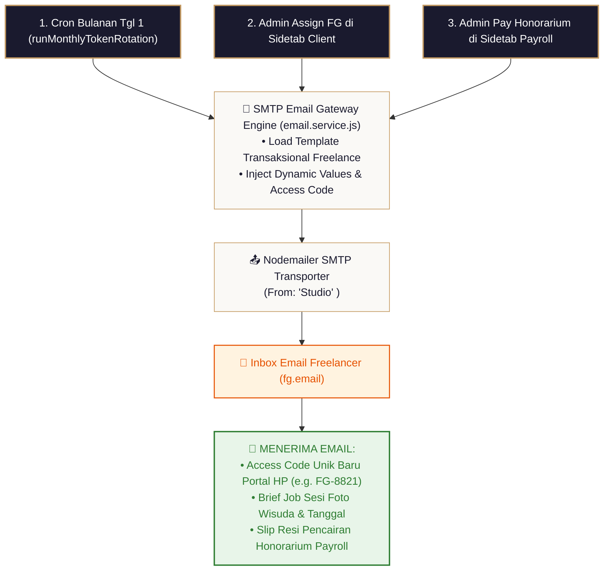

# 📧 Blueprint Spesifikasi Teknikal & Alur Kerja Email Otomatis (SMTP Gateway)

Dokumen ini merupakan panduan spesifikasi arsitektur teknis dan alur kerja (*workflow*) resmi untuk **Sub-Sistem Email Otomatis SMTP Gateway (`email.service.js`)**, yang mencakup konfigurasi SMTP Server, Templating Engine HTML Luxury Dark Theme, Pemicu Pengiriman Email Otomatis, dan Verifikasi Uji Coba Gateway.

> [!NOTE]
> **Wiki System Flow Hub**: [🗺️ Master Flow System](./MASTER_FLOW.md) | [Tahap 1: Inquiry](./TAHAP1_alur_inqury.md) | [Tahap 2: Client Deal](./TAHAP2_alur_client.md) | [Tahap 3: Post-Produksi](./TAHAP3_alur_postproduksi.md) | [Tahap 4: Arsip](./TAHAP4_alur_arsip.md) | [Portal Tracking](./ALUR_TRACKING_CLIENT.md)

---

## 🏛️ 1. Prinsip & Arsitektur Sub-Sistem Email Gateway

1. **Direct SMTP Integration**: Menggunakan `Nodemailer` untuk terhubung langsung ke SMTP Server pilihan studio (Gmail SMTP, cPanel Mail, SendGrid, Mailgun, Amazon SES, dsb).
2. **Dynamic DB Credentials**: Seluruh kredensial SMTP diset secara dinamis melalui Admin Panel dan tersimpan di database (`settings`), tanpa perlu restart server node.js.
3. **Luxury Responsive Template Engine**: Seluruh email yang keluar dibungkus oleh **Engine Template HTML Luxury Dark Navy & Gold Accent (`#121824`, `#1e293b`, `#C59B63`)** yang menyesuaikan branding identitas studio (Logo, Nama Studio, Alamat, WA).
> [!IMPORTANT]
> **ARSITEKTUR HTML LAYOUT: MAIN CARD vs EXTERNAL TRACKING FOOTER CALLOUT BOX**
> Seluruh email Klien didesain dengan struktur HTML 2 Wadah Terpisah:
>
> 1. **📦 WADAH 1: CARD UTAMA LUXURY DARK THEME (Di Dalam Card)**
>    - Berisi Header Logo & Nama Studio, Badge Kategori, serta **SELURUH KONTEN UTAMA EMAIL** (Invoice PDF, Briefing H-1, Link Galeri Seleksi, Download Drive, atau Closing Resi).
>
> 2. **🔻 WADAH 2: BANNER PEMBERITAHUAN TRACKING (DI LUAR CARD UTAMA - PALING BAWAH)**
>    - **Ditempatkan Terpisah DI LUAR Card Utama** (tepat di bawah Card Utama sebelum Footer Copyright).
>    - Berfungsi sebagai **Banner Pemberitahuan Khusus Realtime Update** yang mengimbau Klien agar selalu memantau progres sesi foto & editing wisuda secara realtime:
>
> ```text
> ┌───────────────────────────────────────────────────────────────────────────────────────────┐
> │                      📦 CARD UTAMA LUXURY EMAIL (MAIN CONTENT CARD)                        │
> │ ┌───────────────────────────────────────────────────────────────────────────────────────┐ │
> │ │ 🎓 LOGO & NAMA STUDIO                                                                 │ │
> │ │ ───────────────────────────────────────────────────────────────────────────────────── │ │
> │ │ [ KONTEN UTAMA EMAIL: Invoice PDF / Briefing H-1 / Galeri Seleksi / Final Drive ]     │ │
> │ └───────────────────────────────────────────────────────────────────────────────────────┘ │
> └─────────────────────────────────────────────┬─────────────────────────────────────────────┘
>                                               │ (DI LUAR CARD UTAMA)
>                                               ▼
> ┌───────────────────────────────────────────────────────────────────────────────────────────┐
> │ 📢 BANNER PEMBERITAHUAN EXTERNAL (DI LUAR CARD UTAMA - PALING BAWAH):                    │
> │ 📌 IMBAUAN PANTAU PROGRES REALTIME:                                                       │
> │ "Mohon selalu pantau pembaruan progres terbaru sesi foto dan editing wisuda Anda secara    │
> │  realtime melalui Portal Tracking Klien kami di bawah ini."                               │
> │                                                                                           │
> │ 🔑 Kode Tracking   : TRK-2026-0812-99                                                   │
> │ 📱 Tombol CTA Direct: [ 📱 Pantau Update Progres Foto Wisuda Saya ]                       │
> │                        ➔ https://wisudaphotography.com/tracking.html?code=TRK-xxx         │
> └─────────────────────────────────────────────┬─────────────────────────────────────────────┘
>                                               │
>                                               ▼
> ┌───────────────────────────────────────────────────────────────────────────────────────────┐
> │ 🏢 FOOTER COPYRIGHT & SOCIAL MEDIA STUDIO                                                 │
> └───────────────────────────────────────────────────────────────────────────────────────────┘
> ```

---

## 🔄 2. Diagram Alur Pengiriman Email ke Sisi Client & Freelance

### 2.1. Diagram Alur Pengiriman Email ke Sisi Klien (Client Email Pipeline)

```text
 🎓 ALUR PENGIRIMAN EMAIL OTOMATIS SISI KLIEN (CLIENT EMAIL PIPELINE)
 ═════════════════════════════════════════════════════════════════════════════════════════════

  [ TAHAP 1: RESERVASI & PEMBAYARAN AWAL ]
  ┌─────────────────────────────────────────────────────────────────────────────────────────┐
  │ 1️⃣ TRIGGER EVENT: Admin Verifikasi Pembayaran (dp_status = 'paid')                       │
  │    └─► 📧 EMAIL 1: Invoice DP (50%) / Pelunasan Lunas 100% Awal                         │
  │        • Rangkuman Pembayaran DP 50% atau Lunas 100% & Tanggal Sesi Foto Wisuda         │
  │        • Lampiran Berkas Resi Invoice PDF Resmi (Terverifikasi Lunas/DP)                 │
  │        • [PALING BAWAH] 📱 Direct Link Access Portal Tracking (tracking.html?code=TRK)  │
  └───────────────────────────────────────────┬─────────────────────────────────────────────┘
                                              │
                                              ▼
  [ TAHAP 2: PERSIAPAN SESI PEMOTRETAN (H-1) ]
  ┌─────────────────────────────────────────────────────────────────────────────────────────┐
  │ 2️⃣ TRIGGER EVENT: Cron Worker Automated Reminder H-1 (H-1 Tanggal Pemotretan)            │
  │    └─► 📧 EMAIL 2: Pengingat Sesi Pemotretan Wisuda Besok (H-1 Reminder)                 │
  │        • Konfirmasi Jadwal, Jam Pemotretan, & Titik Lokasi Pertemuan Sesi Foto          │
  │        • Nama Fotografer (FG) yang bertugas beserta Kontak WhatsApp                     │
  │        • Direct Link PDF Briefing & Moodboard Inspirasi Pose (moodboard.html)           │
  │        • [PALING BAWAH] 📱 Direct Link Access Portal Tracking (tracking.html?code=TRK)  │
  └───────────────────────────────────────────┬─────────────────────────────────────────────┘
                                              │
                                              ▼
  [ TAHAP 3: POST-PRODUKSI & SELEKSI FOTO ]
  ┌─────────────────────────────────────────────────────────────────────────────────────────┐
  │ 3️⃣ TRIGGER EVENT: Admin Mengaktifkan Galeri Seleksi (selection_status = 'ready')         │
  │    └─► 📧 EMAIL 3: Pemberitahuan Galeri Seleksi Foto Mentah                             │
  │        • Direct CTA Link Akses Galeri: select-photos.html                               │
  │        • Informasi Batas Kuota Maksimal Foto Pilihan & Panduan Memilih                  │
  │        • [PALING BAWAH] 📱 Direct Link Access Portal Tracking (tracking.html?code=TRK)  │
  └───────────────────────────────────────────┬─────────────────────────────────────────────┘
                                              │
                                              ▼
  [ TAHAP 3: FINAL DELIVERABLES EDITING ]
  ┌─────────────────────────────────────────────────────────────────────────────────────────┐
  │ 4️⃣ TRIGGER EVENT: Admin Upload Foto Final Editan Selesai (status = 'delivered')          │
  │    └─► 📧 EMAIL 4: Pemberitahuan Hasil Foto Final Edit Complete                         │
  │        • Direct Link Master Google Drive All Edited Photos & Highlight Folder           │
  │        • Tombol CTA: [ ✓ Saya Sudah Menerima & Memeriksa Semua File ]                   │
  │        • [PALING BAWAH] 📱 Direct Link Access Portal Tracking (tracking.html?code=TRK)  │
  └───────────────────────────────────────────┬─────────────────────────────────────────────┘
                                              │
                                              ▼
  [ TAHAP 3 & 4: CLOSING STATEMENT TRANSAKSI SELESAI (COMPLETED 100%) ]
  ┌─────────────────────────────────────────────────────────────────────────────────────────┐
  │ 5️⃣ TRIGGER EVENT: Client Klik Konfirmasi Terima / Cron Auto-Approve 48 Jam (completed)  │
  │    └─► 📧 EMAIL 5: Email Closing Statement & Resi Transaksi Completed 100%              │
  │        • Ucapan Selamat, Rangkuman Transaksi Lunas 100%, & PDF Invoice Resi Final       │
  │        • Direct Link Master Google Drive Client, Calculator Size, & Consent Portofolio  │
  │        • [PALING BAWAH] 📱 Direct Link Access Portal Tracking (tracking.html?code=TRK)  │
  └───────────────────────────────────────────┬─────────────────────────────────────────────┘
                                              │
                                              ▼
  [ TAHAP 4: RETENTION DRIVE & REMINDERS ]
  ┌─────────────────────────────────────────────────────────────────────────────────────────┐
  │ 6️⃣ TRIGGER EVENT: Cron Worker Automated Reminder (Sisa Masa Simpan Drive ≤ 14 & 3 Hari) │
  │    └─► 📧 EMAIL 6: Peringatan Batas Waktu Storage Google Drive                          │
  │        • Countdown Sisa Hari Sebelum Folder Dihapus/Cleanup & Imbauan Download HP/PC    │
  │        • Direct Link Master Google Drive Client Storage                                 │
  │        • [PALING BAWAH] 📱 Direct Link Access Portal Tracking (tracking.html?code=TRK)  │
  └───────────────────────────────────────────┬─────────────────────────────────────────────┘
                                              │
                                              ▼
  ┌─────────────────────────────────────────────────────────────────────────────────────────┐
  │ 🟢 STATUS TRANSAKSI COMPLETED (100%) — SELURUH BERKAS FOTO AMAN DIKIRIMKAN              │
  └─────────────────────────────────────────────────────────────────────────────────────────┘
```

#### 📊 Diagram Alur Mermaid Flowchart Sisi Klien:

```mermaid
flowchart TD
    classDef stepNode fill:#1A1A2E,stroke:#C59B63,stroke-width:2px,color:#FFF;
    classDef eventNode fill:#FFFFFF,stroke:#1E40AF,stroke-width:1.5px,color:#1E40AF;
    classDef emailNode fill:#EBF5FF,stroke:#1E40AF,stroke-width:1.5px,color:#1E40AF;
    classDef successNode fill:#E8F5E9,stroke:#2E7D32,stroke-width:2px,color:#2E7D32;

    %% STAGE 1: INQUIRY & DP
    S1["🎓 TAHAP 1: Reservasi & Pembayaran Awal"]:::stepNode --> E1["1️⃣ Event Trigger: Admin Verifikasi Pembayaran (Gate 1 Passed)\n(dp_status = 'paid')"]:::eventNode
    E1 --> M1["📧 EMAIL 1: Invoice DP (50%) / Lunas 100% Awal\n• Rangkuman Pembayaran & PDF Invoice Resi\n• [PALING BAWAH] Kode & Direct Link Tracking"]:::emailNode

    %% STAGE 2: H-1 PHOTO SESSION REMINDER
    M1 --> S2["📸 TAHAP 2: Persiapan Sesi Pemotretan (H-1)"]:::stepNode
    S2 --> E2["2️⃣ Event Trigger: Cron Reminder H-1 Sesi Foto\n(H-1 Tanggal Wisuda)"]:::eventNode
    E2 --> M2["📧 EMAIL 2: Pengingat Sesi Pemotretan Wisuda Besok (H-1)\n• Jam & Lokasi, Identitas FG, Moodboard PDF\n• [PALING BAWAH] Kode & Direct Link Tracking"]:::emailNode

    %% STAGE 3: SELECTION GALLERY
    M2 --> S3["🎨 TAHAP 3: Post-Produksi & Seleksi Foto"]:::stepNode
    S3 --> E3["3️⃣ Event Trigger: Admin Aktifkan Galeri Seleksi\n(selection_status = 'ready')"]:::eventNode
    E3 --> M3["📧 EMAIL 3: Pemberitahuan Galeri Seleksi Foto Mentah\n• Direct Link CTA: select-photos.html\n• [PALING BAWAH] Kode & Direct Link Tracking"]:::emailNode

    %% STAGE 3: DELIVERABLES FINAL
    M3 --> E4["4️⃣ Event Trigger: Admin Upload All Edited Photos\n(status = 'delivered')"]:::eventNode
    E4 --> M4["📧 EMAIL 4: Pemberitahuan Foto Final Edit Selesai\n• Direct Link Drive All Edited & Highlight Folder\n• [PALING BAWAH] Kode & Direct Link Tracking"]:::emailNode

    %% STAGE 3 & 4: CLOSING STATEMENT COMPLETED
    M4 --> S5["🎓 TAHAP 3 & 4: Closing Statement (status = 'completed')"]:::stepNode
    S5 --> E5["5️⃣ Event Trigger: Client Confirm Receipt / Cron 48h Auto-Approve\n(status = 'completed')"]:::eventNode
    E5 --> M5["📧 EMAIL 5: Resi Transaksi & Closing Statement Wisuda\n• Ucapan Selamat, Resi PDF, Direct Drive, Consent\n• [PALING BAWAH] Kode & Direct Link Tracking"]:::emailNode

    %% STAGE 4: RETENTION REMINDERS
    M5 --> S4["📦 TAHAP 4: Retention Drive & Kearsipan"]:::stepNode
    S4 --> E6["6️⃣ Event Trigger: Cron Expiry Reminder (H-14 & H-3)\n(sisa masa simpan Drive ≤ 14 hari)"]:::eventNode
    E6 --> M6["📧 EMAIL 6: Peringatan Batas Simpan Google Drive\n• Countdown Expiry & Direct Link Drive Storage\n• [PALING BAWAH] Kode & Direct Link Tracking"]:::emailNode

    M6 --> END["✅ SELURUH BERKAS FOTO BERHASIL DIAMANKAN KLIEN"]:::successNode
```



---

### 2.2. Diagram Alur Pengiriman Email ke Sisi Freelance (Freelancer Email Workflow)



---

## 📨 3. Rincian 6 Email Transaksional Klien & Email Freelance

Setiap email transaksional yang dikirimkan ke Klien **WAJIB MELAMPIRKAN KODE TRACKING (`{tracking_token}`) DAN DIRECT LINK ACCESS PORTAL TRACKING (`tracking.html?code={tracking_token}`) PADA BAGIAN PALING BAWAH BODY EMAIL**.

---

### 3.1. Email 1: Invoice DP (50%) / Pelunasan Lunas 100% Awal (`Gate 1 Passed`)
* **Waktu Trigger**: Admin memverifikasi pembayaran DP 50% atau Pelunasan Lunas 100% awal (`dp_status = 'paid'`).
* **Penerima**: Alamat Email Klien (`client_email`).
* **Subjek Email**: `📄 [Invoice Resi] Konfirmasi Reservasi Foto Wisuda — {client_name}`
* **Badge Header UI**: `RESERVATION CONFIRMED`
* **Isi Kandungan Email**:
  1. **📋 Rangkuman Transaksi**: Tanggal Sesi Foto Wisuda, Paket Layanan, & Nominal DP 50% / Lunas 100%.
  2. **📄 Lampiran File Invoice**: File PDF Resi Invoice Resmi Lunas DP / Lunas 100%.
  3. **🔻 [BAGIAN PALING BAWAH BODY EMAIL] 📱 Direct Link Access Portal Tracking**:
     - **Kode Tracking Unique**: `Kode Tracking: {tracking_token}` (contoh: `TRK-2026-0812-99`).
     - **Direct Link Button**: **`[ 📱 Buka Portal Tracking Saya ]`** ➔ `https://wisudaphotography.com/tracking.html?code={tracking_token}`.

---

### 3.2. Email 2: Pengingat H-1 Sesi Pemotretan Wisuda (`runH1Reminder`)
* **Waktu Trigger**: Cron Worker H-1 otomatis pada pukul 08:00 WITA (1 hari sebelum tanggal wisuda).
* **Penerima**: Alamat Email Klien (`client_email`).
* **Subjek Email**: `📸 [H-1 Reminder] Pengingat Sesi Foto Wisuda Besok — {client_name}`
* **Badge Header UI**: `PHOTO SESSION H-1 REMINDER`
* **Isi Kandungan Email**:
  1. **⏰ Konfirmasi Jadwal Sesi Foto**: Jam Pemotretan & Titik Lokasi Pertemuan Sesi Foto Wisuda.
  2. **👤 Identitas FG**: Nama Fotografer & Kontak WhatsApp Fotografer yang bertugas.
  3. **📄 Direct Link Briefing & Moodboard**: Link langsung ke PDF Briefing & Moodboard Pose (`moodboard.html`).
  4. **🔻 [BAGIAN PALING BAWAH BODY EMAIL] 📱 Direct Link Access Portal Tracking**:
     - **Kode Tracking Unique**: `Kode Tracking: {tracking_token}` (contoh: `TRK-2026-0812-99`).
     - **Direct Link Button**: **`[ 📱 Buka Portal Tracking Saya ]`** ➔ `https://wisudaphotography.com/tracking.html?code={tracking_token}`.

---

### 3.3. Email 3: Pemberitahuan Galeri Seleksi Foto Mentah (`selection_status = 'ready'`)
* **Waktu Trigger**: Admin meng-impor foto mentah dan mengaktifkan galeri seleksi.
* **Penerima**: Alamat Email Klien (`client_email`).
* **Subjek Email**: `🎨 [Seleksi Foto] Galeri Seleksi Foto Wisuda Siap Dibuka — {client_name}`
* **Badge Header UI**: `PHOTO SELECTION GALLERY READY`
* **Isi Kandungan Email**:
  1. **👉 Direct Link CTA Galeri Seleksi**: **`[ 🎨 Buka Galeri Seleksi Foto Saya ]`** ➔ `https://wisudaphotography.com/select-photos.html?booking_id={id}`.
  2. **ℹ️ Informasi Kuota & Panduan**: Informasi batas kuota foto pilihan & petunjuk memilih foto favorit.
  3. **🔻 [BAGIAN PALING BAWAH BODY EMAIL] 📱 Direct Link Access Portal Tracking**:
     - **Kode Tracking Unique**: `Kode Tracking: {tracking_token}` (contoh: `TRK-2026-0812-99`).
     - **Direct Link Button**: **`[ 📱 Buka Portal Tracking Saya ]`** ➔ `https://wisudaphotography.com/tracking.html?code={tracking_token}`.

---

### 3.4. Email 4: Pemberitahuan Hasil Foto Final Edit Complete (`status = 'delivered'`)
* **Waktu Trigger**: Admin selesai mengunggah foto editan akhir lengkap ke Google Drive.
* **Penerima**: Alamat Email Klien (`client_email`).
* **Subjek Email**: `✨ [Foto Final Ready] Seluruh Foto Hasil Editing Selesai — {client_name}`
* **Badge Header UI**: `ALL EDITED PHOTOS DELIVERED`
* **Isi Kandungan Email**:
  1. **📂 Direct Link Drive Berkas Final**: Direct Link Folder `All Edited Photos` & Folder `Highlight Fast Editing`.
  2. **✓ CTA Konfirmasi Penerimaan**: **`[ ✓ Saya Sudah Menerima & Memeriksa Semua File ]`**.
  3. **🔻 [BAGIAN PALING BAWAH BODY EMAIL] 📱 Direct Link Access Portal Tracking**:
     - **Kode Tracking Unique**: `Kode Tracking: {tracking_token}` (contoh: `TRK-2026-0812-99`).
     - **Direct Link Button**: **`[ 📱 Buka Portal Tracking Saya ]`** ➔ `https://wisudaphotography.com/tracking.html?code={tracking_token}`.

---

### 3.5. Email 5: Email Detail Closing Statement & Resi Transaksi Completed 100% (`completed`)
* **Waktu Trigger**: Klien mengeklik konfirmasi terima file final / Cron Worker Auto-Approve 48 Jam.
* **Penerima**: Alamat Email Klien (`client_email`).
* **Subjek Email**: `🎓 [Completed] Resi Transaksi & Closing Statement Wisuda — {client_name}`
* **Badge Header UI**: `TRANSACTION COMPLETED 100%`
* **Isi Kandungan Email**:
  1. **🔑 Kode Tracking Unique**: `Kode Tracking: {tracking_token}` (contoh: `TRK-2026-0812-99`).
  2. **📱 Direct Link Access Portal Tracking**: **`[ 📱 Buka Portal Tracking Saya ]`** ➔ `https://wisudaphotography.com/tracking.html?code={tracking_token}`.
  3. **🎓 Ucapan Selamat & Apresiasi Momen**: Ucapan selamat atas kelulusan wisuda dan apresiasi kepercayaan studio.
  4. **📋 Rangkuman Data Transaksi Lengkap**: Data Wisudawan, Kampus, Paket Layanan, & Status `🟢 LUNAS 100%`.
  5. **📄 Dokumen Resi PDF Final**: Button CTA **`[ 🖨️ Unduh Invoice PDF Lunas 100% ]`**.
  6. **📂 Akses Direct Google Drive Master Client**: Button CTA **`[ 📁 Buka Master Folder Google Drive Foto Wisuda Saya ]`** (`drive_parent_url`) & Live Size Calculator (`folder_total_size_formatted`).
  7. **💾 Imbauan Backup File Pribadi**: Imbauan mengunduh seluruh foto ke HP/PC sebelum tanggal cleanup (`drive_expiry_date_formatted`).
  8. **📸 Consent Portofolio Studio**: Link pengoperasian izin tampil di katalog portofolio studio (`is_portfolio_allowed`).

---

### 3.6. Email 6: Peringatan Batas Simpan Storage Google Drive (`runDriveCleanupCron`)
* **Waktu Trigger**: Cron Worker otomatis saat sisa masa simpan Drive Klien $\le 14$ hari (H-14) dan $\le 3$ hari (H-3).
* **Penerima**: Alamat Email Klien (`client_email`).
* **Subjek Email**: `⚠️ [Peringatan Retensi] Sisa Masa Simpan Drive Tinggal {diffDays} Hari — {client_name}`
* **Badge Header UI**: `DRIVE EXPIRY WARNING`
* **Isi Kandungan Email**:
  1. **🔑 Kode Tracking Unique**: `Kode Tracking: {tracking_token}` (contoh: `TRK-2026-0812-99`).
  2. **📱 Direct Link Access Portal Tracking**: **`[ 📱 Buka Portal Tracking Saya ]`** ➔ `https://wisudaphotography.com/tracking.html?code={tracking_token}`.
  3. **⏰ Countdown Sisa Hari**: Hitung mundur sisa hari retensi sebelum folder client di Root 1 dibersihkan.
  4. **💾 Direct Link Master Drive Client**: Direct link untuk mengunduh & menyimpan seluruh foto ke HP/PC.

---

### 3.7. Email Rotasi Kode Akses Bulanan Freelancer (`runMonthlyTokenRotation`)
* **Waktu Trigger**: Pemicu Cron Worker bulanan setiap Tanggal 1 pukul 00:01.
* **Penerima**: Seluruh Fotografer / Videografer Aktif (`freelancers.email`).
* **Subjek Email**: `🔐 Kode Akses Portal Freelance Baru — {Bulan/Tahun}`
* **Badge Header UI**: `FREELANCE ACCESS CODE`
* **Isi Kandungan Email**:
  1. Notifikasi pembaharuan kode akses keamanan bulanan.
  2. **Kode Akses Unik Baru** (`access_code`, contoh: `FG-8821`).
  3. **Link Direct Portal Mobile**: `https://wisudaphotography.com/freelance.html`.
  4. Petunjuk penggunaan portal HP dan mengingatkan aturan `H-1 Contact Release`.

---

### 3.8. Email Uji Coba Verifikasi Gateway SMTP (`sendTestEmail`)
* **Waktu Trigger**: Admin mengeklik tombol **`🧪 Kirim Email Uji Coba`** pada menu Settings Admin Panel.
* **Penerima**: Email Admin / Alamat Email Tujuan Uji Coba.
* **Subjek Email**: `🧪 [Uji Coba SMTP] {StudioName} — Verifikasi Email Gateway`
* **Badge Header UI**: `SMTP TEST SUCCESS`
* **Isi Kandungan Email**:
  1. Banner status koneksi `STATUS KONEKSI SMTP SERVER: CONNECTED ✓`.
  2. Tabel rincian teknis koneksi: Host Server, Port, SSL/TLS Status, Nama Pengirim, Email Pengirim, Waktu Uji Coba.

---

## ⚙️ 4. Spesifikasi Konfigurasi SMTP di Admin Panel (`SettingsView.vue`)

Admin dapat mengatur dan menguji koneksi SMTP langsung dari antarmuka web melalui variabel pengaturan berikut:

| Parameter DB Setting | Tipe Data | Deskripsi & Nilai Default |
| :--- | :---: | :--- |
| **`smtp_host`** | `String` | Hostname server SMTP (contoh: `smtp.gmail.com` / `mail.domain.com`). |
| **`smtp_port`** | `Number` | Port pengiriman (contoh: `587` untuk STARTTLS / `465` untuk SSL/TLS). |
| **`smtp_user`** | `String` | Username / Email otentikasi SMTP (contoh: `admin@domain.com`). |
| **`smtp_pass`** | `String` | Password / App Password khusus SMTP. |
| **`smtp_secure`** | `Boolean` | `1` jika menggunakan Port 465 (SSL/TLS), `0` jika Port 587 (STARTTLS). |
| **`smtp_from_name`**| `String` | Nama Pengirim yang tampil di inbox penerima (Default: `Nama Studio`). |
| **`smtp_from_email`**| `String` | Alamat Email Pengirim resmi (Default: sama dengan `smtp_user`). |

---

## 🗄️ 5. Matriks Endpoint API Terkait Service Email SMTP

| Endpoint API | Method | Deskripsi Operasional & Akses Security |
| :--- | :---: | :--- |
| `POST /api/admin/settings/verify-smtp` | `POST` | Memeriksa & memverifikasi koneksi probe socket ke server SMTP. |
| `POST /api/admin/settings/send-test-email` | `POST` | Mengirimkan email uji coba ber-template Luxury ke target email. |

---

*Dokumen blueprint spesifikasi alur kerja Sub-Sistem Email Otomatis SMTP ini resmi disajikan dan dikunci.*
