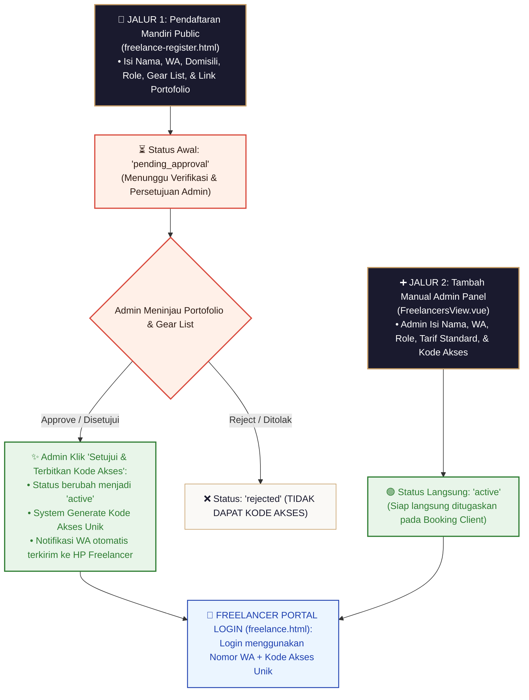

# Blueprint Spesifikasi Teknikal & Alur Kerja Sistem Freelance Studio (Fotografer & Tim Lapangan)

Dokumen ini merupakan panduan spesifikasi arsitektur teknis dan alur kerja (*workflow*) resmi untuk **Sistem Pengelolaan Freelance / Fotografer Studio (Pendaftaran, Kode Akses, Penugasan Job, Eksekusi Pemotretan, & Payout Honorarium)**.

---

## 🏛️ 1. Tahapan Utama Alur Kerja Sistem Freelance

```text
 ┌──────────────────────────────────────────────────────────────────────────────────┐
 │ TAHAP A: ONBOARDING & INPUT FREELANCE BARU (2 JALUR INPUT)                       │
 │ • Jalur 1: Pendaftaran Mandiri via Form Public (Status: pending_approval)        │
 │ • Jalur 2: Tambah Manual oleh Admin di Admin Panel (Status: active)              │
 └──────────────────────────────────────┬───────────────────────────────────────────┘
                                        │
                                        ▼
 ┌──────────────────────────────────────────────────────────────────────────────────┐
 │ TAHAP B: VERIFIKASI ADMIN & PENERBITAN KODE AKSES UNIK (Access Code)            │
 │ • Admin menyetujui Pendaftaran Mandiri ──► System Generate Kode Akses Unik      │
 │ • Kode Akses & Link Portal dikirimkan otomatis via WhatsApp ke Freelancer        │
 └──────────────────────────────────────┬───────────────────────────────────────────┘
                                        │
                                        ▼
 ┌──────────────────────────────────────────────────────────────────────────────────┐
 │ TAHAP C: PENUGASAN JOB PEMOTRETAN (Assignment & Confirmation Flow)               │
 │ • Admin menugaskan FG di Tahap 2 Sidetab CLIENT (Status: assigned)              │
 │ • Notifikasi WA Penugasan masuk ke HP FG ──► FG klik [ 🟢 Konfirmasi Terima Job ] │
 └──────────────────────────────────────┬───────────────────────────────────────────┘
                                        │
                                        ▼
 ┌──────────────────────────────────────────────────────────────────────────────────┐
 │ TAHAP D: EKSEKUSI HARI PEMOTRETAN (Shooting Day & Zero Upload Rule)              │
 │ • FG membuka Portal HP: Cek Lokasi Maps, Kontak Client, & PDF Moodboard Pose     │
 │ • Zero Upload FG: FG HANYA serahkan SD Card/File ke Admin (Tanpa Upload Drive)   │
 │ • Selesai Pemotretan: FG klik [ 📸 Selesai Pemotretan ] (Atau Auto Cron 30 min)  │
 └──────────────────────────────────────┬───────────────────────────────────────────┘
                                        │
                                        ▼
 ┌──────────────────────────────────────────────────────────────────────────────────┐
 │ TAHAP E: REKAPITULASI HONORARIUM & PAYOUT DANA (Payout History)                  │
 │ • Rekap Honorarium (fg_fee) tersimpan di Portal Freelance (Status: Unpaid)       │
 │ • Admin mentransfer Honor ──► Status berubah [ 🟢 Honor Lunas Ditransfer ]        │
 └──────────────────────────────────────────────────────────────────────────────────┘
```

---

## 📥 2. Detail Rincian Tahap A: Onboarding 2 Jalur Input Freelance Baru

### 2.1. Jalur 1: Pendaftaran Mandiri via Form Public (`freelance-register.html`)
- **Pintu Masuk**: Calon Freelancer mendaftar mandiri via form publik di internet.
- **Form Parameter yang Diisi Calon Freelancer**:
  1. **Nama Lengkap** (`name`)
  2. **Nomor WhatsApp Active** (`phone`)
  3. **Kota Domisili / Base Operasional** (`city`)
  4. **Spesialisasi Role** (`role`: *📸 Fotografer / 🎥 Videografer / ✂️ Editor*) — *Pemotretan wisuda 100% menggunakan 1 FG tunggal saja (tanpa FG 2 / tanpa Drone).*

  5. **Daftar Alat / Equipment Gear List** (`gear_list`: *Kamera, Lensa, Lighting, dll.*)
  6. **Link Portofolio Karya** (`portfolio_url`: *Drive / Instagram / Website*)
- **Status Awal**: **`pending_approval`** (Belum bisa login, menunggu verifikasi Admin).

### 2.2. Jalur 2: Tambah Manual oleh Admin di Admin Panel (`FreelancersView.vue`)
- **Pintu Masuk**: Admin menambah tim freelance internal secara langsung di Admin Panel.
- **Form Parameter yang Diisi Admin**:
  1. **Nama Lengkap** (`name`)
  2. **Nomor WhatsApp** (`phone`)
  3. **Kota Domisili** (`city`)
  4. **Spesialisasi Role** (`role`)
  5. **Besaran Tarif Standar Honor** (`default_fee`)
  6. **Kode Akses Unik Custom / Auto-Generate** (`access_code`)
- **Status Awal**: **`active`** (Langsung aktif dan siap ditugaskan).

---

## 🔄 3. Diagram Alur Kerja Visual Tahap A (Onboarding 2 Jalur Input)



---

## 🗄️ 4. Ringkasan Status State Freelancer (Tabel `freelancers`)

| Status State | Sumber Input | Akses Login Portal | Status Kesiapan Job |
| :--- | :--- | :--- | :--- |
| **`pending_approval`** | Jalur 1 (Form Mandiri) | 🔴 Ditolak (Belum Disetujui) | Belum Bisa Ditugaskan |
| **`rejected`** | Jalur 1 (Ditolak Admin) | 🔴 Ditolak | Tidak Aktif |
| **`active`** | Jalur 1 (Disetujui) / Jalur 2 (Direct Admin) | 🟢 Diizinkan (WA + Access Code) | **Siap Ditugaskan ke Booking** |
| **`inactive`** | Non-Aktifkan oleh Admin | 🔴 Dibatasi Sementara | Ditinggalkan |

---

*Dokumen cetak biru spesifikasi tahap onboarding sistem Freelance ini resmi tersimpan sebagai panduan arsitektur utama.*
