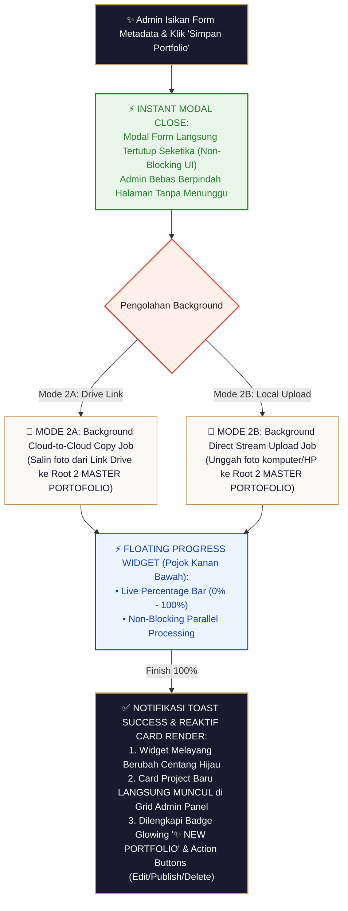

# Blueprint Spesifikasi Teknikal & Alur Kerja Sistem Portofolio Studio (Sidetab Portofolio & Web Portofolio Publik)

> [!NOTE]
> **Wiki System Flow Hub**: [🗺️ Master Flow System](./MASTER_FLOW.md) | [Tahap 3: Post-Produksi](./TAHAP3_alur_postproduksi.md) | **Portofolio Studio** | [Struktur Drive](./STRUKTUR_FOLDER_DRIVE.md)

Dokumen ini merupakan panduan spesifikasi arsitektur teknis dan alur kerja (*workflow*) resmi untuk **Sistem Portofolio Studio (Sidetab Portofolio Admin Panel & Website Portofolio Publik `portofolio.html`)**.

> [!IMPORTANT]
> **Prinsip Utama Arsitektur Portofolio:**
> * **Independensi Storage (Terpisah dari Client)**: Berkas foto portofolio **WAJIB di-copy Cloud-to-Cloud** ke `FOLDER MASTER UTAMA PORTOFOLIO` (Root 2) agar foto di website publik **TIDAK PERNAH BROKEN LINK** saat folder client dibersihkan.
> * **Privasi & Consent Klien**: Hanya foto dari client yang memberikan izin (`is_portfolio_allowed = 1`) yang dapat dipublikasikan.
> * **Public Rating Stars Only**: Website portofolio publik hanya menampilkan Rating Bintang. Catatan ulasan testimoni bersifat **PRIVAT KHUSUS INTERNAL ADMIN** yang dikelola di Sidetab Portofolio Admin (`PortfolioView.vue`).
> * **Google Drive Direct CDN Stream**: Foto ditayangkan dari CDN Google Drive (`lh3.googleusercontent.com`) sehingga **Zero Bandwidth VPS Server** & auto-optimized.

---

## 🏛️ 1. Rincian Mode Input Portofolio Studio

Sistem Portofolio mendukung **2 Mode Pembuatan Portofolio**:

| Mode Input | Sumber Foto | Deskripsi Operasional & Spesifikasi Sistem |
| :--- | :--- | :--- |
| **Mode 1: Automasi Pasca-Produksi** | Auto-Import dari Booking Client (Tahap 3) | Dibuat otomatis saat Admin upload foto highlight di Tahap 3. Jika `is_portfolio_allowed = 1`, sistem meng-copy foto Cloud-to-Cloud ke Folder Master Portofolio Studio (Root 2). |
| **Mode 2A: Manual Link Google Drive** | Link Google Drive Folder | Admin mengeklik **`+ Tambah Portfolio`** di Sidetab Portofolio, menempelkan URL Drive Folder, lalu sistem meng-copy berkas Cloud-to-Cloud ke Root 2. |
| **Mode 2B: Manual Upload Local File** | Berkas Komputer / HP Admin | Admin mengunggah berkas foto langsung dari perangkat Admin ke Folder Master Portofolio Studio (Root 2) via Direct Upload API. |

---

## 🔄 2. Diagram Alur Kerja Visual Portofolio (Portfolio Flowchart)

```text
 ┌──────────────────────────────────────────────────────────────────────────────────┐
 │ STEP 1: ADMIN UPLOAD FOTO HIGHLIGHT (TAHAP 3 PASCA-PRODUKSI)                     │
 │ Admin mengunggah 3-5 foto editan terbaik ke Subfolder 'Highlight/' (Root 1 Client)│
 └──────────────────────────────────────┬───────────────────────────────────────────┘
                                        │
                                        ▼
 ┌──────────────────────────────────────────────────────────────────────────────────┐
 │ STEP 2: AUTOMASI CLOUD-TO-CLOUD COPY KE MASTER PORTOFOLIO (ROOT 2)              │
 │ Sistem meng-copy foto ke Subfolder '{NamaClient}_{Universitas}_{Tahun}' di Root 2│
 └──────────────────────────────────────┬───────────────────────────────────────────┘
                                        │
                                        ▼
 ┌──────────────────────────────────────────────────────────────────────────────────┐
 │ STEP 3: PENGECEKAN KESEPAKATAN CLIENT (is_portfolio_allowed)                     │
 │ Client memilih konfirmasi di Portal Tracking / Halaman Closing Statement         │
 └──────────────────────────────────────┬───────────────────────────────────────────┘
                                        │
                      ┌─────────────────┴─────────────────┐
                      │                                   │
             (is_portfolio_allowed = 1)          (is_portfolio_allowed = 0)
             Client MENGIZINKAN                   Client MENOLAK / BELUM
                      │                                   │
                      ▼                                   ▼
 ┌────────────────────────────────────────┐ ┌─────────────────────────────────────┐
 │ STEP 4A: OTOMATIS PUBLISHED            │ │ STEP 4B: STATUS UNPUBLISHED (DRAFT) │
 │ • Status LANGSUNG 'published = 1'      │ │ • Status tersimpan 'published = 0'  │
 │ • Tanpa perlu konfirmasi Admin lagi    │ │ • Masuk ke Tab Draft Admin          │
 │ • LANGSUNG TAYANG di portofolio.html   │ │ • TIDAK DIKUNCI PERMANEN            │
 │ • Rating Bintang Only (★ 4.9/5.0)      │ │ • Admin TETAP BISA PUBLISH SUATU SAAT│
 └────────────────────────────────────────┘ └─────────────────────────────────────┘
```

```mermaid
flowchart TD
    classDef startEnd fill:#1A1A2E,stroke:#C59B63,stroke-width:2px,color:#FFF;
    classDef process fill:#FAF9F6,stroke:#C59B63,stroke-width:1px,color:#1A1A2E;
    classDef decision fill:#FFF0E8,stroke:#D94A3D,stroke-width:2px,color:#2D1B14;
    classDef subStage fill:#EBF5FF,stroke:#1E40AF,stroke-width:1.5px,color:#1E40AF;
    classDef gate fill:#E8F5E9,stroke:#2E7D32,stroke-width:2px,color:#2E7D32;

    %% STEP 1 & STEP 2: HIGHLIGHT UPLOAD & COPY
    Step1["📸 STEP 1: Admin Upload Foto Highlight\n(Subfolder 'Highlight/' Client di Root 1)"]:::startEnd --> Step2["✨ STEP 2: Automasi Kloning Cloud-to-Cloud ke Root 2:\nSubfolder '{NamaClient}_{Universitas}_{Tahun}' di MASTER PORTOFOLIO"]:::gate

    %% STEP 3: CONSENT BRANCHING
    Step2 --> ConsentCheck{"STEP 3: Konfirmasi Consent Client\n(is_portfolio_allowed)"}:::decision

    %% STEP 4A & STEP 4B
    ConsentCheck -->|Ya (Disetujui = 1)| Step4A["🟢 STEP 4A: OTOMATIS LANGSUNG PUBLISHED (published = 1)\n• Tanpa Perlu Konfirmasi Admin Lagi\n• Langsung Tayang di Website Publik portofolio.html\n• Rating Bintang Publik Only (★ 4.9/5.0)"]:::startEnd

    ConsentCheck -->|Tidak (Menolak = 0)| Step4B["🟡 STEP 4B: STATUS UNPUBLISHED (published = 0)\n• Masuk ke Tab Draft Sidetab Portofolio Admin\n• TIDAK DIKUNCI PERMANEN\n• Admin TETAP BISA Publish Suatu Saat"]:::subStage
```

```mermaid
flowchart TD
    classDef startEnd fill:#1A1A2E,stroke:#C59B63,stroke-width:2px,color:#FFF;
    classDef process fill:#FAF9F6,stroke:#C59B63,stroke-width:1px,color:#1A1A2E;
    classDef decision fill:#FFF0E8,stroke:#D94A3D,stroke-width:2px,color:#2D1B14;
    classDef subStage fill:#EBF5FF,stroke:#1E40AF,stroke-width:1.5px,color:#1E40AF;
    classDef gate fill:#E8F5E9,stroke:#2E7D32,stroke-width:2px,color:#2E7D32;

    %% STEP 1 & STEP 2: AUTOMATION TO DRAFT
    Step1["📸 STEP 1: Admin Upload Foto Highlight\n(Subfolder 'Highlight/' Client di Root 1)"]:::startEnd --> Step2["✨ STEP 2: Automasi Kloning Cloud-to-Cloud ke Root 2 MASTER PORTOFOLIO:\nNama Subfolder: '{NamaClient}_{Universitas}_{Tahun}'\n(Project Langsung Masuk ke TAB DRAFT Admin)"]:::gate


    %% STEP 3 & STEP 4: CONSENT CHECK IN DRAFT
    Step2 --> ConsentCheck{"STEP 3: Konfirmasi Consent Client\n(is_portfolio_allowed)"}:::decision
    
    ConsentCheck -->|Ya (Disetujui = 1)| Step4A["🟢 STEP 4A: Badge 'Disetujui Client'\nStatus di Tab Draft: Ready to Publish\n(Tombol Publish Terbuka)"]:::subStage
    ConsentCheck -->|Tidak (Ditolak = 0)| Step4B["🔴 STEP 4B: Badge 'Ditolak Client'\nStatus di Tab Draft: Privat Only\n(Tombol Publish Dikunci Permanen)"]:::process

    %% STEP 5: ADMIN PUBLISH CONFIRMATION
    Step4A --> Step5["🌟 STEP 5: Admin Klik 'Publish':\nBerpindah dari Tab Draft ke Tab Published\n(Tayang di Website Portofolio Publik portofolio.html)"]:::startEnd
```

---

## 🎨 3. Detail Operasional Pembuatan Portofolio Manual (Mode 2A & Mode 2B)

> [!IMPORTANT]
> **Prinsip Utama Pengalaman Pengguna (UI/UX Non-Blocking):**
> * **Modal Langsung Tutup saat Submit**: Baik pada **Mode 2A (Drive Link)** maupun **Mode 2B (Local Upload)**, saat Admin mengeklik tombol **`Simpan Portfolio`**, modal form **LANGSUNG TERTUTUP INSTAN**. Admin **TIDAK PERLU MENUNGGU** proses upload/salin selesai.
> * **Background Floating Queue Widget (`bottom-5 right-5`)**: Seluruh proses eksekusi (Cloud-to-Cloud import maupun stream upload berkas) berpindah dan diproses di background via **Widget Melayang di Pojok Kanan Bawah**.

---

### 🔄 Diagram Alur Kerja Visual Mode 2A & Mode 2B (Non-Blocking Queue Pipeline)

```text
 ┌──────────────────────────────────────────────────────────────────────────────────┐
 │ ADMIN ISIKAN FORM METADATA & PILIH METODE (MODE 2A DRIVE LINK / MODE 2B UPLOAD)  │
 └──────────────────────────────────────┬───────────────────────────────────────────┘
                                        │
                                        ▼
 ┌──────────────────────────────────────────────────────────────────────────────────┐
 │ ADMIN KLIK TOMBOL 'SIMPAN PORTFOLIO'                                             │
 │ ⚡ MODAL FORM LANGSUNG TERTUTUP INSTAN (Non-Blocking UI)                         │
 └──────────────────────────────────────┬───────────────────────────────────────────┘
                                        │
                      ┌─────────────────┴─────────────────┐
                      │                                   │
             [EKSEKUSI MODE 2A]                  [EKSEKUSI MODE 2B]
             Background Import Job               Background Direct Stream Upload
             Cloud-to-Cloud Copy                 File Komputer/HP ke Root 2
                      │                                   │
                      ▼                                   ▼
 ┌──────────────────────────────────────────────────────────────────────────────────┐
 │ ⚡ FLOATING QUEUE WIDGET MELAYANG (Pojok Kanan Bawah: bottom-5 right-5)          │
 │ • Mode 2A: "🔗 Mengimpor Foto dari Google Drive Link... [ 45% ]"                 │
 │ • Mode 2B: "📁 Mengunggah Berkas Komputer (12/35 Foto)... [ 34% ]"               │
 │ • Progress Bar Live Percentage (0% ──► 100%)                                     │
 │ • Admin Bebas Berpindah Sidetab / Membuat Proyek Baru Secara Bersamaan           │
 └──────────────────────────────────────┬───────────────────────────────────────────┘
                                        │
                                        ▼
 ┌──────────────────────────────────────────────────────────────────────────────────┐
 │ PROSES SELESAI 100% (Notifikasi Toast '✅ Impor Portofolio Selesai!')             │
 │ • Floating Widget Kanan Bawah Berubah Centang Hijau                              │
 │ • Card Project Baru LANGSUNG REAKTIF TAMPIL di Sidetab Portofolio Admin          │
 │ • Dilengkapi Badge Berkedip Halus: '✨ NEW PORTFOLIO' & Status (Draft/Published) │
 └──────────────────────────────────────────────────────────────────────────────────┘
```




---

## 📌 4. Detail Operasional Fitur Sidetab Portofolio Admin (`PortfolioView.vue`)

### 3.1. Pengelolaan Card Portofolio & Filter Tab
- **3 Tab Filter**:
  - `Semua`: Menampilkan seluruh karya portofolio.
  - `Published`: Menampilkan karya yang sedang tayang di website publik.
  - `Draft`: Menampilkan karya yang disembunyikan / dalam proses pengeditan.
- **Informasi pada Card Portofolio**:
  - Cover Photo (Thumbnail CDN Google)
  - Inisial Client / Nama Wisudawan
  - Nama Kampus, Tahun Wisuda, & Kota Location Badge (📍 Kota)
  - Jumlah Foto di dalam album portofolio
  - Badge Icon: `Published`, `Featured`, `✨ NEW PORTFOLIO`

### 3.2. Aksi Cepat Admin Panel
- **Tombol `Publish / Unpublish`**: Menayangkan atau menyembunyikan karya di website publik secara instan.
- **Tombol `Edit`**: Mengubah inisial client, nama kampus, tahun, kota, rating bintang, dan catatan ulasan privat.
- **Tombol `Hapus`**: Menghapus item portofolio dari katalog database.

---

## 🗄️ 4. Ringkasan Integrasi Portofolio

| Halaman / Komponen | Peranan & Hak Akses | Tampilan Rating & Ulasan |
| :--- | :--- | :--- |
| **Sidetab Portofolio Admin** (`PortfolioView.vue`) | Kendali Penuh Admin (CRUD, Publish, Edit, Delete) | Rating Bintang + Catatan Ulasan Privat Client |
| **Website Portofolio Publik** (`portofolio.html`) | Konsumsi Calon Client Publik | **Rating Bintang Publik Only (Tanpa Teks Ulasan)** |

---

*Dokumen cetak biru spesifikasi sistem Portofolio Studio ini resmi terkunci dan menjadi panduan arsitektur utama.*
