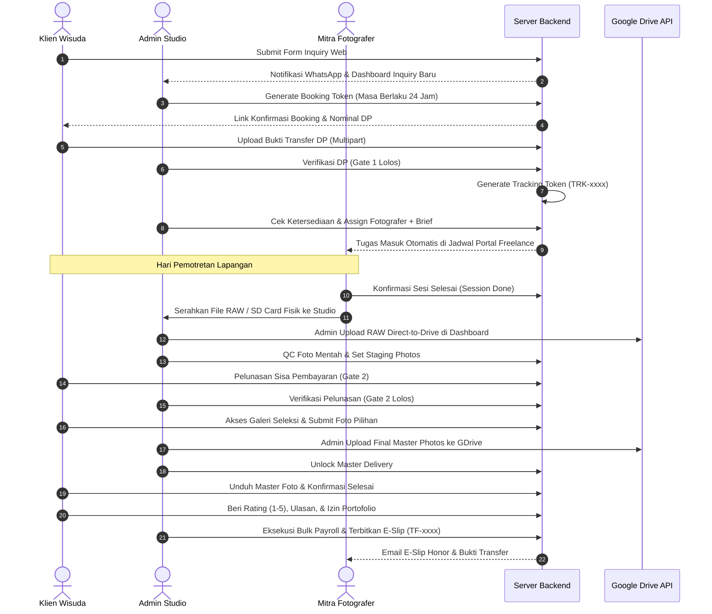
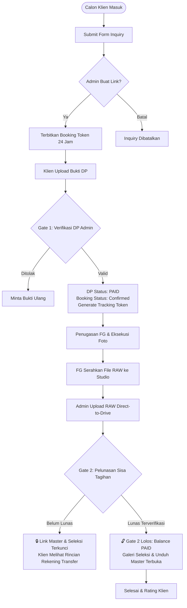
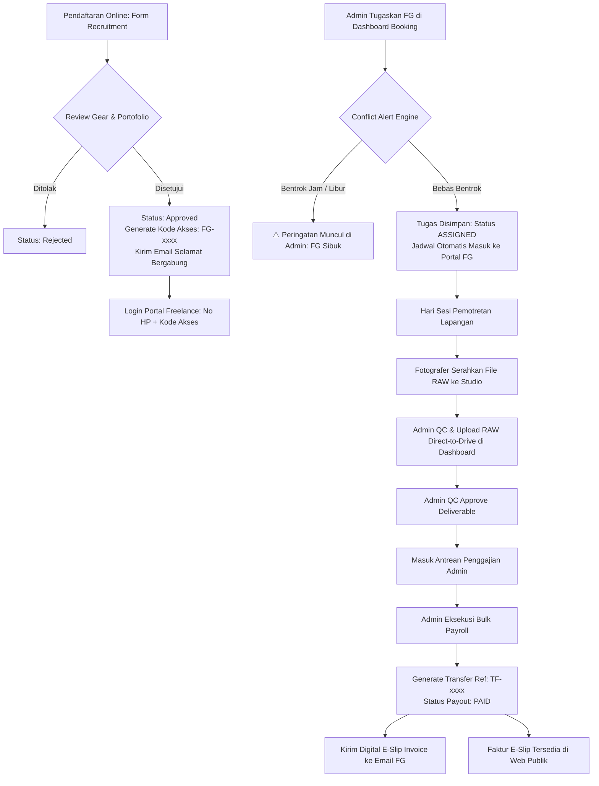
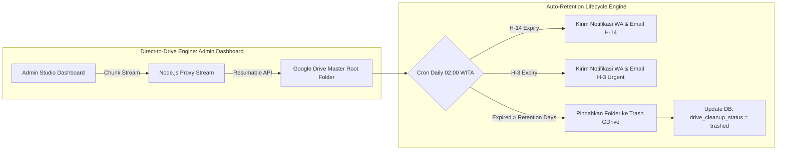

# 🏛️ DOKUMENTASI KOMPREHENSIF & DEEP AUDIT ARSITEKTUR PLATFORM WISUDA v2.0

> **Tanggal Audit:** 14 Agustus 2026  
> **Status Sistem:** `Production-Ready` (Build: `v2.0.0` / Hash: `175f5e01`)  
> **Arsitektur:** Node.js Express Modular Sub-Routers, Better-SQLite3, Vue 3 SPA Admin, Alpine.js Client/Freelance Portals, Direct-to-Drive Zero-Disk Stream, Google Drive API v3, Nodemailer Luxury SMTP Engine.

---

## 📑 DAFTAR ISI
1. [Latar Belakang & Tujuan Aplikasi](#1-latar-belakang--tujuan-aplikasi)
2. [Arsitektur Sistem & Komponen Inti](#2-arsitektur-sistem--komponen-inti)
3. [Diagram Visual Alur Kerja Menyeluruh (Mermaid)](#3-diagram-visual-alur-kerja-menyeluruh-mermaid)
   * 3.1. [Master Lifecycle Sesi Foto Wisuda](#31-master-lifecycle-sesi-foto-wisuda)
   * 3.2. [Alur Transaksi & Finansial (Gate 1 & Gate 2)](#32-alur-transaksi--finansial-gate-1--gate-2)
   * 3.3. [Alur Kerja Mitra Fotografer & Payroll](#33-alur-kerja-mitra-fotografer--payroll)
   * 3.4. [Alur Pipeline Cloud Storage (Direct-to-Drive & Retensi)](#34-alur-pipeline-cloud-storage-direct-to-drive--retensi)
4. [Mekanisme & Logika Bisnis Utama](#4-mekanisme--logika-bisnis-utama)
   * 4.1. [Admin-Centric Studio Model & Centralized Photo Upload](#41-admin-centric-studio-model--centralized-photo-upload)
   * 4.2. [Time-Slot Conflict Detection & Alert Engine](#42-time-slot-conflict-detection--alert-engine)
   * 4.3. [Direct-to-Drive Zero-Disk Transit Stream](#43-direct-to-drive-zero-disk-transit-stream)
   * 4.4. [Google OAuth 3-Step Wizard](#44-google-oauth-3-step-wizard)
   * 4.5. [Two-Way Rating & Portfolio Consent Synchronization](#45-two-way-rating--portfolio-consent-synchronization)
5. [Audit Rinci Modul & Endpoint Backend](#5-audit-rinci-modul--endpoint-backend)
6. [Audit Database, Constraint & Foreign Keys](#6-audit-database-constraint--foreign-keys)
7. [Audit Antarmuka (UI/UX) & Frontend Engine](#7-audit-antarmuka-uiux--frontend-engine)
8. [Kesimpulan, Analisis Kekurangan, & Rekomendasi Efisiensi](#8-kesimpulan-analisis-kekurangan--rekomendasi-efisiensi)

---

## 1. Latar Belakang & Tujuan Aplikasi

Platform Wisuda dibangun khusus untuk menyelesaikan hambatan operasional (*operational bottlenecks*) pada bisnis jasa fotografi wisuda modern:

```
┌────────────────────────────────────────────────────────────────────────────────────────┐
│                        TANTANGAN BISNIS FOTOGRAFI WISUDA                               │
├───────────────────────────────────┬────────────────────────────────────────────────────┤
│ ❌ Masalah Konvensional           │ ✅ Solusi Platform Wisuda v2.0                     │
├───────────────────────────────────┼────────────────────────────────────────────────────┤
│ 1. Disk VPS Jebol / Penuh         │ Direct-to-Drive Stream (Zero-Disk Transit ke GDrive│
│ 2. Klien Ambil Foto Tanpa Lunas   │ Financial Gate 2 (Master Terkunci s.d Lunas)       │
│ 3. Bentrok Jadwal Fotografer      │ Conflict Alert Engine (Hitung Menit & Deteksi Jam) │
│ 4. Koordinasi FG Rumit via WA     │ Portal Freelance Mobile-First Tanpa Akun Rumit     │
│ 5. Gaji Mitra Tertukar / Hilang   │ Bulk Payroll System + Digital E-Slip Invoice       │
│ 6. Storage Google Drive Bengkak   │ Auto-Retention Cron (H-14/H-3 Alert & Auto-Clean)  │
└───────────────────────────────────┴────────────────────────────────────────────────────┘
```

### 🎯 4 Tujuan Utama Platform:
1. **Otomasi Alur Pemesanan 1-Pintu:** Dari calon klien mengajukan tanggal hingga konfirmasi pembayaran DP via link berbatas waktu (*booking token*).
2. **Keamanan Finansial Ketat (Two-Gate Protection):** Mencegah penugasan fotografer sebelum DP valid (Gate 1) dan mengunci hasil foto resolusi tinggi sebelum lunas 100% (Gate 2).
3. **Efisiensi Server 0-Byte Storage (Zero-Disk Transit):** Seluruh pengunggahan foto mentah (*RAW*) dan master dilakukan terpusat oleh Admin langsung ke Google Drive API tanpa membebani disk server VPS.
4. **Sentralisasi Kendali Studio (Admin-Centric):** Seluruh manajemen jadwal, negosiasi ketersediaan mitra, seleksi foto, upload berkas, dan transfer honor dikendalikan penuh oleh Admin dari satu Dashboard SPA.

---

## 2. Arsitektur Sistem & Komponen Inti

```
┌────────────────────────────────────────────────────────────────────────────────────────┐
│                           ARSITEKTUR PLATFORM WISUDA v2.0                              │
└────────────────────────────────────────────────────────────────────────────────────────┘

 [ CLIENT / PUBLIC ]         [ FREELANCE MITRA ]            [ ADMIN STUDIO ]
  - Landing Page (Alpine)     - Mobile Portal (Alpine)       - Dashboard SPA (Vue 3 + Vite)
  - Booking Token Form        - Jadwal Sesi & Brief Foto     - Direct RAW & Master Uploader
  - Live Tracking Page        - Digital E-Slip Invoice       - Schedule & Conflict Matrix
  - Photo Selection Gallery   - Kelola Izin / Libur          - Deliverables Staging & QC
  - Konfirmasi & Rating                                      - Bulk Payroll Engine
           │                           │                             │
           └───────────────────────────┼─────────────────────────────┘
                                       │ (REST API & JSON / Multipart)
                                       ▼
                       ┌───────────────────────────────┐
                       │   EXPRESS.JS MODULAR SERVER   │
                       │   (Port 8081 / CORS / JWT)    │
                       └───────────────┬───────────────┘
                                       │
        ┌──────────────────────────────┼──────────────────────────────┐
        ▼                              ▼                              ▼
 ┌──────────────┐             ┌──────────────────┐          ┌────────────────────┐
 │ BETTER-SQLITE3│            │ GOOGLE DRIVE API │          │ NODEMAILER SMTP    │
 │ (WAL Mode)   │            │ (Resumable Stream│          │ (Luxury Alabaster  │
 │ Data Transaksi│            │ Zero-Disk Transit│          │ Email Engine + CID)│
 └──────────────┘             └──────────────────┘          └────────────────────┘
```

---

## 3. Diagram Visual Alur Kerja Menyeluruh (Mermaid)

### 3.1. Master Lifecycle Sesi Foto Wisuda



---

### 3.2. Alur Transaksi & Finansial (Gate 1 & Gate 2)



---

### 3.3. Alur Kerja Mitra Fotografer & Payroll



---

### 3.4. Alur Pipeline Cloud Storage (Direct-to-Drive & Retensi)



---

## 4. Mekanisme & Logika Bisnis Utama

### 4.1. Admin-Centric Studio Model & Centralized Photo Upload
* **Filosofi Inti:** Seluruh alur operasional studio dikendalikan secara terpusat oleh Admin Studio.
* **Pengunggahan 100% Terpusat di Admin:** Seluruh proses pengunggahan foto wisuda (foto mentah *Staging*, foto kurasi *Highlights*, dan foto hasil olahan *Master Final*), pembuatan folder Google Drive, dan penyaluran berkas klien **DILAKUKAN SEPENUHNYA OLEH ADMIN STUDIO** dari Admin Dashboard.
* **Mitra Freelance Tidak Mengunggah File ke Sistem:** Fotografer fokus pada pemotretan lapangan dan menyerahkan file fisik / SD card ke studio. Portal Freelance murni berfungsi untuk melihat jadwal tugas resmi, membaca brief pemotretan, dan memantau slip gaji digital (*E-Slip*).
* **Eliminasi Tombol Konfirmasi:** Penugasan dari Admin langsung berstatus resmi dan aktif tanpa perlu konfirmasi terima/tolak fotografer di aplikasi.

---

### 4.2. Time-Slot Conflict Detection & Alert Engine
* **Lokasi Berkas:** [src/utils/timeSlot.js](file:///Users/armansyam/Documents/Project%20AmsDev/Wisuda/src/utils/timeSlot.js) & [src/routes/admin/bookings.js](file:///Users/armansyam/Documents/Project%20AmsDev/Wisuda/src/routes/admin/bookings.js)
* **Logika Perhitungan:**
  1. Waktu mulai (`shooting_time`, misal `09:00`) dan durasi paket (`duration_hours`, misal `2 jam`) dikonversi ke menit sejak tengah malam:
     $$\text{Start Minute} = (\text{Hour} \times 60) + \text{Minute}$$
     $$\text{End Minute} = \text{Start Minute} + (\text{Duration} \times 60)$$
  2. Dua sesi $A$ dan $B$ dinyatakan bertabrakan jika:
     $$\text{Start}_A < \text{End}_B \quad \land \quad \text{Start}_B < \text{End}_A$$
  3. Sistem juga memeriksa tabel `fg_schedules` untuk status `unavailable` (jika fotografer menandai dirinya libur/izin).
* **Notifikasi Proaktif Admin:** Jika terjadi bentrok, sistem menolak penyimpanan dan menampilkan peringatan visual badge kuning/merah lengkap dengan ID booking yang bertabrakan di dashboard Admin.

---

### 4.3. Direct-to-Drive Zero-Disk Transit Stream
* **Lokasi Berkas:** [src/routes/direct-upload.js](file:///Users/armansyam/Documents/Project%20AmsDev/Wisuda/src/routes/direct-upload.js) & [src/services/drive-folder.service.js](file:///Users/armansyam/Documents/Project%20AmsDev/Wisuda/src/services/drive-folder.service.js)
* **Mekanisme:**
  * Pengunggahan file oleh Admin menggunakan Google Drive Resumable Upload Session URL.
  * Potongan binary data (*chunks*) langsung disalurkan (*piped*) ke Google Cloud tanpa pernah membuat file sementara (*temporary file*) di harddisk lokal VPS.
  * Hasil: Server VPS dengan disk hemat 10 GB dapat menangani file master puluhan/ratusan Gigabyte tanpa risiko kehabisan ruang disk server.

---

### 4.4. Google OAuth 3-Step Wizard
* **Step 1 (OAuth Credentials Probe Test):** Admin mengisi Client ID & Client Secret. Sebelum disimpan ke database, server melakukan probe test ke endpoint `https://oauth2.googleapis.com/token`. Jika Google merespon `invalid_client`, penyimpanan **ditolak mutlak**.
* **Step 2 (Tautkan Akun Google Drive):** Hanya terbuka jika Step 1 terkonfirmasi valid 100%. Admin melakukan login OAuth untuk memberikan izin akses Drive.
* **Step 3 (Pilih Master Root Folder):** Hanya terbuka jika Step 2 sukses ditautkan ke akun studio.

---

### 4.5. Two-Way Rating & Portfolio Consent Synchronization
* **Sinkronisasi Dua Arah:** Klien dapat memberi rating bintang 1–5 dan ulasan kepuasan di halaman tracking klien, yang secara otomatis masuk ke database `bookings` dan portofolio studio.
* **Fleksibilitas Edit:** Klien dapat merevisi ulasan kapan saja dengan tombol `[ ✏️ Ubah Rating & Ulasan ]`.
* **Koreksi Admin Terhubung:** Jika Admin mengedit rating di menu Admin Portofolio, sistem secara otomatis melakukan *two-way sync* balik ke tabel `bookings` terkait.

---

## 5. Audit Rinci Modul & Endpoint Backend

| Router / Modul | Path Endpoint | Metode | Deskripsi Fungsional & Proteksi |
| :--- | :--- | :---: | :--- |
| **Auth** | `/api/admin/login` | `POST` | Login Admin, verifikasi Bcrypt hash, generate JWT token 7 hari |
| **Public Inquiry**| `/api/public/inquiry` | `POST` | Form publik, normalisasi nama kampus, generate link WhatsApp |
| **Booking Link** | `/api/admin/inquiries/:id/create-booking-link` | `POST` | Terbitkan token 1-pintu kriptografis dengan masa aktif 24 jam |
| **Booking Confirm**| `/api/public/booking-token/:token/confirm` | `POST` | Klien kirim jam foto & upload bukti transfer DP (Multipart) |
| **Gate 1 DP** | `/api/admin/bookings/:id/verify-dp` | `POST` | Verifikasi DP, ubah `dp_status='paid'`, terbitkan tracking token |
| **FG Recruitment**| `/api/public/recruitment/apply` | `POST` | Pendaftaran mitra, input portofolio, gear info, dan domisili |
| **FG Approval** | `/api/admin/recruitment/applications/:id/status` | `PATCH` | Approve mitra, buat kode akses `FG-xxxx`, kirim email sambutan |
| **Assignments** | `/api/admin/assignments` | `POST` | Penugasan sesi foto ke fotografer + brief & deteksi bentrok jam |
| **FG Schedule** | `/api/public/freelance-portal/schedule` | `GET` | Lembar kerja jadwal sesi, kontak klien (H-1), dan ringkasan fee |
| **Direct Upload**| `/api/admin/direct-upload/init` | `POST` | Inisialisasi sesi resumable upload Google Drive oleh Admin |
| **Gate 2 Balance**| `/api/admin/bookings/:id/balance-verify` | `POST` | Verifikasi pelunasan sisa tagihan (`balance_status='paid'`) |
| **Selection** | `/api/public/selection/:id/submit` | `POST` | Klien memilih foto (hanya aktif setelah Gate 2 lolos) |
| **Master Unlock**| `/api/admin/bookings/:id/unlock-final-editing` | `POST` | Buka link folder master Google Drive resolusi tinggi |
| **Tracking** | `/api/public/tracking/:id` | `GET` | Portal live tracking status sesi, countdown retensi Drive |
| **Rating** | `/api/public/tracking/:id/submit-rating` | `POST` | Input & edit ulasan serta bintang kepuasan klien |
| **Consent** | `/api/public/tracking/:id/portfolio-consent`| `POST` | Opsi persetujuan publikasi portofolio (`approved`/`declined`) |
| **Payroll Bulk** | `/api/admin/payouts/complete-bulk` | `POST` | Eksekusi transfer honor massal & terbitkan No. Ref `TF-xxxx` |
| **E-Slip Invoice**| `/api/public/freelance-portal/payout-invoice/:ref` | `GET` | Halaman cetak/faktur digital tanda terima pembayaran honor |

---

## 6. Audit Database, Constraint & Foreign Keys

Struktur database menggunakan engine **SQLite3** dengan performa tinggi via mode **WAL (Write-Ahead Logging)**:

```sql
PRAGMA journal_mode = WAL;
PRAGMA foreign_keys = ON;
PRAGMA synchronous = NORMAL;
```

### Relasi Antar Tabel Utama:
1. `bookings(id)` $\rightarrow$ Relasi utama transaksi pemesanan.
2. `assignments(booking_id)` $\rightarrow$ Menghubungkan booking dengan `freelancers(id)`.
3. `deliverables(assignment_id)` $\rightarrow$ Menampung status QC berkas foto mentah/master.
4. `payouts(assignment_id, fg_id)` $\rightarrow$ Catatan penggajian honor dengan kode unik `transfer_ref`.
5. `fg_schedules(fg_id)` $\rightarrow$ Matriks jadwal harian fotografer (`booked` atau `unavailable`).
6. `portfolio_items(booking_id)` $\rightarrow$ Galeri publik hasil karya yang telah disetujui klien.

---

## 7. Audit Antarmuka (UI/UX) & Frontend Engine

### A. Portal Klien (`public/tracking.html`)
* **Framework:** Alpine.js + TailwindCSS + Google Fonts Outfit.
* **Fitur Utama:**
  * Status Timeline visual (Booking $\rightarrow$ DP $\rightarrow$ Sesi Foto $\rightarrow$ Editing $\rightarrow$ Seleksi $\rightarrow$ Lunas $\rightarrow$ Delivered).
  * Indikator Sisa Hari Retensi Cloud Storage (Countdown Badge Pill).
  * Rating Card Interaktif: Pemilihan bintang 1–5, feedback note, dan tombol ubah ulasan fleksibel.
  * Kartu Pelunasan: Menyajikan nomor rekening studio jika pembayaran belum lunas.

### B. Portal Freelance (`public/freelance-portal.html` & `public/payout-invoice.html`)
* **Framework:** Alpine.js (Mobile-First Dashboard).
* **Fitur Utama:**
  * Login Cepat Tanpa Sandi: Cukup memasukkan nomor WhatsApp dan Kode Akses `FG-xxxx`.
  * Daftar Tugas Langsung: Rincian lokasi kampus, jam sesi, dan brief khusus.
  * Keamanan Privasi Kontak Klien: Nomor WA klien disembunyikan otomatis dan baru terbuka pada H-1 & Hari H.
  * Digital E-Slip Invoice: Faktur honor resmi berlogo studio dengan nomor referensi transfer `TF-xxxx`.

### C. Admin SPA Dashboard (`admin-app/`)
* **Framework:** Vue 3 (Composition API) + Vite + Pinia + Vue Router.
* **Fitur Utama:**
  * Visualisasi Matriks Jadwal: Mendeteksi fotografer yang bentrok jam secara visual.
  * Staging & Deliverables Manager: Admin mengunggah berkas foto mentah (*RAW*) dan master langsung ke Google Drive.
  * Bulk Payroll Center: Memilih beberapa tugas fotografer sekaligus untuk dibayar dalam satu kali klik.

---

## 8. Kesimpulan, Analisis Kekurangan, & Rekomendasi Efisiensi

### 🏆 Kesimpulan Evaluasi Sistem
Platform Wisuda v2.0 berada dalam kondisi **sangat solid, stabil, dan siap pakai penuh (*Production-Ready*)**. Alur transaksi finansial terkunci rapat dengan dua gerbang verifikasi (Gate 1 & Gate 2), penyimpanan awan aman tanpa membebani disk lokal server, dan komunikasi mitra fotografer tersentralisasi secara efisien.

---

### ⚠️ Analisis Kekurangan & Keterbatasan Saat Ini

1. **Karakteristik Single-Writer Database SQLite**:
   * *Analisis:* SQLite menggunakan mekanisme penguncian file saat operasi penulisan (*write lock*). Meski mode WAL sudah aktif, jika volume traffic bersamaan melonjak drastis, antrean transaksi penulisan dapat mengalami *busy timeout*.
2. **Backup Database Masih Tergantung Lokasi Lokal VPS**:
   * *Analisis:* Berkas database utama `DATA/wisuda.db` berada di server lokal. Jika server VPS mengalami kerusakan fisik (*hardware failure*), data transaksi berisiko hilang jika belum ada salinan cadangan berkala ke lokasi penyimpanan sekunder.

---

### 💡 Rekomendasi Efisiensi & Roadmap Masa Depan

```
┌────────────────────────────────────────────────────────────────────────────────────────┐
│                      REKOMENDASI EFISIENSI & ROADMAP SISTEM                            │
├────────────────────────────────┬───────────────────────────────────────────────────────┤
│ Rekomendasi Teknis             │ Alasan Teknis & Manfaat Bisnis                        │
├────────────────────────────────┼───────────────────────────────────────────────────────┤
│ 1. Automated DB Backup to GDrive│ Menjadwalkan salinan cadangan otomatis berkas database│
│    (Snapshot Harian ke Cloud)  │ `DATA/wisuda.db` setiap tengah malam ke Google Drive. │
├────────────────────────────────┼───────────────────────────────────────────────────────┤
│ 2. Connection Pool Tuning      │ Mengoptimalkan waktu timeout SQLite WAL saat beban    │
│    (Busy Timeout Optimization) │ operasi penulisan serentak tinggi di musim wisuda.    │
└────────────────────────────────┴───────────────────────────────────────────────────────┘
```

> [!NOTE]
> **Standar Komunikasi WhatsApp:** Seluruh komunikasi WhatsApp klien & fotografer tetap menggunakan tautan langsung `wa.me` / `api.whatsapp.com` personal yang dikendalikan secara manual oleh Admin untuk menjaga keaslian komunikasi personal (*human touch*) dan keamanan nomor studio dari risiko blokir.

---
**Status Dokumen:**  
Dokumen audit arsitektur komprehensif ini resmi diarsipkan sebagai panduan teknis utama (*Master Architectural Blueprint*) Platform Wisuda v2.0.
