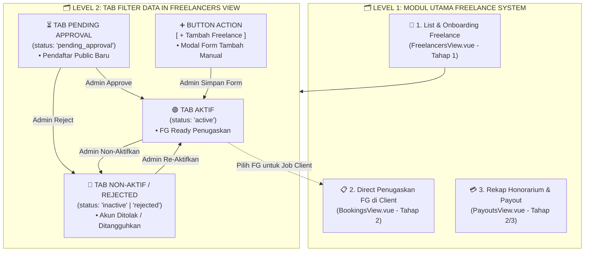
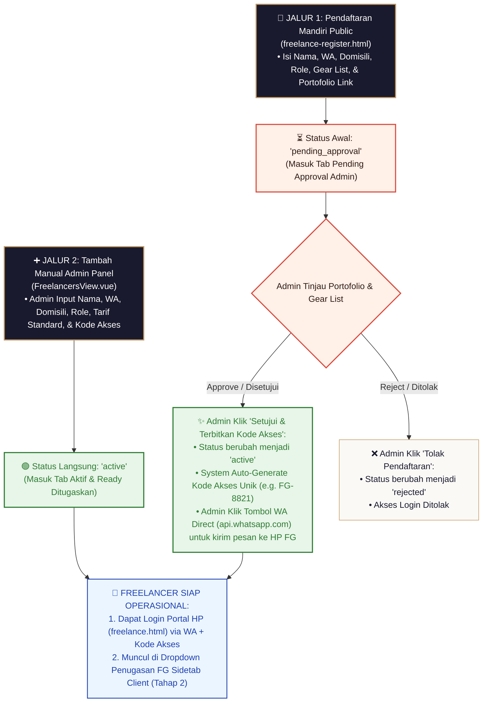

# Cetak Biru Spesifikasi Freelance Tahap 1: List Freelance & Onboarding Tim

> [!NOTE]
> **Wiki System Flow Hub**: [🗺️ Master Flow System](./MASTER_FLOW.md) | [Freelance Overview](./ALUR_FREELANCE.md) | **Freelance Tahap 1: Onboarding** | [Freelance Tahap 2: Portal HP](./FREELANCE_TAHAP2_portal_freelance.md) | [Freelance Tahap 3: Payroll](./FREELANCE_TAHAP3_payroll_freelance.md)

Dokumen ini merupakan panduan spesifikasi arsitektur teknis dan alur kerja (*workflow*) resmi untuk **Freelance Tahap 1: Pengelolaan List Freelance, Pendaftaran Mandiri, Tambah Manual Admin, & Penerbitan Kode Akses Unik**.

---

### 🏛️ 1. Rincian Tampilan UI Minimalis Sidetab List Freelance Admin (`FreelancersView.vue`)

Untuk menjaga antarmuka Admin Panel tetap **super bersih, rapi, kencang, dan tidak ramai (crowded)**, tabel utama disederhanakan hanya menjadi **4 Kolom Ringkas**. Seluruh rincian detail (Gear List, Portofolio, Rekening Bank, & Tombol Aksi Lengkap) dipindahkan ke dalam **Modal Popup `[ 🔍 Detail ]`**.

---

### 🗺️ Diagram Visual Modul Utama & Tab Navigasi Sidetab Freelance:

#### 📌 LEVEL 1: Modul Utama Sistem Freelance Admin (Sub-Navigasi Sidetab):
```text
 ┌────────────────────────────────────────────────────────────────────────────────────────────────────────┐
 │ 🗂️ NAVIGASI UTAMA MODUL FREELANCE ADMIN PANEL                                                            │
 ├────────────────────────────────────────────────────────────────────────────────────────────────────────┤
 │                                                                                                        │
 │  ┌───────────────────────────┐  ┌───────────────────────────┐  ┌───────────────────────────┐           │
 │  │ 👤 MODUL 1: LIST & TIM    │  │ 📋 MODUL 2: PENUGASAN JOB │  │ 💳 MODUL 3: REKAP HONOR   │           │
 │  ├───────────────────────────┤  ├───────────────────────────┤  ├───────────────────────────┤           │
 │  │ • `FreelancersView.vue`   │  │ • Penugaskan FG di Client │  │ • Rekap Honor per Job     │           │
 │  │ • Kelola Biodata & Role   │  │ • Kirim Brief WA Direct   │  │ • Verifikasi Payment Claim│           │
 │  │ • Terbitkan Kode Akses    │  │ • Monitor Status Shooting │  │ • Transfer Bank/E-Wallet  │           │
 │  │ • Approval Pendaftaran    │  │ • (Terintegrasi Client)   │  │ • Status Paid / Unpaid    │           │
 │  └─────────────┬─────────────┘  └───────────────────────────┘  └───────────────────────────┘           │
 │                │                                                                                       │
 └────────────────┼───────────────────────────────────────────────────────────────────────────────────────┘
                  │
                  ▼ (Fokus Utama Tahap 1)
```

#### 📌 LEVEL 2: Tab Filter Status Data pada Tabel List Freelance (`FreelancersView.vue`):
```text
 ┌────────────────────────────────────────────────────────────────────────────────────────────────────────┐
 │ 🗂️ TAB FILTER STATUS DATA (`FreelancersView.vue`)                                                      │
 ├────────────────────────────────────────────────────────────────────────────────────────────────────────┤
 │                                                                                                        │
 │  ┌───────────────────────────┐  ┌───────────────────────────┐  ┌───────────────────────────┐           │
 │  │ 🟢 TAB 1: TAB AKTIF       │  │ ⏳ TAB 2: PENDING APPROVAL │  │ 🔴 TAB 3: NON-AKTIF / REJ │           │
 │  ├───────────────────────────┤  ├───────────────────────────┤  ├───────────────────────────┤           │
 │  │ • Status: `active`        │  │ • Status: `pending...`    │  │ • Status: `rejected` /    │           │
 │  │ • Kode Akses: Diterbitkan │  │ • Belum ada Kode Akses    │  │   `inactive`              │           │
 │  │ • Ready Penugaskan Client │  │ • Menunggu Review Admin   │  │ • Ditolak / Ditangguhkan  │           │
 │  └─────────────┬─────────────┘  └─────────────┬─────────────┘  └─────────────┬─────────────┘           │
 │                │                              │                              │                         │
 └────────────────┼──────────────────────────────┼──────────────────────────────┼─────────────────────────┘
                  │                              │                              │
                  │                              │                              │
 ┌────────────────┴──────────────────────────────┴──────────────────────────────┴─────────────────────────┐
 │ ➕ ACTION BUTTON: `[ + Tambah Freelance ]` (Membuka Modal Form Tambah Manual Instan oleh Admin)       │
 └────────────────────────────────────────────────────────────────────────────────────────────────────────┘
```

#### 📊 Diagram Alur Sistem Navigasi & Filter Freelance (Mermaid):



---

### 🗂️ Layout Tabel Minimalis & Ringkas (4 Kolom Utama):

```text
 🗂️ SIDETAB FREELANCE — KELOLA TIM FREELANCE STUDIO
 ════════════════════════════════════════════════════════════════════════════════════════════════

 [ Tab Aktif (12) ]  [ Tab Pending Approval (3) ]  [ Tab Non-Aktif / Rejected (2) ]   [ + Tambah Freelance ]

 ┌────────────────────────────────┬─────────────────┬───────────────────┬──────────────────────┐
 │ Nama Freelancer & Role         │ Kota Base       │ Kode Akses & WA   │ Aksi                 │
 ├────────────────────────────────┼─────────────────┼───────────────────┼──────────────────────┤
 │ 👤 Arman Syam (📸 FG)          │ 📍 Makassar     │ `FG-8821` [💬 WA] │ [ 🔍 Detail ]        │
 │ 👤 Budi Santoso (🎥 VG)        │ 📍 Depok        │ `FG-9042` [💬 WA] │ [ 🔍 Detail ]        │
 │ 👤 Siti Rahma (✂️ Editor)       │ 📍 Surabaya     │ `FG-7103` [💬 WA] │ [ 🔍 Detail ]        │
 └────────────────────────────────┴─────────────────┴───────────────────┴──────────────────────┘
```

---

### 🔍 Rincian Modal Popup `[ 🔍 Detail ]` Freelancer:

Saat Admin mengeklik tombol **`[ 🔍 Detail ]`** pada salah satu baris tabel, modal popup elegan akan muncul menampilkan rincian lengkap:

```text
 ┌──────────────────────────────────────────────────────────────────────────────────┐
 │ 🔍 DETAIL PROFILE & AKSI FREELANCER (#FG-8821)                                  │
 ├──────────────────────────────────────────────────────────────────────────────────┤
 │ PROFIL UTAMA:                                                                    │
 │ • Nama Lengkap       : Arman Syam                                               │
 │ • Role Spesialisasi  : 📸 Fotografer (Single FG per Sesi)                       │
 │ • WhatsApp           : 6281234567890 [ ───────── [ ✏️ Edit Data ]   [ 🎲 Reset Kode Akses ]   [ 🔴 Non-Aktifkan ] ───────── │
 └──────────────────────────────────────────────────────────────────────────────────┘
```

---

## 🔄 2. Diagram Alur Kerja Visual Freelance Tahap 1 (List & Onboarding Flowchart)

```text
 ┌──────────────────────────────────────────────────────────────────────────────────┐
 │ INPUT FREELANCE BARU (2 JALUR INPUT)                                             │
 └──────────────────────────────────────┬───────────────────────────────────────────┘
                                        │
                      ┌─────────────────┴─────────────────┐
                      │                                   │
             [JALUR 1: PUBLIC REGISTRATION]      [JALUR 2: TAMBAH MANUAL ADMIN]
             Via freelance-register.html         Via Modal + Tambah Freelance
             Status Awal: pending_approval       Status Awal: active
                      │                                   │
                      ▼                                   ▼
 ┌────────────────────────────────────────┐ ┌─────────────────────────────────────┐
 │ VERIFIKASI ADMIN (TAB PENDING)         │ │ LANGSUNG AKTIF DI TAB AKTIF         │
 │ Admin Tinjau Gear List & Portofolio    │ │ System Generate / Set Kode Akses    │
 └────────────────────┬───────────────────┘ └──────────────────┬──────────────────┘
                      │                                        │
             ┌────────┴────────┐                               │
             │                 │                               │
       (Approve)           (Reject)                            │
             │                 │                               │
             ▼                 ▼                               ▼
 ┌──────────────────────┐ ┌──────────────┐ ┌────────────────────────────────────────┐
 │ STATUS: ACTIVE       │ │ STATUS:      │ │ FREELANCER TERDAFTAR DI DATABASE       │
 │ System Auto-Generate │ │ REJECTED     │ │ • Siap ditugaskan di Tahap 2 CLIENT    │
 │ Kode Akses & Kirim   │ │ (Tidak dapat │ │ • Dapat Login Portal HP via            │
 │ WA Notifikasi ke FG  │ │  Kode Akses) │ │   Nomor WA + Kode Akses Unik           │
 └──────────────────────┘ └──────────────┘ └────────────────────────────────────────┘
```

```mermaid
flowchart TD
    classDef startEnd fill:#1A1A2E,stroke:#C59B63,stroke-width:2px,color:#FFF;
    classDef process fill:#FAF9F6,stroke:#C59B63,stroke-width:1px,color:#1A1A2E;
    classDef decision fill:#FFF0E8,stroke:#D94A3D,stroke-width:2px,color:#2D1B14;
    classDef subStage fill:#EBF5FF,stroke:#1E40AF,stroke-width:1.5px,color:#1E40AF;
    classDef gate fill:#E8F5E9,stroke:#2E7D32,stroke-width:2px,color:#2E7D32;

    %% INPUT SOURCES
    J1["📝 JALUR 1: Pendaftaran Mandiri Public<br/>(freelance-register.html)<br/>• Isi Nama, WA, Domisili, Role, Gear List, & Portofolio Link"]:::startEnd --> Pending["⏳ Status Awal: 'pending_approval'<br/>(Masuk Tab Pending Approval Admin)"]:::decision

    J2["➕ JALUR 2: Tambah Manual Admin Panel<br/>(FreelancersView.vue)<br/>• Admin Input Nama, WA, Domisili, Role, Tarif Standard, & Kode Akses"]:::startEnd --> ActiveDirect["🟢 Status Langsung: 'active'<br/>(Masuk Tab Aktif & Ready Ditugaskan)"]:::gate

    %% PENDING APPROVAL FLOW
    Pending --> AdminCheck{"Admin Tinjau Portofolio & Gear List"}:::decision

    AdminCheck -->|Approve / Disetujui| ApproveAction["✨ Admin Klik 'Setujui & Terbitkan Kode Akses':<br/>• Status berubah menjadi 'active'<br/>• System Auto-Generate Kode Akses Unik (e.g. FG-8821)<br/>• Admin Klik Tombol WA Direct (api.whatsapp.com) untuk kirim pesan ke HP FG"]:::gate

    AdminCheck -->|Reject / Ditolak| RejectAction["❌ Admin Klik 'Tolak Pendaftaran':<br/>• Status berubah menjadi 'rejected'<br/>• Akses Login Ditolak"]:::process

    %% READY STATE
    ApproveAction --> ReadyState["🔐 FREELANCER SIAP OPERASIONAL:<br/>1. Dapat Login Portal HP (freelance.html) via WA + Kode Akses<br/>2. Muncul di Dropdown Penugasan FG Sidetab Client (Tahap 2)"]:::subStage
    ActiveDirect --> ReadyState
```��────────┘ └──────────────────┬──────────────────┘
                      │                                        │
             ┌────────┴────────┐                               │
             │                 │                               │
       (Approve)           (Reject)                            │
             │                 │                               │
             ▼                 ▼                               ▼
 ┌──────────────────────┐ ┌──────────────┐ ┌────────────────────────────────────────┐
 │ STATUS: ACTIVE       │ │ STATUS:      │ │ FREELANCER TERDAFTAR DI DATABASE       │
 │ System Auto-Generate │ │ REJECTED     │ │ • Siap ditugaskan di Tahap 2 CLIENT    │
 │ Kode Akses & Kirim   │ │ (Tidak dapat │ │ • Dapat Login Portal HP via            │
 │ WA Notifikasi ke FG  │ │  Kode Akses) │ │   Nomor WA + Kode Akses Unik           │
 └──────────────────────┘ └──────────────┘ └────────────────────────────────────────┘
```



---

## 📌 3. Detail Rincian List Identitas & Parameter Data Freelancer

Data freelancer dikelompokkan secara terstruktur ke dalam **5 Kategori Identitas Utama**:

```text
 ┌──────────────────────────────────────────────────────────────────────────────────┐
 │ IDENTITAS FREELANCER (DATABASE SCHEMA 'freelancers')                             │
 ├──────────────────────────────────────────────────────────────────────────────────┤
 │ 1. PROFIL & KONTAK UTAMA  : Nama, WA (+62 Auto-Format), Email, Kota, Avatar      │
 │ 2. ROLE & PERALATAN       : Role (FG / VG / Editor), Gear List, Portofolio Link  │
 │ 3. REKENING PENCAIRAN     : Tarif Honor, Bank, Nomor Rekening, Nama Pemilik      │
 │ 4. AKSES KEAMANAN         : Kode Akses Unik (e.g. FG-8821), Status Akun           │
 │ 5. METRIK KINERJA         : Total Job Selesai, Total Honor Diterima              │
 └──────────────────────────────────────────────────────────────────────────────────┘

```

---

### 3.1. Kategori 1: Profil & Kontak Utama (Profile & Contact)
1. **Nama Lengkap** (`name` - *String, Wajib*): Nama resmi fotografer.
2. **Nomor WhatsApp Active** (`phone` - *String, Wajib, Unique*):
   - **⚡ Otomatis Normalisasi `+62`**: Input seperti `081234567890` atau `+62 812-3456-7890` **OTOMATIS DIKONVERSI MENJADI FORMAT STANDAR `6281234567890`** oleh backend sanitizer.
   - Digunakan untuk Login Portal HP & Notifikasi WA penugasan.
3. **Email** (`email` - *String, Opsional*): Alamat email fotografer.
4. **Kota Domisili / Base Operasional** (`city` - *String, Wajib Dropdown*): Base kota tempat FG bersedia menerima job (*e.g. Makassar, Depok, Jakarta, Surabaya*).
5. **Alamat Lengkap** (`address` - *Text, Opsional*): Alamat tempat tinggal fotografer.
6. **Foto Profil / ID Card Avatar** (`avatar_url` - *String, Opsional*): Foto profil diri untuk kartu identitas digital di Portal HP (`freelance.html`).

---

### 3.2. Kategori 2: Role, Spesialisasi & Peralatan (Skills & Gear)
> [!IMPORTANT]
> **Aturan Baku Peran Studio:**
> * Pemotretan wisuda **100% MENGGUNAKAN 1 FG TUNGGAL SAJA** (Tidak ada FG 2 / FG pendamping).
> * **TIDAK ADA PILOT DRONE**.

7. **Spesialisasi Role** (`role` - *Enum, Wajib Dropdown*):
   - **`photographer`** (📸 Fotografer — Single FG per Sesi Pemotretan)
   - **`videographer`** (🎥 Videografer — Tim Video Reels / Cinematic Clip)
   - **`editor`** (✂️ Editor — Tim Editing & Retouching Pasca-Produksi)
8. **Daftar Alat / Equipment Gear List** (`gear_list` - *Text, Wajib di Form Public*):
   - Rincian Bodi Kamera (*e.g. Sony A7III, Canon R6*), Lensa (*e.g. 35mm f1.4, 85mm f1.8*), & Lighting (*e.g. Godox V1, Softbox*).
9. **Link Sampel Portofolio Karya** (`portfolio_url` - *String, Wajib di Form Public*): URL Google Drive / Instagram / Website karya terbaik fotografer.

---

### 3.3. Kategori 3: Keuangan & Rekening Bank Pencairan Honor (Financial & Bank)
10. **Tarif Standar Honor per Job** (`default_fee` - *Integer, Wajib Admin Input*): Besaran honor per 1 sesi pemotretan (*e.g. Rp 250.000*).
11. **Nama Bank / E-Wallet** (`bank_name` - *String, Wajib*): Bank/Wallet tujuan pencairan honor (*e.g. BCA, Mandiri, BRI, DANA, OVO*).
12. **Nomor Rekening Bank** (`bank_account_number` - *String, Wajib*): Nomor rekening tujuan transfer.
13. **Nama Pemilik Rekening** (`bank_account_name` - *String, Wajib*): Nama tertera pada buku tabungan.

---

### 3.4. Kategori 4: Akses Keamanan & Autentikasi Sistem (Security Access)
14. **Kode Akses Unik (Access Code)** (`access_code` - *String 8-char, Unique Key*):
    - Kode rahasia unik (*e.g. `FG-8821` / `AMS-9042`*) yang digunakan bersama nomor WA untuk login ke Portal HP. Auto-generated atau di-custom oleh Admin.
15. **Status Akun** (`status` - *Enum, Default: pending_approval / active*):
    - **`pending_approval`**: Baru mendaftar via Form Public, menanti peninjauan & persetujuan Admin.
    - **`active`**: Disetujui Admin, memiliki Kode Akses Unik, & Ready Ditugaskan pada Booking Client.
    - **`rejected`**: Ditolak oleh Admin (Akses Login Ditolak).
    - **`inactive`**: Ditangguhkan sementara oleh Admin.

---

### 3.5. Kategori 5: Metrik Kinerja & Rekapitulasi (Performance & History)
16. **Total Job Selesai** (`total_jobs_completed` - *Integer, Auto-Calculated*): Rekap jumlah sesi pemotretan yang telah dikerjakan.
17. **Total Honorarium Diterima** (`total_payout` - *Integer, Auto-Calculated*): Rekap total dana honor yang telah ditransfer oleh Admin.


---

## 📝 4. Detail Struktur Form Pendaftaran Mandiri Public (`freelance-register.html`)

Halaman registrasi publik ini diakses oleh calon fotografer/tim lapangan untuk mengajukan pendaftaran bergabung dengan studio.

```text
 ┌──────────────────────────────────────────────────────────────────────────────────┐
 │ FORM PENDAFTARAN FREELANCE STUDIO (PUBLIC REGISTRATION)                          │
 ├──────────────────────────────────────────────────────────────────────────────────┤
 │ SECTION 1: IDENTITAS UTAMA & KONTAK                                              │
 │ • Nama Lengkap           : [ Input Nama Lengkap                               ] │
 │ • Nomor WhatsApp Active  : [+62] [ Input Nomor WA                             ] │
 │ • Kota Domisili Base     : [ ▼ Pilih Kota Operasional                         ] │
 │                                                                                  │
 │ SECTION 2: PERAN & PERALATAN (SKILLS & GEAR)                                     │
 │ • Spesialisasi Role      : [ ▼ Pilih Role: Fotografer / Videografer / Editor ] │
 │ • Daftar Alat (Gear)     : [ Textarea: Kamera, Lensa, Lighting, Flash         ] │
 │ • Link Portofolio Karya  : [ Input URL Drive / Instagram / Website Portfolio  ] │
 │                                                                                  │
 │ SECTION 3: REKENING PENCAIRAN HONORARIUM                                         │
 │ • Nama Bank / E-Wallet   : [ ▼ Pilih Bank (BCA, Mandiri, BRI, DANA, OVO, dll) ] │
 │ • Nomor Rekening         : [ Input Nomor Rekening Transfer                    ] │
 │ • Nama Pemilik Rekening  : [ Input Nama Sesuai Buku Tabungan                  ] │
 │                                                                                  │
 │ ──────────── [ 🚀 KIRIM PENDAFTARAN FREELANCE ] ────────────                    │
 └──────────────────────────────────────────────────────────────────────────────────┘
```

### 4.1. Parameter Input Form Registration:

1. **Nama Lengkap** (*Wajib*): Nama resmi pendaftar.
2. **Nomor WhatsApp Active** (*Wajib*): Prefix `+62` otomatis. Digunakan untuk notifikasi kelulusan & username login portal HP.
3. **Kota Domisili / Base Operasional** (*Wajib Dropdown*): Pilihan kota tempat pendaftar bersedia menerima job (*e.g. Makassar, Depok, Jakarta, Surabaya*).
4. **Spesialisasi Role** (*Wajib Dropdown*):
   - `📸 Fotografer` (Single FG per sesi pemotretan)
   - `🎥 Videografer` (Reels & Cinema)
   - `✂️ Editor Foto/Video` (Retouching Pasca-Produksi)
5. **Daftar Alat / Equipment Gear List** (*Wajib Textarea*): Rincian kamera, lensa, & lighting (*e.g. Sony A7III, 35mm f1.4, Godox V1*).
6. **Link Portofolio Karya** (*Wajib URL*): Link Google Drive / Instagram / Website portofolio sampel foto/video terbaik.
7. **Nama Bank / E-Wallet** (*Wajib Dropdown*): Bank/Wallet tujuan pencairan honor (*e.g. BCA, Mandiri, BRI, DANA, OVO*).
8. **Nomor Rekening** (*Wajib Angka*): Nomor rekening tujuan transfer honor jika lolos.
9. **Nama Pemilik Rekening** (*Wajib*): Nama tertera pada buku tabungan/rekening.

---

## ➕ 5. Detail Struktur Modal Tambah Manual Admin (`FreelancersView.vue`)

> [!NOTE]
> **Standarisasi Parameter Biodata (100% Identik):**
> Bidang biodata yang diisikan oleh Admin pada modal ini **100% SAMA DAN IDENTIK** dengan bidang biodata pada Form Pendaftaran Mandiri Public (`freelance-register.html`). Perbedaannya hanya pada penentuan **Tarif Standar Honor (`default_fee`)**, **Kode Akses Unik (`access_code`)**, dan **Status Awal (`active`)** yang langsung ditentukan oleh Admin.

Modal form ini digunakan secara langsung oleh Admin di Admin Panel untuk menambah tim fotografer/editor internal atau langganan studio secara instan.


```text
 ┌──────────────────────────────────────────────────────────────────────────────────┐
 │ MODAL FORM TAMBAH FREELANCE MANUAL (ADMIN PANEL)                                 │
 ├──────────────────────────────────────────────────────────────────────────────────┤
 │ SECTION 1: PROFIL & KONTAK FREELANCER                                            │
 │ • Nama Lengkap           : [ Input Nama Lengkap                               ] │
 │ • Nomor WhatsApp Active  : [+62] [ Input Nomor WA                             ] │
 │ • Kota Domisili Base     : [ ▼ Pilih Kota Operasional                         ] │
 │ • Email (Opsional)       : [ Input Alamat Email                               ] │
 │                                                                                  │
 │ SECTION 2: PERAN & TARIF HONORARIUM                                              │
 │ • Spesialisasi Role      : [ ▼ Pilih Role: Fotografer / Videografer / Editor ] │
 │ • Tarif Standar Honor    : [ Rp 250.000                                       ] │
 │ • Link Portofolio        : [ Input URL Drive / Instagram (Opsional)           ] │
 │                                                                                  │
 │ SECTION 3: REKENING PENCAIRAN (TRANSFER BANK/E-WALLET)                            │
 │ • Nama Bank / E-Wallet   : [ ▼ Pilih Bank (BCA, Mandiri, BRI, DANA, OVO, dll) ] │
 │ • Nomor Rekening         : [ Input Nomor Rekening                             ] │
 │ • Nama Pemilik Rekening  : [ Input Nama Pemilik Rekening                          ] │
 │                                                                                  │
 │ SECTION 4: AKSES SISTEM & AUTENTIKASI                                            │
 │ • Kode Akses Unik (8 char): [ FG-8821 ] [ 🎲 Generate Random ]                   │
 │ • Status Akun            : [ 🟢 Aktif & Ready Penugaskan (active)             ] │
 │                                                                                  │
 │ ───────────── [ ❌ Batal ]   [ 💾 Simpan & Terbitkan Kode Akses ] ───────────── │
 └──────────────────────────────────────────────────────────────────────────────────┘
```

### 5.1. Parameter Input Modal Tambah Admin:

1. **Nama Lengkap** (*Wajib*): Nama fotografer/tim.
2. **Nomor WhatsApp Active** (*Wajib*): Format auto `+62`. Digunakan untuk username login portal HP & notifikasi WA penugasan.
3. **Kota Domisili Base** (*Wajib Dropdown*): Pilihan kota tempat FG bertugas (*e.g. Makassar, Depok, Jakarta, Surabaya*).
4. **Email** (*Opsional*): Alamat email resmi.
5. **Spesialisasi Role** (*Wajib Dropdown*):
   - `📸 Fotografer` (Single FG per sesi pemotretan)
   - `🎥 Videografer` (Reels & Cinema)
   - `✂️ Editor Foto/Video` (Retouching Pasca-Produksi)
6. **Tarif Standar Honor per Job (`default_fee`)** (*Wajib Input Angka*): Besaran honor per 1 sesi pemotretan (*e.g. Rp 250.000*).
7. **Link Portofolio** (*Opsional*): URL Drive / Instagram karya fotografer.
8. **Nama Bank / E-Wallet** (*Wajib Dropdown*): *BCA, Mandiri, BRI, DANA, OVO, dll.*
9. **Nomor Rekening Bank** (*Wajib Input Angka*): Nomor rekening penerima honor.
10. **Nama Pemilik Rekening** (*Wajib Input*): Nama tertera pada buku tabungan.
11. **Kode Akses Unik (`access_code`)** (*Wajib 8-Char Key*): System Auto-Generate (e.g. `FG-8821`) atau di-custom Admin.
12. **Status Akun** (*Default: `active`*): Langsung aktif dan siap ditugaskan pada Sidetab Client.

---

## 🗄️ 6. Ringkasan Status State Freelance Tahap 1

| Status State | Tab UI Admin | Status Kode Akses | Kesiapan Job Penugasan |
| :--- | :--- | :--- | :--- |
| **`pending_approval`** | Tab Pending | Belum Diterbitkan | 🔴 Belum Bisa Ditugaskan |
| **`rejected`** | Tab Rejected | Tidak Diterbitkan | 🔴 Ditolak |
| **`active`** | Tab Aktif | **🟢 Aktif & Diterbitkan (e.g. `FG-8821`)** | **🟢 Ready Ditugaskan di Tahap 2** |
| **`inactive`** | Tab Non-Aktif | 🔴 Ditangguhkan Sementara | 🔴 Ditangguhkan |

---

*Dokumen cetak biru spesifikasi Freelance Tahap 1 (List Freelance & Onboarding) ini resmi tersimpan sebagai acuan teknis utama.*


