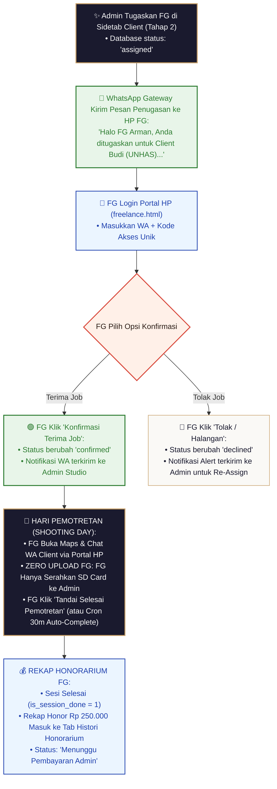

# Cetak Biru Spesifikasi Freelance Tahap 2: Portal HP Freelance & Penugasan Pemotretan

Dokumen ini merupakan panduan spesifikasi arsitektur teknis dan alur kerja (*workflow*) resmi untuk **Freelance Tahap 2: Autentikasi Portal HP, Penugasan Job Pemotretan, Konfirmasi Kesiapan, Eksekusi Hari Pemotretan, & Rekapitulasi Honorarium**.

---

## 🏛️ 1. Rincian Tampilan UI Portal HP Freelance (`/freelance.html`)

Portal Freelance didesain **100% Mobile-First** untuk kenyamanan penggunaan langsung dari HP Fotografer/Tim Lapangan di lokasi pemotretan.

```text
 📱 PORTAL HP FREELANCE — MOBILE DASHBOARD (/freelance.html)
 ════════════════════════════════════════════════════════════════════════════════════════════════

 👤 Arman Syam (📸 Fotografer) | 📍 Makassar | Kode: `FG-8821`

 [ 📋 Penugasan Job (2) ]   [ 💰 Histori Honorarium ]   [ 🔒 Logout ]

 ┌──────────────────────────────────────────────────────────────────────────────────┐
 │ 📌 KARTU JOB PEMOTRETAN (WISUDA UNHAS — #BOOK-101)                              │
 ├──────────────────────────────────────────────────────────────────────────────────┤
 │ • Client / Wisudawan : Budi Santoso (Universitas Hasanuddin)                     │
 │ • Tanggal & Waktu    : 📅 Sabtu, 15 Oktober 2026 • ⏰ 09:00 WITA                │
 │ • Lokasi Pemotretan  : 📍 Lapangan Kampus Unhas Tamalanrea                       │
 │                        [ 🗺️ Buka Google Maps ]                                  │
 │ • Kontak Client      : 📞 081234567890 [ 💬 Chat WA Client ]                     │
 │ • Paket Sesi & Brief : Paket Silver (1 Sesi) | [ 📄 Lihat Moodboard Pose ]       │
 │ • Besaran Honor      : 💵 Rp 250.000 (Honor Standard FG)                         │
 ├──────────────────────────────────────────────────────────────────────────────────┤
 │ STATUS KONFIRMASI JOB:                                                           │
 │ [ 🟢 Konfirmasi Terima Job ]        [ 🔴 Tolak / Halangan ]                     │
 ├──────────────────────────────────────────────────────────────────────────────────┤
 │ AKSI HARI PEMOTRETAN:                                                            │
 │ ⚡ [ 📸 TANDAI SELESAI PEMOTRETAN ] (Zero Upload: Serahkan SD Card ke Admin)     │
 └──────────────────────────────────────────────────────────────────────────────────┘
```

---

## 🔄 2. Diagram Alur Kerja Visual Freelance Tahap 2 (Portal & Execution Flowchart)

```text
 ┌──────────────────────────────────────────────────────────────────────────────────┐
 │ ADMIN PENUGASKAN FG DI SIDETAB CLIENT TAHAP 2 (Status: assigned)                 │
 └──────────────────────────────────────┬───────────────────────────────────────────┘
                                        │
                                        ▼
 ┌──────────────────────────────────────────────────────────────────────────────────┐
 │ NOTIFIKASI WA TERKIRIM KE HP FREELANCER (WhatsApp Gateway)                       │
 │ • Pesan memuat: Nama Client, Tanggal, Lokasi, Honor, & Link Portal HP           │
 └──────────────────────────────────────┬───────────────────────────────────────────┘
                                        │
                                        ▼
 ┌──────────────────────────────────────────────────────────────────────────────────┐
 │ FREELANCER LOGIN PORTAL HP (freelance.html via WA + Access Code)                 │
 └──────────────────────────────────────┬───────────────────────────────────────────┘
                                        │
                      ┌─────────────────┴─────────────────┐
                      │                                   │
             (Disetujui FG)                      (Ditolak FG)
             Klik Terima Job                     Klik Tolak Job
                      │                                   │
                      ▼                                   ▼
 ┌────────────────────────────────────────┐ ┌─────────────────────────────────────┐
 │ STATUS: CONFIRMED                      │ │ STATUS: DECLINED                    │
 │ • Admin mendapat Notifikasi WA Confirm │ │ • Admin mendapat Notifikasi WA Alert│
 │ • Job Terkunci di Jadwal FG            │ │ • Admin Tugaskan FG Lain            │
 └────────────────────┬───────────────────┘ └─────────────────────────────────────┘
                      │
                      ▼
 ┌──────────────────────────────────────────────────────────────────────────────────┐
 │ HARI PEMOTRETAN (SHOOTING DAY EXECUTION):                                        │
 │ 1. FG akses Google Maps & WA Client langsung dari Portal HP                     │
 │ 2. Zero Upload FG: FG TIDAK UPLOAD KE DRIVE (Cukup serahkan SD Card ke Admin)    │
 │ 3. FG Klik [ 📸 Tandai Selesai Pemotretan ] ──► is_session_done = 1              │
 │    *(Atau di-auto-complete oleh Background Cron 30 Menit)*                       │
 └──────────────────────────────────────┬───────────────────────────────────────────┘
                                        │
                                        ▼
 ┌──────────────────────────────────────────────────────────────────────────────────┐
 │ TRANSISI OTOMATIS KE TAHAP 3 PASCA-PRODUKSI & REKAP HONORARIUM                   │
 │ Job berpindah ke Tab Histori Honorarium FG (Status: Pending Pembayaran Admin)    │
 └──────────────────────────────────────────────────────────────────────────────────┘
```



---

## 📌 3. Detail Aturan Operasional Freelance Tahap 2

### 3.1. Rules Zero Upload FG (Bebas Beban Kuota & Anti-Trouble)
> [!IMPORTANT]
> **Aturan Baku Zero Upload FG:**
> * Fotografer di lapangan **TIDAK PERNAH DIBEBANKAN UPLOAD FOTO KE GOOGLE DRIVE**.
> * Fotografer cukup fokus memotret secara maksimal.
> * Setelah pemotretan selesai, SD Card / File mentah diserahkan langsung ke Admin Studio.
> * Pengunggahan berkas ke Google Drive **100% TERPUSAT DILAKUKAN OLEH ADMIN STUDIO** dari Admin Dashboard (`direct-upload.js` Direct Stream Upload API).

---

### 3.2. Fitur Selesai Pemotretan Ganda (Manual Click & Auto Cron 30m)
1. **Pintu Manual (Tombol Portal HP)**:
   - FG mengeklik tombol **`[ 📸 Tandai Selesai Pemotretan ]`** di Portal HP.
   - Database meng-update `is_session_done = 1`.
2. **Pintu Otomatis (Background Cron 30 Menit)**:
   - Jika FG lupa mengeklik tombol selesai akibat kesibukan di lapangan, **Background Cron Worker** (berjalan tiap 30 menit) akan memeriksa sesi foto yang jam selesainya telah lewat $\ge 30$ menit dan meng-update `is_session_done = 1` secara otomatis.

---

### 3.3. Transparansi Rekapitulasi Honorarium & Payout
- **Tab Histori Honorarium** di Portal HP menyajikan rincian:
  - Kode Booking & Nama Client
  - Tanggal Pemotretan & Besaran Honor (`fg_fee`)
  - **Status Payout**:
    - `⏳ Menunggu Pembayaran Admin` (`payout_status = 'pending'`)
    - `🟢 Honor Lunas Ditransfer` (`payout_status = 'paid'`, disertai link Bukti Transfer dari Admin).

---

*Dokumen cetak biru spesifikasi Freelance Tahap 2 (Portal HP & Execution) ini resmi tersimpan sebagai acuan teknis utama.*
