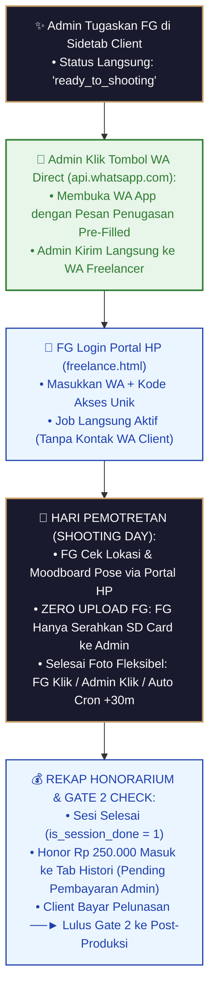

# Cetak Biru Spesifikasi Freelance Tahap 2: Portal HP Freelance & Penugasan Pemotretan

> [!NOTE]
> **Wiki System Flow Hub**: [🗺️ Master Flow System](./MASTER_FLOW.md) | [Freelance Overview](./ALUR_FREELANCE.md) | [Freelance Tahap 1: Onboarding](./FREELANCE_TAHAP1_list_freelance.md) | **Freelance Tahap 2: Portal HP** | [Freelance Tahap 3: Payroll](./FREELANCE_TAHAP3_payroll_freelance.md)

Dokumen ini merupakan panduan spesifikasi arsitektur teknis dan alur kerja (*workflow*) resmi untuk **Freelance Tahap 2: Autentikasi Portal HP, Penugasan Job Pemotretan, Konfirmasi Kesiapan, Eksekusi Hari Pemotretan, & Rekapitulasi Honorarium**.

---

## 🏛️ 1. Rincian Tampilan UI Portal HP Freelance (`/freelance.html`)

Portal Freelance didesain **100% Mobile-First** untuk kenyamanan penggunaan langsung dari HP Fotografer/Tim Lapangan di lokasi pemotret```text
 📱 PORTAL HP FREELANCE — MOBILE DASHBOARD (/freelance.html)
 ════════════════════════════════════════════════════════════════════════════════════════════════

 👤 Arman Syam (📸 Fotografer) | 📍 Makassar | Kode: `FG-8821`

 [ 📋 Job Aktif (2) ]   [ 📸 Selesai Sesi Pemotretan (14) ]   [ 💰 Histori Honorarium ]   [ 🔒 Logout ]

 📋 DAFTAR JOB AKTIF (LIST RINGKAS MOBILE):
 ┌──────────────────────────────────────────────────────────────────────────────────────────────┐
 │ Nama Client & Univ       │ Tanggal & Jam Pemotretan  │ Lokasi Pemotretan       │ Aksi        │
 ├──────────────────────────────────────────────────────────────────────────────────────────────┤
 │ 👤 Budi Santoso (UNHAS)  │ 📅 Sabtu, 15 Okt • 09:00  │ 📍 Kampus Tamalanrea    │ [ 🔍 Detail ]│
 │ 👤 Siti Aminah (UNM)     │ 📅 Minggu, 16 Okt • 13:00 │ 📍 Kampus Parangtambung │ [ 🔍 Detail ]│
 └──────────────────────────────────────────────────────────────────────────────────────────────┘
```

---

### 🔍 Rincian Modal Popup `[ 🔍 Detail ]` Job Pemotretan:

Saat Freelancer mengeklik tombol **`[ 🔍 Detail ]`** pada salah satu baris list di atas, modal popup elegan akan muncul menampilkan seluruh informasi lengkap:

```text
 ┌──────────────────────────────────────────────────────────────────────────────────┐
 │ 🔍 DETAIL RINCIAN JOB PEMOTRETAN (#BOOK-101)                                    │
 ├──────────────────────────────────────────────────────────────────────────────────┤
 │ INFORMASI CLIENT & JADWAL:                                                       │
 │ • Nama Client        : Budi Santoso                                             │
 │ • Asal Universitas   : Universitas Hasanuddin (UNHAS)                            │
 │ • Tanggal & Jam     : 📅 Sabtu, 15 Oktober 2026 • ⏰ 09:00 WITA                │
 │ • Lokasi Pemotretan  : 📍 Lapangan Kampus Unhas Tamalanrea                       │
 │                                                                                  │
 │ KONTAK WA CLIENT (H-1 RELEASE):                                                  │
 │ • Kontak WA Client   : 🔒 Disembunyikan (Terbuka Otomatis saat H-1 & Hari H)    │
 │   *(Saat H-1 & Hari H)*: 📞 081234567890 [ 💬 Chat WA Client ]                     │
 │                                                                                  │
 │ PAKET SESI & BRIEF:                                                              │
 │ • Paket Pemotretan   : Paket Silver (1 Sesi Pemotretan)                          │
 │ • Moodboard Brief    : [ 📄 Lihat Moodboard Pose PDF ]                          │
 │ • Honorarium FG      : 💵 Rp 250.000 (Honor Standard FG)                         │
 │ • Status Job         : 🟢 READY TO SHOOTING (Ditetapkan oleh Admin)              │
 ├──────────────────────────────────────────────────────────────────────────────────┤
 │ AKSI FREELANCER:                                                                 │
 │ ⚡ [ 📸 TANDAI SELESAI PEMOTRETAN ] (Zero Upload: Serahkan SD Card ke Admin)     │
 │ *(Jika di Tab Selesai Sesi)*: 💬 [ 💳 REQUEST PAYMENT / TAGIH HONOR KE ADMIN ]   │
 └──────────────────────────────────────────────────────────────────────────────────┘
```

> [!NOTE]
> **Perpindahan Tab Otomatis Sesi Selesai (`is_session_done = 1`):**
> * Begitu sesi pemotretan ditandai selesai (baik via tombol manual FG, tombol Admin, maupun Cron +30m), item job **OTOMATIS BERPINDAH** dari Tab **`[ 📋 Job Aktif ]`** ke Tab **`[ 📸 Selesai Sesi Pemotretan ]`**.
> * **Fitur Request Payment**: Di dalam Modal Popup Detail pada Tab Selesai Sesi Pemotretan, Freelancer memiliki tombol **`[ 💳 Request Payment / Tagih Honor ]`**. Saat diklik, sistem membuka WhatsApp via **Direct WA Link (`api.whatsapp.com`)** ke Nomor WA Admin Studio dengan format pesan rincian pencairan honorarium pra-terisi.

> [!IMPORTANT]
> **Aturan Pembukaan Kontak Client (H-1 Release Rule):**
> * **Sebelum H-1 (H-3 dst)**: Kontak telepon/WA client **DISEMBUNYIKAN** di Portal Freelancer demi kerahasiaan & proteksi transaksi studio.
> * **Mulai H-1 & Hari H Pemotretan**: Kontak WA client **OTOMATIS TERBUKA & DITAMPILKAN** di Modal Popup Detail beserta tombol `[ 💬 Chat WA Client ]`.
> * **Tujuan H-1 Release**: Memungkinkan Freelancer berkordinasi langsung dengan client mengenai titik temu, pakaian, dan aba-aba lokasi pada H-1 dan Hari H pemotretan.�� Menunggu Pembayaran Admin                              │
 ├──────────────────────────────────────────────────────────────────────────────────┤
 │ AKSI FREELANCER:                                                                 │
 │ 💬 [ 💳 REQUEST PAYMENT / TAGIH HONOR KE ADMIN ] (Buka Direct WA Link Admin)     │
 └──────────────────────────────────────────────────────────────────────────────────┘
```

> [!NOTE]
> **Perpindahan Tab Otomatis Sesi Selesai (`is_session_done = 1`):**
> * Begitu sesi pemotretan ditandai selesai (baik via tombol manual FG, tombol Admin, maupun Cron +30m), kartu job **OTOMATIS BERPINDAH** dari Tab **`[ 📋 Job Aktif ]`** ke Tab **`[ 📸 Selesai Sesi Pemotretan ]`**.
> * **Fitur Request Payment**: Di Tab Selesai Sesi Pemotretan, Freelancer memiliki tombol **`[ 💳 Request Payment / Tagih Honor ]`**. Saat diklik, sistem membuka WhatsApp via **Direct WA Link (`api.whatsapp.com`)** ke Nomor WA Admin Studio dengan format pesan rincian pencairan honorarium pra-terisi.

> [!IMPORTANT]
> **Aturan Pembukaan Kontak Client (H-1 Release Rule):**
> * **Sebelum H-1 (H-3 dst)**: Kontak telepon/WA client **DISEMBUNYIKAN** di Portal Freelancer demi kerahasiaan & proteksi transaksi studio.
> * **Mulai H-1 & Hari H Pemotretan**: Kontak WA client **OTOMATIS TERBUKA & DITAMPILKAN** di Portal HP Freelancer beserta tombol `[ 💬 Chat WA Client ]`.
> * **Tujuan H-1 Release**: Memungkinkan Freelancer berkordinasi langsung dengan client mengenai titik temu, pakaian, dan aba-aba lokasi pada H-1 dan Hari H pemotretan.

---

## 🔄 2. Diagram Alur Kerja Visual Freelance Tahap 2 (Direct Assignment & Execution Flowchart)

```text
 ┌──────────────────────────────────────────────────────────────────────────────────┐
 │ ADMIN PENUGASKAN FG DI SIDETAB CLIENT TAHAP 2 (Status: assigned / ready)         │
 └──────────────────────────────────────┬───────────────────────────────────────────┘
                                        │
                                        ▼
 ┌──────────────────────────────────────────────────────────────────────────────────┐
 │ ADMIN KLIK TOMBOL NOTIFIKASI WA DIRECT (api.whatsapp.com / WA.me)                │
 │ • Admin klik tombol [ 💬 Kirim WA Penugasan ] di Admin Dashboard                 │
 │ • Membuka App WhatsApp dengan teks template penugasan otomatis terisi            │
 │ • Admin kirim pesan penugasan langsung ke HP Freelancer                          │
 └──────────────────────────────────────┬───────────────────────────────────────────┘
                                        │
                                        ▼
 ┌──────────────────────────────────────────────────────────────────────────────────┐
 │ FREELANCER LOGIN PORTAL HP (freelance.html via WA + Access Code)                 │
 │ • Penugasan LANGSUNG AKTIF & Tampil di Dashboard HP Freelancer                   │
 └──────────────────────────────────────┬───────────────────────────────────────────┘
                                        │
                                        ▼
 ┌──────────────────────────────────────────────────────────────────────────────────┐
 │ HARI PEMOTRETAN (SHOOTING DAY EXECUTION):                                        │
 │ 1. FG cek Teks Lokasi Pemotretan & Moodboard Pose (PDF) dari Portal HP           │
 │ 2. Zero Upload FG: FG TIDAK UPLOAD KE DRIVE (Cukup serahkan SD Card ke Admin)    │
 │ 3. Selesai Foto Fleksibel (3 Pintu): FG Klik / Admin Klik / Auto Cron +30m       │
 │    ──► is_session_done = 1                                                       │
 └──────────────────────────────────────┬───────────────────────────────────────────┘
                                        │
                                        ▼
 ┌──────────────────────────────────────────────────────────────────────────────────┐
 │ REKAP HONORARIUM & VERIFIKASI PELUNASAN CLIENT (GATE 2)                          │
 │ • Job berpindah ke Tab Histori Honorarium FG (Status: Pending Pembayaran Admin)  │
 │ • Booking di Sidetab Client lanjut ke Pelunasan (Gate 2) sebelum ke Editing      │
 └──────────────────────────────────────────────────────────────────────────────────┘
```



---

## 📌 3. Detail Aturan Operasional Freelance Tahap 2

### 3.1. Rules Zero Upload FG (Bebas Beban Kuota & Anti-Trouble)
> [!IMPORTANT]
> **Aturan Baku Zero Upload FG:**
> * Fotografer di lapangan **TIDAK PERNAH DIBEBANKAN UPLOAD FOTO KE GOOGLE DRIVE**.
> * Fotografer cukup fokus memotret secara maksimal.
> * Setelah pemotretan selesai, SD Card / File mentah diserahkan langsung ke Admin Studio.
> * Pengunggahan berkas ke Google Drive **100% TERPUSAT DILAKUKAN OLEH ADMIN STUDIO** dari Admin Dashboard (`direct-upload.js` Direct Stream Upload API).

---

### 3.2. Fitur Selesai Pemotretan Fleksibel (3 Pintu Eksekusi & Auto Cron +30m Toleransi)
> [!NOTE]
> Penandaan **Sesi Pemotretan Selesai (`is_session_done = 1`)** didesain **SUPER FLEKSIBEL** dan dapat dipicu melalui 3 pintu utama:

1. **Pintu 1 — Freelancer (Portal HP `freelance.html`)**:
   - FG mengeklik tombol **`[ 📸 Tandai Selesai Pemotretan ]`** langsung dari lokasi pemotretan.
2. **Pintu 2 — Admin Studio (Admin Dashboard `BookingsView.vue`)**:
   - Admin mengeklik tombol penandaan selesai secara manual dari Sidetab CLIENT jika FG berhalangan mengeklik.
3. **Pintu 3 — Otomasi Background Cron (+30 Menit Toleransi)**:
   - Jika FG dan Admin lupa mengeklik tombol akibat kesibukan di lapangan, **Background Cron Worker** akan menghitung:
     $$WaktuToleransi = TanggalWisuda + JamMulai + DurasiSesi + 30\text{ Menit}$$
   - Begitu waktu saat ini telah melewati $WaktuToleransi$, Cron meng-update `is_session_done = 1` secara otomatis.

---

### 3.3. Aturan Transisi Ke Tahap Post-Produksi (Syarat Mutlak Gate 2 Pelunasan)
> [!CAUTION]
> **Sesi Foto Selesai TIDAK LANGSUNG Pindah ke Sidetab Post-Produksi / Editing:**
> * Menandai `is_session_done = 1` HANYA menandai bahwa sesi pemotretan telah selesai.
> * Booking **TETAP BERADA DI SIDETAB CLIENT** pada status **`💳 Menunggu Pelunasan`** bagi client yang masih memiliki sisa pembayaran (DP).
> * Client mengunggah bukti sisa pelunasan di `tracking.html` untuk diverifikasi Admin (`balance_status = 'paid'`).
> * **Syarat Mutlak Lulus Gate 2 ke Post-Produksi / Editing**:
>   1. **Sesi Pemotretan Selesai**: `is_session_done = 1` (Pilihan: via FG, Admin, atau Cron +30m).
>   2. **Pembayaran 100% Lunas**: `balance_status = 'paid'` ATAU `balance_amount = 0`.
> * Jika client sudah bayar **Lunas 100% sejak awal** (tanpa sisa DP), booking otomatis langsung masuk ke Sidetab Post-Produksi (*Auto-Bypass*).

---

### 3.4. Transparansi Rekapitulasi Honorarium & Payout
- **Tab Histori Honorarium** di Portal HP menyajikan rincian:
  - Kode Booking & Nama Client
  - Tanggal Pemotretan & Besaran Honor (`fg_fee`)
  - **Status Payout**:
    - `⏳ Menunggu Pembayaran Admin` (`payout_status = 'pending'`)
    - `🟢 Honor Lunas Ditransfer` (`payout_status = 'paid'`, disertai link Bukti Transfer dari Admin).

---

### 3.5. Cron Service Reminder Menuju Hari H (H-3, H-1, & Hari H Selesai)
> [!NOTE]
> Sistem memiliki **Background Cron Worker** yang berjalan secara berkala untuk menjaga disiplin jadwal dan kesiapan tim freelance menuju hari pemotretan:

1. **🔔 Cron Reminder H-3 Pemotretan**:
   - Berjalan otomatis mengecek seluruh jadwal pemotretan yang tersisa 3 hari lagi.
   - Menyiapkan tautan Direct WA (`api.whatsapp.com`) untuk Admin melakukan pengingat kesiapan awal kepada Freelancer.
2. **⏰ Cron Reminder H-1 Pemotretan (Pembukaan Akses Kontak Client)**:
   - Berjalan otomatis mengecek pemotretan yang berlangsung besok hari (H-1).
   - **Membuka Akses Kontak WA Client** di Portal HP Freelancer (`[ 💬 Chat WA Client ]`).
   - Menyiapkan tautan Direct WA (`api.whatsapp.com`) untuk Admin melakukan konfirmasi akhir peralatan & koordinasi dengan Freelancer.
3. **⚡ Cron Auto-Complete Sesi Foto (+30 Menit Toleransi)**:
   - Berjalan tiap 30 menit mengecek sesi foto Hari H yang sudah lewat durasi $+ 30$ menit.
   - Otomatis menandai sesi selesai (`is_session_done = 1`) jika FG/Admin belum mengeklik tombol manual.

---

*Dokumen cetak biru spesifikasi Freelance Tahap 2 (Portal HP & Execution) ini resmi tersimpan sebagai acuan teknis utama.*
