# Cetak Biru Spesifikasi Freelance Tahap 3: Pengelolaan Payroll & Rekapitulasi Honorarium Freelance

> [!NOTE]
> **Wiki System Flow Hub**: [🗺️ Master Flow System](./MASTER_FLOW.md) | [Freelance Overview](./ALUR_FREELANCE.md) | [Freelance Tahap 1: Onboarding](./FREELANCE_TAHAP1_list_freelance.md) | [Freelance Tahap 2: Portal HP](./FREELANCE_TAHAP2_portal_freelance.md) | **Freelance Tahap 3: Payroll**

Dokumen ini merupakan panduan spesifikasi arsitektur teknis dan alur kerja (*workflow*) resmi untuk **Freelance Tahap 3: Pengelolaan Payroll Admin, Rekapitulasi Honorarium per Job, Verifikasi & Validasi Pre-Payment via WhatsApp, Selection/Bulk Payout per Client, Transfer Bank/E-Wallet, & Pencatatan Status Payout (`unpaid` / `paid` / `pending`)**.

---

### 🏛️ 1. Rincian Tampilan UI Sidetab Payroll Freelance Admin (`PayrollView.vue`)

Untuk menjaga operasional pembayaran honorarium studio tetap **transparan, terstruktur, akurat, dan cepat**, Sidetab Payroll Admin Panel (`PayrollView.vue`) dibagi menjadi **3 Tab Filter Utama** dan tabel ringkas ber-performa tinggi dengan fitur pengelompokan per fotografer dan pemilihan massal (*bulk selection*).

---

### 🗺️ Diagram Visual Struktur Navigasi Sidetab Payroll Admin:

```text
 ┌────────────────────────────────────────────────────────────────────────────────────────────────────────┐
 │ 🗂️ NAVIGASI TAB SIDETAB PAYROLL FREELANCE (`PayrollView.vue`)                                           │
 ├────────────────────────────────────────────────────────────────────────────────────────────────────────┤
 │                                                                                                        │
 │  ┌───────────────────────────┐  ┌───────────────────────────┐  ┌───────────────────────────┐           │
 │  │ ⏳ TAB 1: BELUM DIBAYAR   │  │ ✅ TAB 2: SUDAH DIBAYAR   │  │ 📋 TAB 3: SEMUA PAYOUT    │           │
 │  ├───────────────────────────┤  ├───────────────────────────┤  ├───────────────────────────┤           │
 │  │ • Status: `pending`       │  │ • Status: `paid`          │  │ • Histori Lengkap Studio  │           │
 │  │ • Pengelompokan per FG    │  │ • Resi Transfer Terlampir │  │ • Akumulasi Bulanan Studio│           │
 │  │ • Selection per Client    │  │ • Tercatat di Kas Studio  │  │ • Payout per Role/FG      │           │
 │  └─────────────┬─────────────┘  └─────────────┬─────────────┘  └─────────────┬─────────────┘           │
 │                │                              │                              │                         │
 └────────────────┼──────────────────────────────┼──────────────────────────────┼─────────────────────────┘
```

---

### 🗂️ Layout Tabel Sidetab Payroll Admin (Tab Belum Dibayar / Pending Grouped View):

```text
 🗂️ SIDETAB PAYROLL — KELOLA PAYOUT & HONORARIUM FREELANCE
 ════════════════════════════════════════════════════════════════════════════════════════════════

 [ ⏳ Belum Dibayar (4) ]   [ ✅ Sudah Dibayar (28) ]   [ 📋 Semua ]

 ┌───────────────────────────┬───────────────┬──────────────────┬──────────────┬──────────────────────────┐
 │ Fotografer (FG) & No. WA  │ Jumlah Client │ Total Fee Payout │ Status Sesi  │ Aksi Admin               │
 ├───────────────────────────┼───────────────┼──────────────────┼──────────────┼──────────────────────────┤
 │ 👤 Arman Syam             │ 🎓 3 Client   │ Rp 750.000       │ ✓ 3/3 Selesai│ [ 🔍 Detail & Bayar ]    │
 │    (BCA: 1234567 a/n Arman)│               │                  │              │                          │
 │ 👤 Siti Rahma             │ 🎓 2 Client   │ Rp 300.000       │ ⏳ 1/2 Selesai│ [ 🔍 Detail & Bayar ]    │
 │    (DANA: 08123456.. )    │               │                  │              │                          │
 └───────────────────────────┴───────────────┴──────────────────┴──────────────┴──────────────────────────┘
```

---

## 🔍 2. Rincian Modal Popup & Alur Validasi Pre-Transfer

Proses pembayaran honorarium terdiri dari **2 Tahap Modal Popup di UI Admin** dan **1 Alur Validasi Direct WhatsApp** sebelum dana ditransfer:

---

### 📱 2.1 Modal Popup 1: Detail Rincian Project & Bulk Selection (`showDetailModal`)

Saat Admin mengeklik tombol **`[ 🔍 Detail & Bayar ]`** pada baris freelancer, modal interaktif ini akan muncul. Admin dapat menandai (*checkbox*) client mana saja yang akan dibayarkan:

```text
 ┌──────────────────────────────────────────────────────────────────────────────────────────────────┐
 │ 📸 RINCIAN PAYROLL FREELANCER — Arman Syam                                                       │
 ├──────────────────────────────────────────────────────────────────────────────────────────────────┤
 │ INFO REKENING TUJUAN:                                                                            │
 │ • Bank / E-Wallet : 🏦 Bank BCA - 1234567890 (A/N: Arman Syam)                                   │
 │ • No. HP / WA     : 081234567890                                                                 │
 │                                                                                                  │
 │ DAFTAR CLIENT / PROJECT (BULK SELECTION):                                                        │
 │ ┌───┬─────────────────────────────────┬───────────────────┬──────────────┬─────────────────────┐ │
 │ │ ☑ │ Klien / Project                 │ Lokasi            │ Fee Payout   │ Status Sesi         │ │
 │ ├───┼─────────────────────────────────┼───────────────────┼──────────────┼─────────────────────┤ │
 │ │ ☑ │ 🎓 Budi Santoso (15 Okt 2026)    │ UNHAS Makassar    │ Rp 250.000   │ File Disetor        │ │
 │ │ ☑ │ 🎓 Andi Ahmad (15 Okt 2026)     │ UNM Parangtambung │ Rp 250.000   │ File Disetor        │ │
 │ │ ☐ │ 🎓 Siti Nurhaliza (16 Okt 2026)  │ UIN Alauddin      │ Rp 250.000   │ Sesi Selesai        │ │
 │ └───┴─────────────────────────────────┴───────────────────┴──────────────┴─────────────────────┘ │
 │                                                                                                  │
 │ RINGKASAN AKSI PAYOUT:                                                                           │
 │ • Terpilih : 2 dari 3 project                                                                    │
 │ • Total Fee: Rp 500.000                                                                         │
 │                                                                                                  │
 │ ───────────── [ ❌ Batal ]   [ 💬 Validasi WA ]   [ 💸 Bayar Selected ] ──────────────────────── │
 └──────────────────────────────────────────────────────────────────────────────────────────────────┘
```

---

### 💬 2.2 Tampilan Chat Direct WhatsApp Validasi Pre-Transfer (Admin ➔ Freelancer)

Ketika Admin mengeklik tombol **`[ 💬 Validasi WA ]`** pada Modal 1, sistem membuka tautan WhatsApp (`wa.me`) ke nomor Freelancer. Pesan terisi otomatis berisi detail lengkap client terpilih, total nominal, dan rekening tujuan untuk diverifikasi oleh Freelancer **SEBELUM** transfer diproses:

```text
 ┌──────────────────────────────────────────────────────────────────────────────────────────────────┐
 │ 💬 WHATSAPP DIRECT CHAT — VALIDASI PAYROLL SEBELUM TRANSFER                                      │
 ├──────────────────────────────────────────────────────────────────────────────────────────────────┤
 │                                                                                                  │
 │  ┌───────────────────────────────────────────────────────────────────────────┐                   │
 │  │ Halo Arman Syam, mohon konfirmasi rincian fee berikut sebelum kami       │                   │
 │  │ transfer:                                                                 │                   │
 │  │                                                                           │                   │
 │  │ Rincian Tugas:                                                            │                   │
 │  │ 1. Klien: Budi Santoso (15 Oktober 2026) - Fee: Rp 250.000                │                   │
 │  │ 2. Klien: Andi Ahmad (15 Oktober 2026) - Fee: Rp 250.000                 │                   │
 │  │                                                                           │                   │
 │  │ Total yang akan dibayarkan: *Rp 500.000*                                  │                   │
 │  │                                                                           │                   │
 │  │ Rekening tujuan:                                                          │                   │
 │  │ Bank: Bank BCA                                                            │                   │
 │  │ No. Rek: 1234567890                                                       │                   │
 │  │ A/N: Arman Syam                                                           │                   │
 │  │                                                                           │                   │
 │  │ Jika data di atas sudah sesuai, mohon membalas pesan ini agar proses      │                   │
 │  │ transfer dapat segera diproses. Terima kasih!                             │                   │
 │  └───────────────────────────────────────────────────────────────────────────┘                   │
 │                                                                                                  │
 └──────────────────────────────────────────────────────────────────────────────────────────────────┘
```

---

### 💳 2.3 Modal Popup 2: Konfirmasi Final Pembayaran / Transfer (`showPayModal`)

Setelah data disetujui via WA dan Admin mengeklik **`[ 💸 Bayar Selected ]`**, modal konfirmasi final pembayaran akan terbuka:

```text
 ┌──────────────────────────────────────────────────────────────────────────────────┐
 │ 💳 KONFIRMASI PEMBAYARAN PAYROLL                                                 │
 ├──────────────────────────────────────────────────────────────────────────────────┤
 │ Kirim fee ke fotografer: Arman Syam                                              │
 │                                                                                  │
 │ REKENING TUJUAN:                                                                 │
 │ • Bank           : 🏦 Bank BCA - 1234567890                                      │
 │ • Atas Nama      : Arman Syam                                                    │
 │ • Total Transfer : Rp 500.000                                                    │
 │                                                                                  │
 │ ────────────────────────── [ Batal ]   [ Konfirmasi Pembayaran ✅ ] ──────────── │
 └──────────────────────────────────────────────────────────────────────────────────┘
```

*Saat Admin mengeklik **`[ Konfirmasi Pembayaran ✅ ]`**, sistem backend akan memproses endpoint `/api/admin/payouts/complete-bulk`, mengubah status menjadi `paid`, meng-update laporan pengeluaran kas studio, dan menyediakan tombol **`[ 📤 Slip WA ]`** untuk mengirim resi pencairan.*

---

## 🔄 3. Diagram Alur Kerja Visual Freelance Tahap 3 (Payroll & Payout Flowchart)

```mermaid
graph TD
    subgraph JobExecution["📸 TAHAP EXECUTION (TAHAP 2)"]
        DoneShooting["✅ Sesi Pemotretan Selesai / File Disetor<br/>(is_session_done = 1 / status = done)"]
    end

    subgraph PayrollSystem["💳 TAHAP PAYROLL & PAYOUT (TAHAP 3)"]
        CreatePending["⏳ Record Payout Terbuat Automatis<br/>• Table: 'payouts'<br/>• status = 'pending'"]
        
        WAClaim["💬 Freelancer Klik [💳 Request Payment] di Portal HP (Opsional)<br/>• Membuka Direct WA ke Admin Studio<br/>• Pesan rincian tagihan pre-filled"]
        
        AdminReview["🔍 Admin Buka PayrollView.vue (Tab Belum Dibayar)<br/>• Admin Klik [ 🔍 Detail & Bayar ] di Nama FG"]
        
        AdminSelect["☑️ Admin Tandai / Bulk Select Client (Modal 1)<br/>• Pilih client mana saja yang akan dibayarkan (e.g. 2 dari 3 client)<br/>• Total nominal fee ter-kalkulasi otomatis"]
        
        AdminWAValidate["💬 Admin Klik [ 💬 Validasi WA ] (Sebelum Transfer)<br/>• Direct WA terkirim ke FG berisi rincian client & rekening<br/>• FG mengonfirmasi data via WA"]
        
        AdminModalPay["💳 Admin Klik [ 💸 Bayar Selected ] ➔ Buka Modal 2<br/>• Tampil konfirmasi nominal & rekening tujuan final"]

        AdminTransfer["🏦 Admin Klik [ Konfirmasi Pembayaran ✅ ]<br/>• System update status to 'paid' via /api/admin/payouts/complete-bulk"]
        
        StatusPaid["✅ Status Berubah: 'paid'<br/>• Payout Masuk Tab Sudah Dibayar<br/>• Total Kas Pengeluaran Studio Ter-update"]
        
        WANotif["💬 Admin Kirim [ 📤 Slip WA ] ke Freelancer<br/>• Pesan WA konfirmasi lunas + Link Invoice Digital (/payout-invoice.html?ref=...)"]
    end

    DoneShooting --> CreatePending
    CreatePending --> WAClaim
    WAClaim --> AdminReview
    AdminReview --> AdminSelect
    AdminSelect --> AdminWAValidate
    AdminWAValidate --> AdminModalPay
    AdminModalPay --> AdminTransfer
    AdminTransfer --> StatusPaid
    StatusPaid --> WANotif
```



---

## 📌 4. Detail Parameter Data Payroll (`payouts` & `freelancers`)

Setiap data pembayaran honorarium dicatat dalam skema database dengan bidang parameter berikut:

1. **`id`** (*Primary Key*): Identifier unik record payout.
2. **`assignment_id`** (*Foreign Key*): ID penugasan sesi foto freelancer.
3. **`fg_id`** (*Foreign Key*): ID freelancer penerima honor.
4. **`booking_id`** (*Foreign Key*): ID job booking terkait.
5. **`total_payout` / `fg_fee`** (*DECIMAL/INTEGER*): Besaran nominal honorarium per job.
6. **`status`** (*ENUM*):
   - **`pending`**: Tagihan terbit setelah sesi selesai, belum dibayar Admin.
   - **`paid`**: Lunas ditransfer oleh Admin.
7. **`bank_account`** (*JSON/TEXT*): Data rekening bank tujuan (`bank`, `norek`/`number`, `atas_nama`/`name`).
8. **`transfer_ref`** (*STRING/NULL*): Nomor referensi transaksi transfer bank / invoice ref.
9. **`paid_at`** (*DATETIME/NULL*): Waktu persis saat Admin mengonfirmasi pembayaran.

---

## 💬 5. Format Komunikasi WhatsApp (WA Direct Workflow)

### 📲 A. Direct WA Request Payment dari Portal HP Freelance (Freelancer ➔ Admin)
Format pesan pra-terisi saat Freelancer menekan **`[ 💳 Request Payment ]`** di Portal HP:

```text
Halo Admin Studio Wisuda,

Saya ingin mengajukan klaim pencairan honorarium pemotretan:
• Nama Freelancer : Arman Syam (FG-8821)
• Client Job       : Budi Santoso (UNHAS - #BOOK-101)
• Tanggal Sesi     : 15 Oktober 2026
• Nominal Honor    : Rp 250.000

Destinasi Transfer:
• Bank             : BCA
• No. Rekening     : 1234567890
• A.N. Pemilik     : Arman Syam

Mohon konfirmasi pencairannya. Terima kasih! 🙏
```

---

### 📩 B. Direct WA Validasi Detail Sebelum Transfer (Admin ➔ Freelancer)
Format pesan pra-terisi saat Admin menekan **`[ 💬 Validasi WA ]`** di Modal 1 sebelum transfer:

```text
Halo Arman Syam, mohon konfirmasi rincian fee berikut sebelum kami transfer:

Rincian Tugas:
1. Klien: Budi Santoso (15 Oktober 2026) - Fee: Rp 250.000
2. Klien: Andi Ahmad (15 Oktober 2026) - Fee: Rp 250.000

Total yang akan dibayarkan: *Rp 500.000*

Rekening tujuan:
Bank: BCA
No. Rek: 1234567890
A/N: Arman Syam

Jika data di atas sudah sesuai, mohon membalas pesan ini agar proses transfer dapat segera diproses. Terima kasih!
```

---

### 📤 C. Direct WA Slip Bukti Transfer (Admin ➔ Freelancer)
Format pesan saat Admin menekan **`[ 📤 Slip WA ]`** setelah pembayaran selesai:

```text
Halo Arman Syam, pembayaran fee untuk tugas kamu telah berhasil ditransfer.

Rincian Tugas:
- Client: Budi Santoso, Andi Ahmad
- Tanggal Shoot: 15 Oktober 2026
- Total Transfer: Rp 500.000

No. Referensi: TRX-BCA-994821

Detail Invoice Payroll:
https://wisuda.app/payout-invoice.html?ref=TRX-BCA-994821

Terima kasih atas kerja samanya!
```

---

## 🗄️ 6. Ringkasan State Payout Freelance Tahap 3

| Status State | Tab UI Admin | Akses Selection Checkbox | Validasi WA Pre-Payment | Slip WA & Invoice Post-Payment | Pencatatan Kas Studio |
| :--- | :--- | :--- | :--- | :--- | :--- |
| **`pending`** | Tab Belum Dibayar | 🟢 Aktif (Bisa Dicentang Bulk) | 🟢 Tombol `💬 Validasi WA` Aktif | 🔴 Belum Ada Slip | ⏳ Belum Mengurangi Kas |
| **`paid`** | Tab Sudah Dibayar | 🔴 Non-Aktif (Sudah Lunas) | 🔴 Selesai | 🟢 Tombol `📄 Invoice` & `📤 Slip WA` | **✅ Tercatat Pengeluaran Kas Studio** |

---

*Dokumen cetak biru spesifikasi Freelance Tahap 3 (Payroll & Rekapitulasi Honorarium) ini resmi tersimpan sebagai acuan teknis utama.*
