# 🗺️ Master Blueprint & Arsitektur Utama Flow Sistem Studio Wisuda

Dokumen ini merupakan **Pusat Navigasi & Master Flow Utama (Wiki Hub)** yang merangkum, menghubungkan, dan memetakan seluruh alur kerja operasional (*end-to-end workflow*), arsitektur teknis, isolasi state database, integrasi sistem freelance, manajemen portofolio studio, hingga manajemen penyimpanan Google Drive.

> [!IMPORTANT]
> **Prinsip Arsitektur Utama Sistem Studio:**
> 1. **Registrasi 1-Pintu & Timer Dinamis 3 Jam**: Pintu masuk inquiry mandiri client (`inquiry.html`) dengan Link Booking Terpadu berbatas waktu dinamis (Default **3 Jam**).
> 2. **Isolasi Ketat State Database**: Status state pada Tahap 1 Inquiry (`inquiries`) terisolasi total dan tidak pernah dicampur adukkan ke Tahap 2 Client (`bookings`).
> 3. **Zero Local Disk Transit**: Pengunggahan foto 100% direct-stream ke Google Drive Cloud Studio (Zero Disk VPS).
> 4. **Dual-Root Google Drive Storage**: Pemisahan Root 1 (Storage Client sementara ber-retention) dan Root 2 (Master Portofolio Studio permanen seumur hidup via Cloud-to-Cloud copy).
> 5. **Zero Upload FG & Mobile Portal**: FG tidak dibebankan upload file; seluruh penugasan & briefing diakses via Portal Mobile (`freelance.html`).
> 6. **Direct WhatsApp API Integration**: Komunikasi client & freelancer berbasis tautan WA direct tanpa kerumitan gateway pihak ketiga.

---

## 🗂️ 1. Indeks Utama Wiki & Matriks Dokumen Spesifikasi

Gunakan tabel navigasi wiki di bawah ini untuk mengakses dokumen spesifikasi detail setiap tahap/sub-sistem:

| Modul / Sub-Sistem | Dokumen Spesifikasi Resmi | Cakupan Utama & Pintu Gate |
| :--- | :--- | :--- |
| 🌐 **Master Flow (Wiki Hub)** | 📄 [MASTER_FLOW.md](./MASTER_FLOW.md) | Central Navigation Hub & Master End-to-End Architecture Diagram. |
| 🎓 **Tahap 1: Inquiry & Booking** | 📄 [TAHAP1_alur_inqury.md](./TAHAP1_alur_inqury.md) | Inquiry 1-pintu, Link Booking Terpadu, Timer 3j, & **Gate 1 Verifikasi DP**. |
| 👥 **Tahap 2: Client Deal & Shooting** | 📄 [TAHAP2_alur_client.md](./TAHAP2_alur_client.md) | Background Drive Mapping, Assign FG, Cron 30m Selesai, & **Gate 2 Pelunasan**. |
| 🎬 **Tahap 3: Post-Produksi & Deliverables** | 📄 [TAHAP3_alur_postproduksi.md](./TAHAP3_alur_postproduksi.md) | Direct Upload Admin, Galeri Seleksi Klien, Highlight Portofolio, & **Closing Statement (`completed`)**. |
| 📦 **Tahap 4: Arsip, Retention & Cancel** | 📄 [TAHAP4_alur_arsip.md](./TAHAP4_alur_arsip.md) | Tabel Completed/Cancelled, Auto WA Reminder H-7/H-3, & **Drive Expired Cleanup**. |
| 👤 **Sistem Freelance (Overview)** | 📄 [ALUR_FREELANCE.md](./ALUR_FREELANCE.md) | Overview Onboarding, Access Code, Penugasan, Execution, & Payroll Summary. |
| 📝 **Freelance Tahap 1: Onboarding** | 📄 [FREELANCE_TAHAP1_list_freelance.md](./FREELANCE_TAHAP1_list_freelance.md) | Form Public `freelance-register.html`, Admin Manual Add, Approval & Access Code. |
| 📱 **Freelance Tahap 2: Mobile Portal** | 📄 [FREELANCE_TAHAP2_portal_freelance.md](./FREELANCE_TAHAP2_portal_freelance.md) | Mobile Dashboard `freelance.html`, H-1 Contact Release, Zero Upload, & Execution. |
| 💳 **Freelance Tahap 3: Payroll** | 📄 [FREELANCE_TAHAP3_payroll_freelance.md](./FREELANCE_TAHAP3_payroll_freelance.md) | Bulk Payout Admin `PayrollView.vue`, Direct WA Pre-Validation, & Resi Transfer. |
| ✨ **Sub-Sistem Portofolio Studio** | 📄 [ALUR_PORTOFOLIO.md](./ALUR_PORTOFOLIO.md) | Auto-Import Consent (`is_portfolio_allowed`), Cloud-to-Cloud Copy, & `portofolio.html`. |
| 📱 **Portal Tracking Klien** | 📄 [ALUR_TRACKING_CLIENT.md](./ALUR_TRACKING_CLIENT.md) | Antarmuka `tracking.html`, Form DP/Pelunasan, Direct Drive Access, Size Calculator, & Closing Card. |
| 📧 **Sub-Sistem Email Otomatis (SMTP)** | 📄 [ALUR_EMAIL_SMTP.md](./ALUR_EMAIL_SMTP.md) | Nodemailer Gateway, Luxury Template Engine, Rotation Access Code FG, & Test Email. |
| 📁 **Arsitektur Google Drive** | 📄 [STRUKTUR_FOLDER_DRIVE.md](./STRUKTUR_FOLDER_DRIVE.md) | Dual-Root Architecture (Root 1 Client Storage vs Root 2 Master Portfolio). |

---

## 🔄 2. Master End-to-End Diagram Alur Kerja Sistem (Unified System Flowchart)

```mermaid
flowchart TD
    classDef startEnd fill:#1A1A2E,stroke:#C59B63,stroke-width:2px,color:#FFF;
    classDef process fill:#FAF9F6,stroke:#C59B63,stroke-width:1px,color:#1A1A2E;
    classDef decision fill:#FFF0E8,stroke:#D94A3D,stroke-width:2px,color:#2D1B14;
    classDef subStage fill:#EBF5FF,stroke:#1E40AF,stroke-width:1.5px,color:#1E40AF;
    classDef gate fill:#E8F5E9,stroke:#2E7D32,stroke-width:2px,color:#2E7D32;
    classDef expired fill:#FEF2F2,stroke:#EF4444,stroke-width:2px,color:#EF4444;

    %% TAHAP 1: INQUIRY TO GATE 1
    InquiryStart["🎓 Public Client: Form inquiry.html"]:::startEnd --> InquiryAdmin["🔴 Sidetab Inquiry Admin (status = 'new')\nAuto-Sync 3 Detik"]:::process
    InquiryAdmin --> WAQuote["💬 Diskusi WA & Admin Klik 'Buat Link Booking'"]:::process
    WAQuote --> GenLink["🔗 System Generate Link Booking Terpadu\n(Timer Dinamis Default 3 Jam)"]:::subStage
    GenLink --> TimerCheck{"Client Upload DP Sebelum\nTimer 3 Jam Habis?"}:::decision

    TimerCheck -->|Waktu Habis / Expired| ExpiredLink["❌ Token Lock / Card Expired\nCTA WA Direct ke Admin"]:::expired
    ExpiredLink --> ReGenLink["🔄 Admin Klik 'Re-Generate Link'\n(Reset Timer 3 Jam + Token Baru)"]:::subStage
    ReGenLink --> TimerCheck

    TimerCheck -->|Tepat Waktu| Gate1["🚪 GATE 1: VERIFIKASI DP ADMIN\n(dp_status = 'paid')"]:::gate

    %% TAHAP 2: CLIENT DEAL & SHOOTING
    Gate1 --> AutoDriveMapping["📁 Otomasi Background Drive Mapping:\nWisuda_NamaClient_Tanggal\n(4 Subfolder: JPG, Highlight, Final, Moodboard)"]:::process
    AutoDriveMapping --> SidetabClient["👤 Sidetab CLIENT (status = 'confirmed')\nStatus UI: Belum Ada FG"]:::subStage
    
    %% FREELANCE INTEGRATION
    SidetabClient --> AssignFG["👤 Admin Klik 'Assign FG'\nPilih Fotografer & Set Honor Fee"]:::process
    AssignFG --> ReadyShooting["🟢 Status UI: Ready to Shooting\nNotif Penugasan WA Direct ke FG"]:::subStage
    ReadyShooting --> FGPortal["📱 FG Access Portal HP (freelance.html)\nCek Brief, Lokasi & PDF Moodboard"]:::process
    FGPortal --> ShootingDay["📸 Hari H Pemotretan (Zero Upload FG)\nFG Serahkan SD Card ke Admin"]:::process

    ShootingDay --> SessionDoneCron["⚡ Auto Cron 30m / Button FG / Admin\n(is_session_done = 1)"]:::process
    SessionDoneCron --> Gate2{"🚪 GATE 2: VERIFIKASI PELUNASAN\n(balance_status = 'paid' ATAU balance = 0)"}:::decision

    Gate2 -->|Belum Lunas| WaitBalance["💳 Status UI: Menunggu Pelunasan\nClient Upload Bukti Pelunasan di tracking.html"]:::decision
    WaitBalance --> Gate2

    %% TAHAP 3: POST-PRODUKSI & DELIVERABLES
    Gate2 -->|Lunas| PostProd["🎬 Sidetab Post-Produksi (status = 'post_production')\nAdmin Upload foto mentah ke 📁 JPG/ Drive"]:::gate
    PostProd --> SelectGallery["🎨 Galeri Seleksi Aktif di tracking.html\nClient Pilih Foto Sesuai Kuota Paket"]:::subStage
    SelectGallery --> UploadHighlight["✨ Admin Upload Foto ke 📁 Highlight/ Drive"]:::process

    %% PORTOFOLIO SUBSYSTEM INTEGRATION
    UploadHighlight --> ConsentCheck{"Consent Client Izin Portofolio?\n(is_portfolio_allowed = 1)"}:::decision
    ConsentCheck -->|Ya| AutoPortfolioCopy["🌟 Cloud-to-Cloud Copy ke Root 2 Drive:\nSubfolder {Nama}_Highlight\nAuto-Import ke portofolio.html"]:::gate
    ConsentCheck -->|Tidak| PrivateHighlight["🔒 Stored Privat (Tanpa Copy Root 2)"]:::process

    AutoPortfolioCopy --> UploadFinal["🖼️ Admin Upload File Editan Final ke 📁 Final Editing/"]:::process
    PrivateHighlight --> UploadFinal

    UploadFinal --> ClosingStatement["📦 Client Konfirmasi Diterima di tracking.html\n(Atau Auto-Approve 48 Jam)"]:::process
    ClosingStatement --> CompletedState["✅ STATUS: COMPLETED (Selesai 100%)\nTampilan Halaman Closing Statement & Resi Lunas"]:::startEnd

    %% TAHAP 4: ARCHIVE & RETENTION
    CompletedState --> TabArchive["📂 Sidetab ARSIP (Tab Completed)\nTabel Ringkas (Nama, Kampus, Button Detail)"]:::subStage
    TabArchive --> CronWAReminder["📲 Cron Notifikasi WA Reminder:\n• H-7 Pengingat Amankan Berkas\n• H-3 Final Alert WA Reminder Download"]:::process
    CronWAReminder --> DriveCleanup{"Expired Retention Date\nTercapai?"}:::decision

    DriveCleanup -->|Masa Simpan Selesai| ExecuteCleanup["🔴 CLEANUP DRIVE EXECUTED:\n1. Parent Folder Client di Root 1 = DIHAPUS TOTAL\n2. Folder Master Portofolio di Root 2 = PERMANEN AKTIF"]:::startEnd

    %% FREELANCE PAYROLL SUBSYSTEM LINK
    SessionDoneCron --> PayrollPending["💳 Payout Record Created (status = 'pending')\nMasuk Sidetab Payroll Admin (PayrollView.vue)"]:::subStage
    PayrollPending --> AdminBulkPay["☑️ Admin Bulk Selection & Direct WA Validation\nAdmin Transfer Honor ke Bank/E-Wallet FG"]:::process
    AdminBulkPay --> PayrollPaid["✅ Status Payout = 'paid'\nSlip WA & Invoice Digital Terkirim ke FG"]:::startEnd
```



---

## 🏛️ 3. Rincian Modul & Alur Kerja Terintegrasi

### 3.1. Tahap 1: Inquiry, Link Terpadu & Gate 1 (Verifikasi DP)
* **Dokumen Acuan**: 📄 [TAHAP1_alur_inqury.md](./TAHAP1_alur_inqury.md)
* **Pintu Masuk**: Calon client mengisi form 5-step di `inquiry.html`. Data tersimpan di `inquiries` (`status = 'new'`) dan auto-sync 3 detik di Admin Panel.
* **Link Booking Terpadu**: Admin mendiskusikan paket, biaya transport, dan diskon via WA, lalu menggenerate **1 Link Booking Terpadu** dengan **Live Timer 3 Jam** (konfigurasi dinamis di `SettingsView.vue`).
* **Handling Expired**: Jika timer 3 jam habis, token dikunci. Client mengeklik tombol CTA WhatsApp API direct untuk meminta Admin me-generate token baru (`Re-Generate Link`).
* **Gate 1 Verifikasi DP**: Admin memverifikasi bukti bayar DP (`dp_status = 'paid'`). Otomasi background membuat 4 subfolder Drive Klien (`JPG/`, `Highlight/`, `Final Editing/`, `Moodboard/`), dan data ditransfer ke Sidetab Client.

---

### 3.2. Tahap 2: Client Deal, Assignment FG & Gate 2 (Pelunasan)
* **Dokumen Acuan**: 📄 [TAHAP2_alur_client.md](./TAHAP2_alur_client.md)
* **Status UI Ringkas (3 Status)**:
  1. `👤 Belum Ada FG` $\rightarrow$ Admin menugaskan Fotografer via tombol `Assign FG`.
  2. `🟢 Ready to Shooting` $\rightarrow$ FG menerima WA notifikasi penugasan & memantau brief di Portal Mobile HP (`freelance.html`).
  3. `💳 Menunggu Pelunasan` $\rightarrow$ Sesi foto selesai (`is_session_done = 1`), menunggu pelunasan sisa DP.
* **Otomasi Sesi Selesai Cron (+30m)**: Cron service otomatis menandai `is_session_done = 1` 30 menit setelah durasi sesi foto berakhir.
* **Gate 2 Pelunasan**: Booking hanya boleh lulus ke Sidetab Post-Produksi jika `is_session_done = 1` DAN `balance_status = 'paid'` (atau Lunas 100% di awal yang langsung di-bypass).

---

### 3.3. Tahap 3: Post-Produksi, Galeri Seleksi & Closing Statement
* **Dokumen Acuan**: 📄 [TAHAP3_alur_postproduksi.md](./TAHAP3_alur_postproduksi.md)
* **Urutan 6 Langkah**:
  1. Admin mengonfirmasi berkas foto dari kamera.
  2. Admin upload foto mentah ke `JPG/` Drive (direct stream zero local disk) & mengaktifkan Galeri Seleksi.
  3. Klien memilih foto terbaik di Galeri Seleksi `tracking.html` sesuai kuota paket (`max_selected_photos`).
  4. Admin upload foto highlight ke `Highlight/` Drive $\rightarrow$ Cloud-to-Cloud Copy ke Master Portofolio Studio (Root 2) jika `is_portfolio_allowed = 1`.
  5. Admin upload foto editan final ke `Final Editing/` Drive.
  6. Klien mengonfirmasi penerimaan foto di `tracking.html` $\rightarrow$ Status booking menjadi **`completed`** (Selesai 100%).
* **Tampilan Closing Statement**: Timeline berganti menjadi Halaman Closing Statement dengan rangkuman transaksi lengkap, resi lunas PDF, button link Master Drive Client, form izin portofolio, dan form rating bintang 5.

---

---

### 3.4.1. Masa Aktif & Siklus Hidup Portal Tracking Klien (`tracking_token`)

> [!IMPORTANT]
> **Jawaban Resmi Masa Aktif Link Tracking (`tracking.html?code=TRK-xxx`):**
> Link tracking Klien tidak langsung mati begitu foto diserahkan. Portal tracking Klien memiliki **3 Fase Masa Aktif**:

1. **Fase 1: Masa Aktif Progres (Gate 1 DP s/d Status `completed`)**:
   - **Tampilan**: Dashboard Timeline Tracker 10-Step Realtime.
   - **Fungsi**: Tempat Klien mengisi Form DP/Pelunasan, memantau progres pemotretan, dan membuka Galeri Seleksi Foto Mentah.

2. **Fase 2: Masa Aktif Closing Statement & Storage Access (Masa Simpan Retensi 3 Bulan / 90 Hari)**:
   - **Tampilan**: Dashboard Closing Statement & Master Drive Access.
   - **Durasi Aktif**: **TETAP AKTIF SELAMA MASA SIMPAN RETENSI GOOGLE DRIVE (DEFAULT: 3 BULAN / 90 HARI)** sejak tanggal transaksi `completed`.
   - **Fungsi**: Klien tetap dapat mengeklik link tracking kapan saja selama 3 bulan untuk mengunduh Master Google Drive, cek *Live Storage Size Calculator*, lihat *Expiry Countdown*, tombol *Confirm Backup*, dan setting *Consent Portofolio*.

3. **Fase 3: Masa Kedaluwarsa Cleanup (Setelah 3 Bulan / Expired Date Tercapai)**:
   - **Tampilan**: Halaman Informatif Expiration (*"Masa Simpan Berkas wisuda Anda telah berakhir sesuai batas retensi 3 bulan"*).
   - **Eksekusi**: Cron Worker pembersih (`runDriveCleanupCron`) memindahkan folder Klien di Root 1 ke Trash, dan Token Tracking di-cleanup dari database aktif ke Sidetab ARSIP (`TAHAP4_alur_arsip.md`).

---

### 3.5. Sub-Sistem Freelance & Tim Lapangan (3 Tahap)
* **Dokumen Acuan**: 
  - Overview: 📄 [ALUR_FREELANCE.md](./ALUR_FREELANCE.md)
  - Onboarding & List: 📄 [FREELANCE_TAHAP1_list_freelance.md](./FREELANCE_TAHAP1_list_freelance.md)
  - Portal HP & Execution: 📄 [FREELANCE_TAHAP2_portal_freelance.md](./FREELANCE_TAHAP2_portal_freelance.md)
  - Payroll & Payout: 📄 [FREELANCE_TAHAP3_payroll_freelance.md](./FREELANCE_TAHAP3_payroll_freelance.md)
* **Onboarding 2 Jalur**: Public registration (`freelance-register.html`) status `pending_approval` OR Admin manual add status `active`.
* **Kode Akses Unik**: Admin menerbitkan Kode Akses Unik (misal: `FG-8821`) dan dikirim via Direct WA Link.
* **Portal Mobile HP (`freelance.html`)**: Mobile dashboard untuk FG login via WA + Access Code. Kontak WA client disembunyikan sampai H-1 (`H-1 Release Rule`).
* **Zero Upload FG Rule**: FG tidak pernah dibebankan upload Drive; cukup menyerahkan SD Card ke Admin.
* **Payroll Admin (`PayrollView.vue`)**: Bulk selection payout per freelancer, Direct WA pre-validation sebelum transfer, pencatatan status `pending` / `paid`, dan penerbitan resi slip WA.

---

### 3.6. Sub-Sistem Portofolio Studio
* **Dokumen Acuan**: 📄 [ALUR_PORTOFOLIO.md](./ALUR_PORTOFOLIO.md)
* **Consent Klien (`is_portfolio_allowed`)**: Hanya foto dari client yang memberikan izin yang dipublikasikan.
* **Cloud-to-Cloud Copy**: Foto dari subfolder `Highlight/` Root 1 disalin secara independen ke Root 2 `MASTER PORTOFOLIO` agar tidak broken link saat folder client dibersihkan.
* **Public Rating Stars Only**: Website publik `portofolio.html` hanya menampilkan Rating Bintang. Catatan ulasan testimoni bersifat privat internal Admin (`PortfolioView.vue`).

---

### 3.7. Arsitektur Google Drive Storage
* **Dokumen Acuan**: 📄 [STRUKTUR_FOLDER_DRIVE.md](./STRUKTUR_FOLDER_DRIVE.md)
* **Dual-Root Architecture**:
  - `Root 1`: `FOLDER MASTER UTAMA CLIENT` (Permanen) $\rightarrow$ berisi subfolder `MASTER CLIENT ({NamaClient}_{Univ}_{Tanggal})` yang akan di-cleanup saat expired.
  - `Root 2`: `MASTER PORTOFOLIO` (Permanen) $\rightarrow$ berisi subfolder `{NamaClient}_{Univ}_Highlight` yang tersimpan **PERMANEN SEUMUR HIDUP**.

---

## 🗄️ 4. Matriks Isolasi State Database antar Tabel

Untuk mencegah kebocoran state atau miskomunikasi antar modul, berikut adalah matriks isolasi status state database:

| Tabel Database | Bidang Status | Nilai Enum / State | Lingkup Modul & Aturan Isolasi |
| :--- | :--- | :--- | :--- |
| `inquiries` | `status` | `new`, `quoted`, `converted`, `expired`, `lost`, `archived` | **KHUSUS TAHAP 1 INQUIRY**. Tidak pernah dibawa ke Tahap 2 Client. |
| `bookings` | `status` | `confirmed`, `shooting`, `post_production`, `delivered`, `completed`, `cancelled`, `lost_permanent` | **KHUSUS TAHAP 2, 3, & 4 CLIENT**. Dibuat saat lulus Gate 1. |
| `bookings` | `dp_status` | `unpaid`, `paid` | Gate 1 Verifikasi DP. |
| `bookings` | `balance_status` | `unpaid`, `paid` | Gate 2 Verifikasi Pelunasan Sisa DP. |
| `freelancers` | `status` | `pending_approval`, `active`, `rejected`, `inactive` | Status akun & kesiapan penugasan freelancer. |
| `payouts` | `status` | `pending`, `paid` | Status pencairan honorarium FG di Sidetab Payroll Admin. |
| `portfolio_items` | `published` | `0` (Draft/Privat), `1` (Published) | Status penayangan karya di `portofolio.html`. |

---

## 🔗 5. Peta Hubungan Antar-Dokumen (Wiki Navigation Links)

Setiap dokumen spesifikasi dalam direktori `FLOW_SISTEM/` saling terhubung melalui struktur link wiki berikut:

```text
                        ┌──────────────────────────────┐
                        │      MASTER_FLOW.md          │
                        │   (Wiki Central Hub)         │
                        └──────────────┬───────────────┘
                                       │
      ┌────────────────────────────────┼────────────────────────────────┐
      │                                │                                │
      ▼                                ▼                                ▼
┌───────────────────────────┐    ┌───────────────────────────┐    ┌───────────────────────────┐
│ TAHAP1_alur_inqury.md     │    │ ALUR_FREELANCE.md         │    │ STRUKTUR_FOLDER_DRIVE.md  │
│ ├─► TAHAP2_alur_client.md │    │ ├─► FREELANCE_TAHAP1...  │    │ └─► ALUR_PORTOFOLIO.md    │
│ ├─► TAHAP3_postproduksi.md│    │ ├─► FREELANCE_TAHAP2...  │    └───────────────────────────┘
│ └─► TAHAP4_alur_arsip.md  │    │ └─► FREELANCE_TAHAP3...  │
└───────────────────────────┘    └───────────────────────────┘
```

---

## 🛠️ 6. Catatan Rencana Refactoring & Perbaikan Teknis Backend (Backend Engineering Roadmap)

> [!IMPORTANT]
> **Tujuan Refactoring Teknis Backend:**
> Memastikan bahwa kode backend (Express JS API, endpoint routes, query SQL, variabel controller, dan penamaan status di database) nantinya diselaraskan, dirapikan, dan disesuaikan sepenuhnya agar mencerminkan arsitektur sistem terkini (**Link Booking Terpadu**, **Direct Drive Stream**, **Gate System**, dan **Single Tracking Portal**).

### 📋 Daftar Refactoring & Standardization Item Backend:

1. **Penyelarasan Terminology Status Tahap 1 (`inquiries.status`)**:
   - **Legacy Backend Field**: `inquiries.status = 'quoted'` & Route `POST /api/admin/inquiries/:id/quote`.
   - **Target Refactoring**:
     - Memperbarui nama status enum di database menjadi `inquiries.status = 'booking_link_active'` (atau `booking_generated`) agar selaras dengan **Link Booking Terpadu**.
     - Menyediakan endpoint route eksplisit: `POST /api/admin/inquiries/:id/create-booking-link` (dengan tetap menjaga alias backwards-compatibility).

2. **Standardisasi Penamaan Endpoint Route Public Client (`src/routes/public.js`)**:
   - Mengonsolidasikan seluruh endpoint client dengan penamaan yang bersih dan konsisten:
     - `POST /api/public/bookings/:id/upload-dp` (Upload bukti DP)
     - `POST /api/public/bookings/:id/upload-balance` (Upload bukti pelunasan)
     - `POST /api/public/tracking/:id/confirm-receipt` (Konfirmasi terima foto final)
     - `POST /api/public/tracking/:id/recheck-folder-size` (Kalkulasi ulang ukuran Drive)
     - `POST /api/public/tracking/:id/confirm-backup` (Konfirmasi backup file secured)
     - `POST /api/public/tracking/:id/portfolio-consent` (Update izin portofolio)
     - `POST /api/public/tracking/:id/reschedule` (Pengajuan jadwal ulang)

3. **Struktur Payload Respon Backend yang Seragam**:
   - Memastikan seluruh endpoint API mengembalikan struktur JSON standar:
     ```json
     {
       "success": true,
       "message": "Deskripsi pesan operasi sukses",
       "data": { ... }
     }
     ```
   - Penanganan error yang transparan tanpa swallowing exception sesuai aturan behavioral `user_global`.

4. **Kerapian & Modularisasi Service Layer**:
   - Memisahkan logic bisnis berat dari router handler ke dedicated service modules:
     - `src/services/drive.service.js` (Google Drive Direct Resumable Upload API & Dual-Root Storage)
     - `src/services/cron.service.js` (Cron background worker 30m auto-complete, retention cleanup, & WA reminders)
     - `src/services/booking.service.js` (State machine transition & Gate verification 1 & 2)

5. **Pemberlakuan Strict Audit Logging**:
   - Menambahkan catatan audit log timestamp pada setiap perubahan state krusial (misal: saat Gate 1 diverifikasi, Gate 2 diverifikasi, Reschedule diajukan, dan Client Confirm Backup).

---

*Master Blueprint & Arsitektur Utama Flow Sistem Studio Wisuda ini resmi dibuat, diperbarui, dan dikunci sebagai pusat acuan seluruh pengembang & operasional studio.*
