```mermaid
flowchart TD
    classDef startEnd fill:#1A1A2E,stroke:#C59B63,stroke-width:2px,color:#FFF;
    classDef process fill:#FAF9F6,stroke:#C59B63,stroke-width:1px,color:#1A1A2E;
    classDef decision fill:#FFF0E8,stroke:#D94A3D,stroke-width:2px,color:#2D1B14;
    classDef branch1 fill:#EBF5FF,stroke:#1E40AF,stroke-width:1.5px,color:#1E40AF;
    classDef expired fill:#FEF2F2,stroke:#EF4444,stroke-width:2px,color:#EF4444;
    classDef gate fill:#E8F5E9,stroke:#2E7D32,stroke-width:2px,color:#2E7D32;

    %% TAHAP 1A
    Start["🎓 Calon Client Buka inquiry.html"]:::startEnd --> FillForm["Form 5-Step Biodata Mandiri\n(Nama, WA, Tanggal, Kampus, Lokasi)"]:::process
    FillForm --> Submit1A["Submit Form → Save DB inquiries\n(status = 'new')"]:::process
    Submit1A --> AdminAlert["🔴 Tampil di Sidetab Inquiry Admin Panel\n(Badge: 'Baru Masuk' + Auto-Sync 3 Detik)"]:::process

    %% TAHAP 1B
    AdminAlert --> WAComm["💬 Admin Komunikasi via WhatsApp dengan Client\n(Diskusi Paket, Tanggal, Transport Charge & Nego)"]:::process
    WAComm --> MakeLink["🔗 Admin Klik 'Buat Link Booking'\n(Input Paket, Biaya Transport +, Diskon -, & Timer 3 Jam)"]:::branch1
    MakeLink --> GenLink["Sistem Generate 1 Link Booking Terpadu\n(Kirim Link via WhatsApp ke Client)"]:::branch1

    %% LIVE COUNTDOWN DASHBOARD ADMIN
    GenLink --> AdminListTimer["🖥️ DASHBOARD ADMIN: Sidetab Inquiry (Link Booking Aktif)\nTampil Badge Hitungan Mundur Expired Live:\n'⏳ Sisa 02j 45m 12d' (Berjalan Realtime)"]:::process

    %% TIMER EVALUATION
    AdminListTimer --> CheckTimer{"Apakah Client Upload Bukti Bayar\nSebelum Timer 3 Jam Habis?"}:::decision

    %% CABANG EXPIRED & RE-TOKEN
    CheckTimer -->|Waktu 3j Habis / Expired| ExpiredState["❌ STATUS: 'expired' / Kedaluwarsa\n• Link & Token Dikunci/Diblokir\n• Tampil Card Expired + Tombol CTA WA Direct\n(wa.me/{adminPhone}?text=...)"]:::expired
    ExpiredState --> ReGenLinkAction["🔄 ADMIN RE-GENERATE LINK BOOKING\nClient Klik WA → Admin Klik 'Re-Generate Link'\n(Sistem Generate TOKEN BARU: TRK-REV-xxx / TOK-NEW-xxx\n+ Reset Timer 3 Jam Baru)"]:::branch1
    ReGenLinkAction --> CheckTimer

    %% CABANG TEPAT WAKTU
    CheckTimer -->|Upload Tepat Waktu| UnifiedTracking["📱 Halaman Tracking / Confirm Client\nTampil Rangkuman Total Harga:\nPaket + Biaya Transport - Diskon\nBanner Status: '⏳ Menunggu Verifikasi DP'"]:::gate

    %% GATE 1 ADMIN
    UnifiedTracking --> Gate1["Sidetab Inquiry Admin Panel:\nBadge: ⏳ Menunggu Verikasi DP\nTombol: 🔍 Verifikasi DP"]:::gate

    Gate1 --> PassGate1["✅ LULUS GATE 1:\n• 4 Subfolder Drive Otomatis Created (JPG, Highlight, Final Editing, Moodboard)\n• Resmi Masuk Sidetab Client / Bookings (status = 'confirmed')"]:::startEnd
```

# Blueprint Spesifikasi Teknikal & Alur Kerja Inquiry (Tahap 1)

> [!NOTE]
> **Wiki System Flow Hub**: [🗺️ Master Flow System](./MASTER_FLOW.md) | **Tahap 1: Inquiry** | [Tahap 2: Client Deal](./TAHAP2_alur_client.md) | [Tahap 3: Post-Produksi](./TAHAP3_alur_postproduksi.md) | [Tahap 4: Arsip](./TAHAP4_alur_arsip.md)

Dokumen ini merupakan panduan spesifikasi arsitektur teknis dan alur kerja (*workflow*) resmi untuk **Tahap 1: Registrasi 1-Pintu Mandiri Client, Komunikasi WhatsApp, Link Booking Terpadu (Dengan Transport/Diskon), Timer 3 Jam Dinamis, hingga Lolos Gate 1 Verifikasi DP**.

---

## 🏛️ 1. Rincian Sub-Tahap pada Tahap 1 (Inquiry ke Gate 1)

Tahap 1 terbagi menjadi **2 Sub-Tahap Utama**:

| Sub-Tahap | Nama Tahapan | Deskripsi Operasional & Urutan Sistem |
| :--- | :--- | :--- |
| **Tahap 1A** | **Registrasi 1-Pintu Mandiri Client** | Calon client wajib mengisi form inquiry 5-step di `inquiry.html` secara mandiri. Data tersimpan di database (`inquiries.status = 'new'`) dan **seketika itu juga tampil di Sidetab Inquiry Admin Panel (Auto-Sync 3 Detik)**. |
| **Tahap 1B** | **Komunikasi WA & Link Booking Terpadu** | Admin berkomunikasi via WA. Admin mengeklik **`🔗 Buat Link Booking`** di Sidetab Inquiry. Admin dapat menginput **Biaya Transport (+)** atau **Diskon (-)** jika ada nego/luar kota. Sistem menerbitkan **1 Jenis Link Booking Terpadu** dengan **Live Timer 3 Jam (Dinamis Settings Admin)**. |

---

## 🔄 2. Diagram Alur Kerja Visual Tahap 1A & 1B (Single Unified Flowchart)

```text
                           [CALON CLIENT ISU INQUIRY]
                            Buka Form inquiry.html (1-Pintu)
                                       │
                                       ▼
                       [DATA TAMPIL DI SIDETAB INQUIRY]
                    Auto-Sync Realtime 3 Detik (status = 'new')
                                       │
                                       ▼
                     [ADMIN KOMUNIKASI VIA WHATSAPP]
                Diskusi Paket, Lokasi, Biaya Transport, / Diskon
                                       │
                                       ▼
                       [ADMIN KLIK: 🔗 BUAT LINK BOOKING]
                   Input Form Link Booking Terpadu:
                   • Pilih Paket Utama
                   • Input Biaya Transport (+ Rp X) [Opsional]
                   • Input Diskon / Potongan (- Rp Y) [Opsional]
                   • Set Timer Expired (Default 3 Jam)
                                       │
                                       ▼
                    [SISTEM GENERATE LINK BOOKING TERPADU]
                         (Kirim via WA ke Client)
                                       │
                                       ▼
                 [DASHBOARD ADMIN: TIMER COUNTDOWN LIVE]
                  Tampil Badge Live: ⏳ Expired: 02j 45m 12d
                                       │
                      ┌────────────────┴────────────────┐
                      ▼                                 ▼
       ┌──────────────────────────────┐  ┌──────────────────────────────┐
       │ JIKA TIMER 3j HABIS EXPIRED  │  │ CLIENT BUKA LINK & UPLOAD    │
       │ • Link & Token Dikunci       │  │ (Tampil Rangkuman Total Harga│
       │ • Tampil Card Expired +      │  │  Paket + Transport - Diskon) │
       │   [💬 Tombol WA Direct Admin]│  └──────────────┬───────────────┘
       └──────────────┬───────────────┘                 │
                      │                                 │
         Client Klik Tombol WA Direct                   │
         (wa.me/{adminPhone}?text=...)                  │
                      │                                 │
          Admin Klik "Re-Generate Link"                 │
          (Menerbitkan Token Baru +                     │
           Reset Timer 3 Jam Baru)                      │
                      │                                 │
                      └────────────────┬────────────────┘
                                       │
                      Client Buka Link Baru & Upload Bayar
                                       │
                                       ▼
                       [MASUK GATE 1: VERIFIKASI ADMIN]
                  Badge Admin: ⏳ Menunggu Verifikasi DP
                    Admin Klik: 🔍 Verifikasi DP
                                       │
                                       ▼
                [LULUS INQUIRY → MASUK SIDETAB CLIENT / BOOKINGS]
              (Otomasi 4 Subfolder Google Drive Created & Mapped)
```



---

## 📋 3. Rincian Operasional Link Booking Terpadu (Tahap 1B)

### 3.1. Kebijakan Link Booking Terpadu (Single Unified Link)
Tidak ada lagi pemisahan alur yang membingungkan. Sistem hanya menerbitkan **1 Jenis Link Booking Terpadu**.

* **Form Pembuatan Link Booking di Admin Panel**:
  Saat Admin mengeklik tombol **`🔗 Buat Link Booking`** pada baris client di Sidetab Inquiry, Admin mengisi modal form serbaguna:
  1. **Pilihan Paket Utama**: Memilih paket fotografi yang disepakati.
  2. **Biaya Transport (+ Rp X)** *(Opsional)*: Diisi jika lokasi wisuda di luar kota atau membutuhkan akomodasi tambahan.
  3. **Diskon / Potongan (- Rp Y)** *(Opsional)*: Diisi jika ada potongan promo atau penyesuaian harga nego.
  4. **Metode Pembayaran**: Opsi DP (% awal) atau Pelunasan Lunas 100%.
  5. **Durasi Timer Expired**: Default **3 Jam** (Dinamis diset dari Settings Admin `SettingsView.vue`).

### 3.2. Rangkuman Total Harga di Halaman Client
Saat client membuka Link Booking dari pesan WA, halaman web (`confirm-booking.html` / `tracking.html`) menyajikan **Rangkuman Total Harga yang Transparan**:

```text
┌───────────────────────────────────────────────────────────┐
│ 🧾 RANGKUMAN PENAWARAN & PEMBAYARAN RESERVASI              │
├───────────────────────────────────────────────────────────┤
│ Paket Fotografi Utama    : Rp 500.000                     │
│ Biaya Transport / Lokasi : + Rp 50.000                    │
│ Diskon Kesepakatan Nego  : - Rp 20.000                    │
├───────────────────────────────────────────────────────────┤
│ TOTAL PEMBAYARAN         : Rp 530.000                     │
│ TAGIHAN DP (50%)         : Rp 265.000                     │
├───────────────────────────────────────────────────────────┤
│ ⏳ BATAS WAKTU RESERVASI : Sisa 02:45:12 (Selesaikan DP) │
└───────────────────────────────────────────────────────────┘
```

---

## 🗄️ 4. Spesifikasi State, Durasi Dinamis (Default 3 Jam), & Countdown Expired

### 4.1. Pengaturan Operasional Admin: Durasi Expired Dinamis (Default 3 Jam)
> [!IMPORTANT]
> **Kebijakan Pengaturan Operasional Studio (`SettingsView.vue`):**
> * **Default Expiration Timer**: **3 JAM** (Sangat cepat & responsif agar slot ketersediaan tanggal wisuda tidak tertahan lama tanpa kepastian).
> * **Konfigurasi Dinamis di Admin Panel**:
>   - Pada menu **Pengaturan Operasional Admin** (`SettingsView.vue`), tersedia bidang input: **`Durasi Expired Penawaran / Token (Jam)`** (Default: `3` jam).
>   - Admin dapat mengubah batas durasi ini kapan saja (misal: 1 jam, 3 jam, 6 jam, 12 jam, atau 24 jam) menyesuaikan kepadatan musim wisuda.
> * **Tampilan Live Countdown Timer di Dashboard Admin (`InquiriesView.vue`)**:
>   - Di Sidetab Inquiry Admin Panel, pada setiap baris/card calon client berstatus `quoted`, ditampilkan **Badge Hitungan Mundur Expired Live (Second-by-Second Realtime Countdown)** tepat di samping nama & status client:
>     `⏳ Expired: 02j 45m 12d` (Warna Hijau/Biru) $\rightarrow$ `⚠️ Expired: 00j 04m 30d` (Warna Merah Pulse & Animasi Flash).
> * **Tampilan Live Countdown Timer di Antarmuka Client**:
>   - Halaman client menampilkan banner batas pembayaran:
>     `⚠️ Batas Waktu Pembayaran DP: Sisa 02:45:12 (Selesaikan Pembayaran Sebelum Timer Habis)`.

### 4.2. Konsekuensi Expired & Tampilan Halaman Client (Dengan Tombol CTA WhatsApp API)

1. **Ketika Waktu Timer 3 Jam Habis (Expired)**:
   - **Token Lama Dikunci/Diblokir**: Baik `TOK-xxx` maupun `TRK-xxx` otomatis dikunci oleh sistem.
   - **Tampilan Halaman Expired di Client**:
     Form upload bukti bayar disembunyikan dan digantikan oleh **Card Peringatan Expired Merah Elegant**:
     ```text
     ❌ Masa Berlaku Penawaran Telah Kedaluwarsa
     Batas waktu reservasi (3 Jam) telah habis. Slot jadwal ini telah dilepaskan kembali.
     
     [💬 Hubungi Admin via WhatsApp untuk Re-Generate Link]
     ```
   - **Tombol CTA WhatsApp API Direct (`wa.me` Link)**:
     - Tombol hijau CTA secara otomatis mengarahkan client ke WhatsApp Admin:
       `https://wa.me/{adminPhone}?text=Halo%20Admin,%20saya%20{clientName}%20ingin%20meminta%20re-generate%20link%20penawaran%20wisuda%20saya.`

2. **Prosedur Penerbitan Token Baru saat Admin Klik `🔄 Re-Generate Link`**:
   - Client mengklik tombol CTA WhatsApp $\rightarrow$ Admin menerima pesan WA client.
   - Admin mengeklik tombol **`🔄 Re-Generate Link`** di Sidetab Inquiry.
   - Sistem meng-update draf booking, menerbitkan **Token Baru (`TOK-NEW-xxx` / `TRK-REV-xxx`)**, dan me-reset **Timer 3 Jam Baru**.
   - Admin mengirimkan link WA baru ber-token segar ke client.

### 4.3. Isolasi Ketat Status State (Hanya Berlaku di Tabel `inquiries` Tahap 1)

> [!IMPORTANT]
> **Prinsip Isolasi Ketat State Database (Mencegah Miskomunikasi):**
> * Seluruh status state di bawah ini (`new`, `quoted`, `converted`, `expired`, `lost`, `archived`) **HANYA BERLAKU DI TAHAP 1 INQUIRY** (Tabel `inquiries`).
> * Status Tahap 1 ini **TIDAK PERNAH DIBAWA/DICAMPURKAN KE TAHAP 2 (SIDETAB CLIENT)**.
> * Begitu lulus Gate 1 (`dp_status = 'paid'`), data inquiry ditandai `status = 'converted'`, lalu data aktif resmi dibuat di Tabel `bookings` yang menggunakan status tersendiri Tahap 2 (`confirmed` $\rightarrow$ `shooting` $\rightarrow$ `editing`).

```sql
-- Status State Khusus di Tabel inquiries (Tahap 1 SAJA):
-- 'new'       : Baru masuk dari inquiry.html (Tahap 1A)
-- 'quoted'    : Admin sudah mengirimkan Link Booking Terpadu dengan Timer 3 Jam Aktif (Tahap 1B)
--               *Catatan Refactoring Backend: Dalam rencana refactoring teknis backend, nilai enum 'quoted'
--               akan diselaraskan menjadi 'booking_link_active' (Lihat MASTER_FLOW.md Bab 6).*
-- 'converted' : Client sudah men-submit pembayaran & lolos verifikasi Gate 1 (Resmi Pindah ke Tahap 2)
-- 'expired'   : Timer 3 jam habis sebelum client upload bukti bayar (Memerlukan Re-Generate Link)
-- 'lost'      : Inquiry dibatalkan manual / tidak jadi deal
-- 'archived'  : Inquiry diarsipkan oleh admin
```


---

## 🚪 5. Gate 1: Pintu Akhir Inquiry (Titik Verifikasi Tunggal DP)

> [!IMPORTANT]
> **Aturan Eksekusi Pintu Akhir Inquiry (Gate 1):**
> Begitu status pembayaran berubah menjadi **`dp_status = 'paid'`** (setelah admin memverifikasi bukti bayar):
> 1. **Proses Mapping Folder Google Drive Otomatis Berjalan (Background Service)**:
>    ```text
>    Google Drive Studio / Master Folder / Wisuda_{NamaClient}_{TanggalWisuda} /
>      ├── 📁 JPG/           ← Galeri Seleksi Mentah (staging_drive_url)
>      ├── 📁 Highlight/     ← Edit Pilihan Client & Portofolio (highlight_drive_url)
>      ├── 📁 Final Editing/ ← Seluruh File Edit Terkirim (download_url)
>      └── 📁 Moodboard/     ← Berkas Foto Referensi Pose Client (moodboard_drive_url)
>    ```
> 2. **Lolos Masuk ke Sidebar CLIENT**:
>    - Data client secara resmi **LULUS / KELUAR dari Sidetab Inquiry**.
>    - Data client berpindah dan tampil secara otomatis di Sidetab **Client / Bookings** sebagai **CLIENT DEAL AKTIF** (`status = 'confirmed'`).

---

*Dokumen spesifikasi alur Inquiry Terpadu Tahap 1 ini resmi disatukan, disederhanakan, dan terkunci.*
