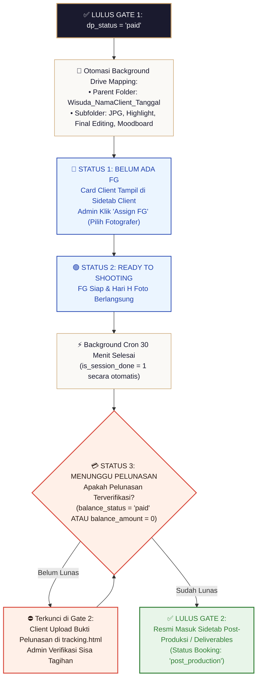

# Blueprint Spesifikasi Teknikal & Alur Kerja Sistem Client Deal (Tahap 2)

> [!NOTE]
> **Wiki System Flow Hub**: [🗺️ Master Flow System](./MASTER_FLOW.md) | [Tahap 1: Inquiry](./TAHAP1_alur_inqury.md) | **Tahap 2: Client Deal** | [Tahap 3: Post-Produksi](./TAHAP3_alur_postproduksi.md) | [Tahap 4: Arsip](./TAHAP4_alur_arsip.md) | [System Freelance](./ALUR_FREELANCE.md)

Dokumen ini merupakan panduan spesifikasi arsitektur teknis dan alur kerja (*workflow*) resmi untuk **Tahap 2: Pengolahan Client Deal di Sidetab CLIENT / Bookings hingga Sesi Foto Selesai & Kelulusan Gate 2**.

> [!IMPORTANT]
> **Prinsip Simplikasi UI/UX & Isolasi State Database:**
> * Drive Mapping (4 Subfolder: `JPG/`, `Highlight/`, `Final Editing/`, `Moodboard/`) berjalan **OTOMATIS DI BACKGROUND** saat masuk Tahap 2 tanpa mengotori tampilan UI.
> * Pada UI Sidetab **CLIENT**, **HANYA ADA 3 STATUS SEDERHANA** agar operasional admin super mudah dan tidak membingungkan.

---

## 🏛️ 1. 3 Status Utama UI/UX Sidetab CLIENT

Seluruh client deal yang masuk ke Sidetab CLIENT hanya akan melewati **3 Status Utama**:

| Status UI | Badge Icon UI | Penjelasan Operasional Admin & Sistem |
| :--- | :--- | :--- |
| **1. Belum Ada FG** | `👤 Belum ada FG` | Status awal saat client deal masuk. Drive 4 subfolder sudah otomatis ter-mapping di background. Admin tinggal klik tombol **`Assign FG`** untuk memilih fotografer. |
| **2. Ready to Shooting** | `🟢 Ready to Shooting` | FG sudah di-assign & siap bertugas di Hari H. *(Sesi foto selesai otomatis dikerjakan oleh Background Cron 30 Menit $\rightarrow$ `is_session_done = 1`)*. |
| **3. Menunggu Pelunasan** | `💳 Menunggu Pelunasan` | Sesi foto selesai (`is_session_done = 1`). Menunggu client melunasi sisa DP di `tracking.html` untuk Lulus Gate 2. *(Auto-Bypass jika Lunas 100% di awal)*. |

---

## 🔄 2. Diagram Alur Kerja Visual Tahap 2 (Client Deal Flowchart)

```text
                     [LULUS GATE 1: dp_status = 'paid']
                                     │
                                     ▼
                [OTOMASI BACKGROUND: MAPPING 4 FOLDER DRIVE]
                 • 📁 JPG/           (staging_drive_url)
                 • 📁 Highlight/     (highlight_drive_url)
                 • 📁 Final Editing/ (download_url)
                 • 📁 Moodboard/     (moodboard_drive_url)
                                     │
                                     ▼
                      [STATUS 1: 👤 BELUM ADA FG]
                 (Tampil Card Client di Sidetab Client)
                                     │
                       Admin Klik "Assign FG"
                   Pilih Fotografer & Brief Tugas
                                     │
                                     ▼
                   [STATUS 2: 🟢 READY TO SHOOTING]
                       FG Siap & Sesi Foto Hari H
                                     │
                     Otomasi Cron 30 Menit Selesai
                         (is_session_done = 1)
                                     │
                                     ▼
                    [STATUS 3: 💳 MENUNGGU PELUNASAN]
                  Client Upload Sisa DP di tracking.html
                     Admin Verifikasi → Lunas
                    (Lunas 100% awal → Auto-Bypass)
                                     │
                                     ▼
                   [LULUS GATE 2: MASUK POST-PRODUKSI]
                         (status = 'post_production')

```



---

## 📌 3. Detail Operasional 3 Status Sidetab CLIENT

### 3.1. Status 1: Belum Ada FG (`need_fg`)
- **Pintu Masuk Client Deal**: Begitu verifikasi DP di Gate 1 selesai, sistem membuat 4 subfolder Drive secara *direct background* dan menampilkan card client di Sidetab CLIENT dengan badge `👤 Belum ada FG`.
- **Tindakan Admin**: Admin mengeklik tombol **`Assign FG`**, memilih fotografer dari dropdown registered freelancers, menentukan jam shooting & durasi, mengisi honor fee (`fg_fee`), dan memberikan brief.

### 3.2. Status 2: Ready to Shooting (`fg_ready` / `shooting`)
- **Fotografer Siap**: FG menerima WA notifikasi penugasan dan memantau tugas & brief di Portal Freelance (*100% Zero Upload File FG*).
- **Hari H Pemotretan**: Pemotretan berlangsung.
- **Otomasi Sesi Selesai Cron (30 Menit)**: Cron service setiap 30 menit otomatis mengecek $WaktuSelesai = TanggalWisuda + JamMulai + DurasiJam$. Begitu waktu lewat, cron otomatis mengeset `is_session_done = 1` tanpa perantara konfirmasi FG.

### 3.3. Status 3: Menunggu Pelunasan (`need_balance`)
- **Kondisi DP di Awal**: Sesi foto selesai (`is_session_done = 1`), client mengunggah bukti pelunasan via link `tracking.html` $\rightarrow$ Admin verifikasi pelunasan (`balance_status = 'paid'`).
- **Kondisi Lunas 100% di Awal**: Jika client sudah bayar Lunas 100% sejak Gate 1 (`balance_amount = 0`), **STATUS 3 OTOMATIS DI-BYPASS**.

---

## 🚪 4. Gate 2: Syarat Lolos ke Sidetab Post-Produksi

> [!IMPORTANT]
> **Aturan Kelulusan Gate 2 (Masuk Sidetab Post-Produksi):**
> Booking **DILARANG MASUK** ke Sidetab Post-Produksi jika belum memenuhi 2 syarat mutlak:
> 1. **Sesi Foto Selesai**: `is_session_done = 1` (otomatis diset oleh Cron 30 menit).
> 2. **Pelunasan Terverifikasi**: `balance_status = 'paid'` ATAU `balance_amount = 0` (lunas 100% di awal).

---

*Dokumen blueprint spesifikasi alur Client Deal Tahap 2 ini resmi disederhanakan, terstruktur, dan terkunci.*
