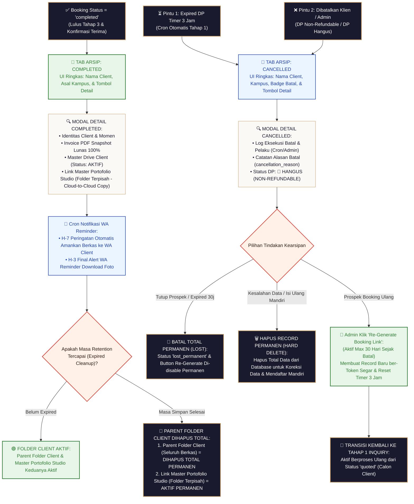

# Blueprint Spesifikasi Teknikal & Alur Kerja Sidetab ARSIP (Tahap 4)

Dokumen ini merupakan panduan spesifikasi arsitektur teknis dan alur kerja (*workflow*) resmi untuk **Tahap 4: Pengarsipan Permanen Transaksi (Sidetab ARSIP / Archive)**.

> [!IMPORTANT]
> **Prinsip Simplikasi UI & Pengelolaan Retention Drive:**
> * **Ringkas di UI Utama**: Tampilan tabel Sidetab ARSIP **hanya menampilkan Nama Client, Asal Kampus, dan Tombol `[🔍 Detail]`** agar UI super bersih dan tidak membingungkan.
> * **Tanpa Token Tracking**: Token tracking (`tracking_token`) tidak ditampilkan di arsip karena sudah di-cleanup oleh cron setelah transaksi completed.
> * **Drive Retention & Expired Count**: Modal Detail menampilkan **Hitungan Mundur Masa Simpan Drive & Tanggal Expired Cleanup**, serta **Link Master Drive** & **Link Drive Portofolio Highlight**.

---

## 🏛️ 1. Rincian Tampilan UI Ringkas & Modal Detail Tab COMPLETED

### 1.1. Tampilan UI Utama Tabel Tab COMPLETED (Super Ringkas)

Pada UI Sidetab ARSIP (Tab Completed), tabel hanya menampilkan 3 kolom ringkas:

```text
 🎓 TAB ARSIP: COMPLETED (TRANSAKSI SELESAI 100%)
 ════════════════════════════════════════════════════════════════════════════════════════════════════════════

 [🔍 Cari Nama Client / Kampus...] [📅 Filter Tanggal Wisuda]

 ┌──────────────────────────────────────────────────────────────────────────────────────────────────────────┐
 │ NO │ NAMA CLIENT              │ ASAL KAMPUS / UNIVERSITAS        │ AKSI TIAP BARIS                       │
 ├────┼──────────────────────────┼──────────────────────────────────┼───────────────────────────────────────┤
 │ 1  │ Budi Santoso             │ Universitas Indonesia (Depok)    │ [ 🔍 Detail Lengkap ]                │
 │ 2  │ Siti Rahma               │ Universitas Gadjah Mada (Yogya) │ [ 🔍 Detail Lengkap ]                │
 └────┴──────────────────────────┴──────────────────────────────────┴───────────────────────────────────────┘
```

---

### 1.2. Isi Lengkap Modal Detail Arsip (`[🔍 Detail Lengkap]`)

Saat Admin mengeklik tombol **`[🔍 Detail Lengkap]`**, modal popup interaktif terbuka dan menampilkan seluruh rangkuman kearsipan:

```text
 📜 DETAIL KEARSIPAN CLIENT: BUDI SANTOSO (COMPLETED)
 ════════════════════════════════════════════════════════════════════════════════════════════════════════════

 👤 1. IDENTITAS CLIENT & MOMEN
 • Nama Client      : Budi Santoso
 • Nomor WhatsApp   : 0812-3456-7890
 • Asal Kampus      : Universitas Indonesia (Balairung UI Depok)
 • Tanggal Wisuda   : 15 Oktober 2026
 • Status Transaksi : ✅ COMPLETED (Selesai 100%)

 📸 2. LAYANAN & TIM FOTOGRAFER
 • Paket Layanan    : Paket Wisuda Personal Premium (Rp 750.000)
 • Fotografer       : Dimas Prasetyo (FG-01)
 • Honor Fotografer : Rp 300.000 (Status Payout: 🟢 LUNAS)

 💳 3. KEUANGAN & DOKUMEN RESI
 • Total Bayar      : Rp 750.000 (DP: Rp 375.000 | Pelunasan: Rp 375.000)
 • Status Bayar     : 🟢 LUNAS 100%
 • Resi Invoice PDF : [ 🖨️ Unduh Invoice PDF Lunas ]

 📂 4. AKSES GOOGLE DRIVE & MASA SIMPAN (RETENTION POLICY)
 • Status Master Folder Client : 🔴 TIDAK AKTIF / SUDAH DIBERSIHKAN (Folder Client Dihapus Permanen)
 • Link Master Drive Client   : [ 🗑️ Parent Folder Client Telah Dihapus Pembersihan ] (Expired: 30 Nov 2026)
 • Link Master Portofolio     : [ ✨ Buka Master Portofolio Studio (AKTIF PERMANEN - TERPISAH) ]
 • Mekanisme Salin Portofolio : Cloud-to-Cloud Copy ke Master Folder Portofolio Studio (Folder Terpisah)
 • Notifikasi Peringatan Client: ✅ Terkirim WA H-7 & H-3 ke Klien (Auto-Reminder Download)

 ⭐ 5. RATING & ULASAN PRIVAT CLIENT
 • Rating Kepuasan  : ★ 5.0 / 5.0
 • Catatan Testimoni: "Fotografernya ramah sekali, editan fotonya sangat rapi dan tepat waktu. Terima kasih studio!"
   (Catatan ulasan bersifat PRIVAT khusus internal Admin & dapat di-edit oleh Admin)
```

---

## 🔄 2. Diagram Alur Kerja Visual Tahap 4 (Archive Flowchart)

```text
 ┌──────────────────────────────────┐        ┌──────────────────────────────────┐
 │  BOOKING COMPLETED (SELESAI 100%)│        │   BOOKING CANCELLED / EXPIRED    │
 └─────────────────┬────────────────┘        └─────────────────┬────────────────┘
                   │                                           │
                   ▼                                           ▼
       ┌──────────────────────┐                    ┌──────────────────────┐
       │ TAB ARSIP: COMPLETED │                    │ TAB ARSIP: CANCELLED │
       │ (Ringkas: Nama,      │                    │ (Ringkas: Nama,      │
       │  Kampus, Button)     │                    │  Kampus, Badge Batal)│
       └───────────┬──────────┘                    └───────────┬──────────┘
                   │                                           │
                   ▼                                           ▼
       ┌──────────────────────┐                    ┌──────────────────────┐
       │ MODAL DETAIL ARSIP:  │                    │ MODAL DETAIL CANCEL: │
       │ • Data Client & FG   │                    │ • Log Batal & Reason │
       │ • Invoice PDF Lunas  │                    │ • Status: DP HANGUS  │
       │ • Link Drive Client  │                    │   (NON-REFUNDABLE)   │
       │ • Link Master        │                    │ • Re-Generate Button │
       │   Portofolio Studio  │                    └──────────────────────┘
       │ • WA Reminder H-7/H-3 │
       └───────────┬──────────┘
                   │
         [Bila Tanggal Expired Cleanup Tercapai]
                   │
                   ▼
       ┌────────────────────────────────────────────────────────┐
       │ TRANSIKSI EXPIRATION DRIVE:                            │
       │ 1. Subfolder Client di Master Root 1 → DIHAPUS TOTAL   │
       │ 2. Master Portofolio Studio (Root 2) → AKTIF PERMANEN │
       └────────────────────────────────────────────────────────┘
```




---

## 📌 3. Detail Operasional Arsitektur 2 Master Root Folder Drive & Retention

> [!IMPORTANT]
> **Prinsip Utama Pembersihan Drive (SPECIFIC CLIENT FOLDER ONLY):**
> * **Spesifikasi Struktur Terperinci**: Rincian arsitektur folder terpisah diatur resmi pada dokumen [FLOW_SISTEM/STRUKTUR_FOLDER_DRIVE.md](file:///Users/armansyam/Documents/Project%20AmsDev/Wisuda/FLOW_SISTEM/STRUKTUR_FOLDER_DRIVE.md).
> * **Folder Master Utama Studio TIDAK PERNAH DIHAPUS**: Folder `FOLDER MASTER UTAMA CLIENT` (Root 1) dan `FOLDER MASTER UTAMA PORTOFOLIO` (Root 2) milik Studio tersimpan **PERMANEN SEUMUR HIDUP**.
> * **Yang Dihapus Hanya Folder Spesifik Client**: Pembersihan otomatis saat *expired* **HANYA MENGHAPUS FOLDER SPESIFIK CLIENT TERSEBUT** (`MASTER CLIENT (NamaClient_Univ_Tanggal)`) yang berada di dalam `FOLDER MASTER UTAMA CLIENT`.


### 3.1. Cron Notifikasi WA Peringatan Amankan Foto (H-7 & H-3)
- **Peringatan Otomatis H-7 Sebelum Cleanup**:
  Sistem Cron setiap hari mengecek booking completed yang memiliki $drive\_expiry\_date = Today + 7\text{ Hari}$. Cron otomatis mengirimkan pesan WhatsApp pengingat ke Klien:  
  *"Halo Kak {client_name}, mengingatkan bahwa berkas foto wisuda Kakak di Google Drive tinggal 7 Hari Lagi sebelum dibersihkan/dihapus. Mohon segera download/amankan seluruh foto Kakak ya! Link Drive: {drive_parent_url}"*
- **Peringatan Final H-3 Sebelum Cleanup**:
  Cron mengirimkan pesan peringatan WA terakhir $drive\_expiry\_date = Today + 3\text{ Hari}$.

### 3.2. Eksekusi Hapus Subfolder Client saat Expired Cleanup
- **Eksekusi Pembersihan (Cleanup)**:
  Saat $drive\_expiry\_date \le Today$, cron pembersih menghapus subfolder client (`MASTER CLIENT (NamaClient_Univ_Tanggal)`) dari `FOLDER MASTER UTAMA CLIENT` (Root 1) untuk membebaskan storage cloud studio.
- **Tampilan pada Modal Detail Arsip**:
  - **Link Master Drive Client (`drive_parent_url`)**: Berubah status menjadi `🔴 TIDAK AKTIF / SUDAH DIBERSIHKAN (Folder Client di Root 1 Dihapus Permanen)`.
  - **Link Master Portofolio (`portfolio_url`)**: **100% PERMANEN SEJAK AWAL & TIDAK PERNAH DIHAPUS** (`[ ✨ Buka Master Portofolio Studio ]`), selama item portofolio tersebut aktif di Sidetab Portofolio Admin.

### 3.4. Rincian Alur Kerja & Modal Detail Tab CANCELLED

> [!IMPORTANT]
> **Kebijakan Bisnis Studio (DP Non-Refundable / DP Hangus):**
> Uang DP (Down Payment) yang telah dibayarkan oleh client **TIDAK DAPAT DIKEMBALIKAN / NON-REFUNDABLE**. Jika transaksi dibatalkan, status DP secara otomatis dinyatakan **HANGUS**.

#### 📊 2 Pintu Masuk Transaksi ke Tab Cancelled:
1. **Pintu 1: Expired DP 3 Jam (Cron Otomatis Tahap 1)** $\rightarrow$ Timer 3 jam habis tanpa verifikasi bayar DP. Badge: `⏳ Expired DP`.
2. **Pintu 2: Dibatalkan (DP Non-Refundable / DP Hangus)** $\rightarrow$ Pembatalan oleh Klien/Admin. DP dinyatakan hangus. Badge: `❌ Dibatalkan (DP Hangus)`.

#### 🔍 Rincian Isi Modal Detail Cancel (`[🔍 Detail Cancel]`):
- **Identitas Client & Momen**: Nama Client, Nomor WA, Kampus, Rencana Tanggal Wisuda.
- **Log Eksekusi Batal**: Waktu Eksekusi Batal & Pelaku (Otomatis System Cron / Username Admin).
- **Catatan Alasan Pembatalan**: `cancellation_reason` (misal: *"Jadwal wisuda kampus berbenturan"*, *"DP tidak dibayar dalam 3 jam"*).
- **Status Keuangan DP**: **`🔴 DP HANGUS (NON-REFUNDABLE)`**.

#### ⚙️ 3 Aksi Pengelolaan Batal pada Modal Detail:
1. **`[ 🔄 Re-Generate Booking Link ]` (Garda Depan Prospek Kembali)**:
   - **Masa Aktif Re-Generate**: Hanya dapat diakses selama window **30 Hari** sejak tanggal batal.
   - **Transisi**: Menerbitkan record inquiry baru di **Tahap 1 (Sidetab INQUIRY)** dengan Token Unik Baru & Reset Timer 3 Jam.
2. **`[ 🛑 Batalkan Total Permanen (Lost) ]` (Tutup Prospek Permanen)**:
   - **Eksekusi Batal Total**: Admin dapat mengeklik tombol ini (atau otomatis diset oleh Cron setelah 30 hari) untuk mengunci transaksi sebagai **Batal Total Permanen (`lost_permanent`)**.
   - **Hasil**: Tombol Re-Generate **DIHILANGKAN PERMANEN**, transaksi terkunci abadi di Tab Cancelled sebagai prospek yang tidak kembali (*Lost Prospect*).
3. **`[ 🗑️ Hapus Record Permanen ]` (Koreksi Kesalahan Data)**:
   - **Tujuan Usulan**: Untuk mengatasi **kesalahan input data / typo fatal** atau jika calon client ingin mengisi ulang secara mandiri via Form Public `inquiry.html`.
   - **Hasil**: Data record **DIHAPUS PERMANEN DARI DATABASE (HARD DELETE)**, membebaskan identitas client agar dapat membuat Inquiry Baru secara bersih dari awal.

---

## 🗄️ 4. Ringkasan Status State Sidetab ARSIP (Tabel `bookings`)

| Status State | Status DP | Status Re-Generate | Keterangan Kearsipan |
| :--- | :--- | :--- | :--- |
| **`completed`** | `🟢 Lunas 100%` | `N/A` | Transaksi wisuda sukses 100%, lunas, dan foto telah diterima. |
| **`cancelled`** | `🔴 DP Hangus` | `🟢 Aktif (Max 30j)` | Dibatalkan/Expired. Re-Generate aktif selama 30 hari. |
| **`lost_permanent`**| `🔴 DP Hangus` | `🔴 Di-Disable` | **Batal Total Permanen (Lost)**. Re-Generate matikan permanen. |
| **`deleted`** | `N/A` | `N/A` | **Hard Delete / Hapus Total**. Data dihapus dari database untuk koreksi data. |


---

*Dokumen blueprint spesifikasi Sidetab ARSIP Tahap 4 ini resmi disajikan untuk didiskusikan.*


