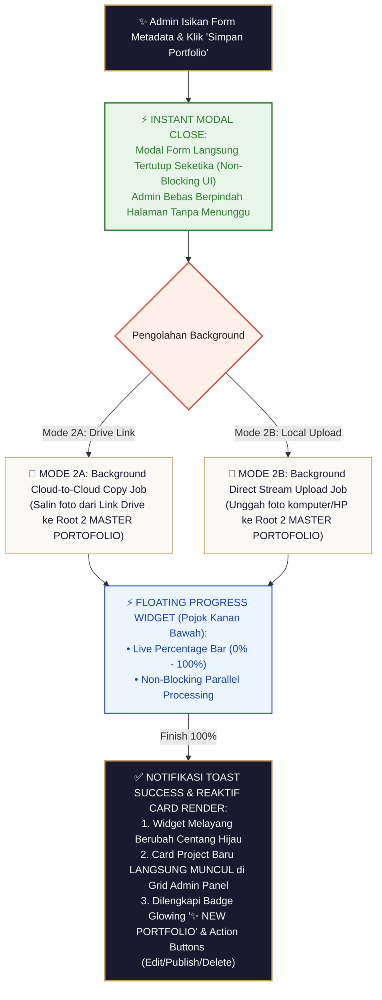
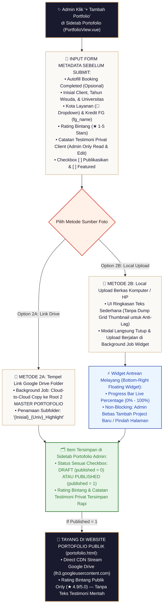

# Blueprint Spesifikasi Teknikal & Alur Kerja Sistem Portofolio Studio Wisuda

Dokumen ini merupakan panduan spesifikasi arsitektur teknis, alur kerja (*workflow*), standar penyimpan data independen, serta desain UI/UX pengolahan antrean (*queue management*) untuk sistem Portofolio Studio Wisuda.

---

## 🏛️ 1. Prinsip Utama Arsitektur Sistem

### 1.1. Independensi Storage Portofolio (Anti-Broken Link)
> [!IMPORTANT]
> **Kebijakan Isolasi Berkas Drive Portofolio:**
> * Folder pada transaksi **Booking Klien** memiliki kebijakan pembersihan otomatis (*Auto-Clean Retention Policy*) setelah periode tertentu.
> * Seluruh berkas foto portofolio **WAJIB terduplikasi dan tersimpan secara independen** di subfolder khusus di dalam **Master Portofolio** Google Drive Studio:
>   ```text
>   Google Drive Studio / Master Portofolio / {Inisial}_{NamaUniversitas}_{TahunWisuda} /
>   ```
> * Portofolio **DILARANG HANYA MENGGUNAKAN REF-LINK** dari folder booking klien. Hal ini menjamin foto di website portofolio publik tidak akan pernah pecah (*broken link*) ketika folder booking klien dibersihkan.

### 1.2. Hukum Privasi & Consent Klien (`portfolio_consent`)
* Seluruh foto wisuda klien terikat oleh persetujuan publikasi (*consent*) dari klien.
* Jika status `portfolio_consent === 'declined'`, sistem **WAJIB mengunci status portofolio di `published = 0` (Draft/Unpublished)** dan API Backend **WAJIB menolak** setiap upaya publikasi manual oleh Admin dengan HTTP `400 Bad Request`.

### 1.3. Penayangan Foto via Direct Google Drive CDN (`lh3.googleusercontent.com`)
* Seluruh foto yang ditayangkan di Halaman Portofolio Publik (`/portfolio.html`) maupun Admin Panel **TIDAK DIMUAT DARI DISK VPS**, melainkan **dimuat langsung dari CDN Google Drive**:
  ```text
  https://lh3.googleusercontent.com/d/{fileId}=s1600
  ```
* **Keunggulan CDN Google**:
  1. **Zero Bandwidth VPS**: Trafik dan beban download foto ditanggung 100% oleh infrastruktur Edge Server global Google.
  2. **Auto Image Optimization**: Parameter `=s1600` menginstruksikan CDN Google untuk menyajikan gambar tajam teroptimasi hingga resolusi 1600px secara responsif.
  3. **Database SQLite Slim**: Database studio hanya menyimpan *metadata teks* (Inisial, Uni, Tahun, Kota, & Array URL CDN Google).

## 🔄 2. Diagram Alur Kerja Visual Portofolio (Portfolio Flowchart)

```text
 ┌──────────────────────────────────────────────────────────────────────────────────┐
 │ STEP 1: ADMIN UPLOAD FOTO HIGHLIGHT (TAHAP 3 PASCA-PRODUKSI)                     │
 │ Admin mengunggah 3-5 foto editan terbaik ke Subfolder 'Highlight/' (Root 1 Client)│
 └──────────────────────────────────────┬───────────────────────────────────────────┘
                                        │
                                        ▼
 ┌──────────────────────────────────────────────────────────────────────────────────┐
 │ STEP 2: AUTOMASI CLOUD-TO-CLOUD COPY KE MASTER PORTOFOLIO (ROOT 2)              │
 │ Sistem meng-copy foto ke Subfolder '{NamaClient}_{Univ}_Highlight' di Root 2     │
 └──────────────────────────────────────┬───────────────────────────────────────────┘
                                        │
                                        ▼
 ┌──────────────────────────────────────────────────────────────────────────────────┐
 │ STEP 3: PENGECEKAN KESEPAKATAN CLIENT (is_portfolio_allowed)                     │
 │ Client memilih konfirmasi di Portal Tracking / Halaman Closing Statement         │
 └──────────────────────────────────────┬───────────────────────────────────────────┘
                                        │
                      ┌─────────────────┴─────────────────┐
                      │                                   │
             (is_portfolio_allowed = 1)          (is_portfolio_allowed = 0)
             Client MENGIZINKAN                   Client MENOLAK / BELUM
                      │                                   │
                      ▼                                   ▼
 ┌────────────────────────────────────────┐ ┌─────────────────────────────────────┐
 │ STEP 4A: OTOMATIS PUBLISHED            │ │ STEP 4B: STATUS UNPUBLISHED (DRAFT) │
 │ • Status LANGSUNG 'published = 1'      │ │ • Status tersimpan 'published = 0'  │
 │ • Tanpa perlu konfirmasi Admin lagi    │ │ • Masuk ke Tab Draft Admin          │
 │ • LANGSUNG TAYANG di portofolio.html   │ │ • TIDAK DIKUNCI PERMANEN            │
 │ • Rating Bintang Only (★ 4.9/5.0)      │ │ • Admin TETAP BISA PUBLISH SUATU SAAT│
 └────────────────────────────────────────┘ └─────────────────────────────────────┘
```

---

## 🎨 3. Detail Operasional Pembuatan Portofolio Manual (Mode 2A & Mode 2B)


> [!IMPORTANT]
> **Prinsip Utama Pengalaman Pengguna (UI/UX Non-Blocking):**
> * **Modal Langsung Tutup saat Submit**: Baik pada **Mode 2A (Drive Link)** maupun **Mode 2B (Local Upload)**, saat Admin mengeklik tombol **`Simpan Portfolio`**, modal form **LANGSUNG TERTUTUP INSTAN**. Admin **TIDAK PERLU MENUNGGU** proses upload/salin selesai.
> * **Background Floating Queue Widget (`bottom-5 right-5`)**: Seluruh proses eksekusi (Cloud-to-Cloud import maupun stream upload berkas) berpindah dan diproses di background via **Widget Melayang di Pojok Kanan Bawah**.

---

### 🔄 Diagram Alur Kerja Visual Mode 2A & Mode 2B (Non-Blocking Queue Pipeline)

```text
 ┌──────────────────────────────────────────────────────────────────────────────────┐
 │ ADMIN ISIKAN FORM METADATA & PILIH METODE (MODE 2A DRIVE LINK / MODE 2B UPLOAD)  │
 └──────────────────────────────────────┬───────────────────────────────────────────┘
                                        │
                                        ▼
 ┌──────────────────────────────────────────────────────────────────────────────────┐
 │ ADMIN KLIK TOMBOL 'SIMPAN PORTFOLIO'                                             │
 │ ⚡ MODAL FORM LANGSUNG TERTUTUP INSTAN (Non-Blocking UI)                         │
 └──────────────────────────────────────┬───────────────────────────────────────────┘
                                        │
                      ┌─────────────────┴─────────────────┐
                      │                                   │
             [EKSEKUSI MODE 2A]                  [EKSEKUSI MODE 2B]
             Background Import Job               Background Direct Stream Upload
             Cloud-to-Cloud Copy                 File Komputer/HP ke Root 2
                      │                                   │
                      ▼                                   ▼
 ┌──────────────────────────────────────────────────────────────────────────────────┐
 │ ⚡ FLOATING QUEUE WIDGET MELAYANG (Pojok Kanan Bawah: bottom-5 right-5)          │
 │ • Mode 2A: "🔗 Mengimpor Foto dari Google Drive Link... [ 45% ]"                 │
 │ • Mode 2B: "📁 Mengunggah Berkas Komputer (12/35 Foto)... [ 34% ]"               │
 │ • Progress Bar Live Percentage (0% ──► 100%)                                     │
 │ • Admin Bebas Berpindah Sidetab / Membuat Proyek Baru Secara Bersamaan           │
 └──────────────────────────────────────┬───────────────────────────────────────────┘
                                        │
                                        ▼
 ┌──────────────────────────────────────────────────────────────────────────────────┐
 │ PROSES SELESAI 100% (Notifikasi Toast '✅ Impor Portofolio Selesai!')             │
 │ • Floating Widget Kanan Bawah Berubah Centang Hijau                              │
 │ • Card Project Baru LANGSUNG REAKTIF TAMPIL di Sidetab Portofolio Admin          │
 │ • Dilengkapi Badge Berkedip Halus: '✨ NEW PORTFOLIO' & Status (Draft/Published) │
 └──────────────────────────────────────────────────────────────────────────────────┘
```



  │
                                          ▼
 ┌──────────────────────────────────────────────────────────────────────────────────┐
 │ ITEM TERBENTUK DI SIDETAB PORTOFOLIO ADMIN (PortfolioView.vue)                   │
 │ • Status Sesuai Checkbox: DRAFT (published = 0) ATAU PUBLISHED (published = 1)   │
 │ • Jika Published: Tayang di Website Publik portofolio.html (Rating Bintang Only) │
 └──────────────────────────────────────────────────────────────────────────────────┘
```




---

### 2.1. Mode 1: Automasi Pasca-Produksi Booking
1. **Trigger**: Admin menyimpan/mengunggah link foto *Highlight Pasca-Produksi* pada detail booking.
2. **Execution**: Backend memicu *background process* untuk menyalin foto secara *Cloud-to-Cloud* dari folder booking ke subfolder `Master Portofolio`.
3. **Default Status**: Portofolio dibuat berstatus **`unpublish` (published = 0)**.
4. **Client Confirmation**: Klien menerima permintaan persetujuan di Portal Tracking (`/tracking/:token`):
   * `granted`: Admin diizinkan mengubah status menjadi `published = 1`.
   * `declined`: System otomatis mengunci portofolio pada `published = 0` (unpublish).

### 2.2. Mode 2A: Direct Creation via Google Drive Link
1. **Trigger**: Admin memilih Tab **Link Google Drive** pada modal Tambah Portofolio.
2. **Execution**: Admin memasukkan URL folder Drive publik. Backend menjalankan *background import job* (`portfolio_import_jobs`) yang menyalin seluruh foto *Cloud-to-Cloud* ke subfolder `Master Portofolio`.
3. **Non-Blocking**: Admin langsung dapat menutup modal dan melanjutkan pekerjaan lain.

### 2.3. Mode 2B: Direct Creation via Local Upload (Berkas Komputer/HP)
1. **Penyederhanaan UI Input (Tanpa Preview Thumbnail Grid)**:
   * Saat Admin memilih file foto dari komputer/HP (misal 20–500+ foto), **UI TIDAK PERLU MERENDER PREVIEW DUMP GAMBAR (THUMBNAIL GRID)** untuk menjaga performa browser agar sangat ringan dan tidak *lagging*.
   * Tampilan UI hanya menyajikan ringkasan teks sederhana, contoh: **`📁 35 Berkas Foto Terpilih (Total 120 MB)`**.
2. **Sekuens Eksekusi Pasca-Submit**:
   * **Langkah 1 (Database Entry Creation)**: Saat tombol Submit diklik, buat record awal *project portofolio* di database SQLite (`portfolio_items`) dengan status awal Draft (`published = 0`) untuk mendapatkan ID project (`portfolio_id`).
   * **Langkah 2 (Otomatis Minimize & Masuk Antrean Widget)**: Modal form langsung tertutup otomatis dan task upload dimasukkan ke indikator **Widget Melayang di Sudut Kanan Bawah (Minimized Queue Widget)**.
   * **Langkah 3 (Direct Stream Upload Background)**: Foto-foto di-stream secara bertahap (satu demi satu / batch kecil) ke subfolder `Master Portofolio` di Google Drive via Service Account OAuth.
   * **Langkah 4 (Update Metadata & ID Link Completion)**: Setelah seluruh foto selesai diunggah ke Google Drive, backend memperbarui kolom `cover_photo_url` dan `highlight_photos` di database project `portfolio_id` terkait dengan URL CDN Google (`https://lh3.googleusercontent.com/d/{fileId}=s1600`), lalu menandai status antrean sebagai **Completed (`100% ✅`)**.

---

## 🗕 3. Spesifikasi UI/UX Queue Management (Google Drive Style Widget)

UI/UX antrean upload di Halaman Portofolio Admin (`PortfolioView.vue`) mengadopsi standar Google Drive Web:

1. **Posisi Floating Widget**:
   * Terletak melayang di **sudut kanan bawah layar** (`fixed bottom-5 right-5 z-50`).
2. **Fitur Minimize & Auto-Minimize Pasca-Submit**:
   * Saat Admin men-submit Mode 2B (Local Upload), modal form langsung tertutup dan otomatis aktif sebagai widget kecil di sudut kanan bawah.
   * Terdapat toggle *Minimize* & *Expand* jika Admin ingin membuka kembali detail antrean.
3. **Non-Blocking Parallel Queueing (Antrean Multi-Project)**:
   * Saat satu atau lebih upload sedang berlangsung di background, Admin **TETAP BISA MENGEKLIK tombol `+ Tambah Portfolio`** untuk membuat project portofolio baru.
   * Project baru akan **masuk ke dalam antrean (list job)** tanpa mematikan atau menghentikan progres upload project lain yang sedang berjalan.
   * Widget menampilkan total antrean aktif, contoh: `⚡ 2 Upload Berjalan` atau `⚡ 3 Upload Berjalan`.

---

## 📋 4. Tabel Matriks Spesifikasi Technical API & Database

| Parameter | Mode 1 (Auto Post-Prod) | Mode 2A (Drive Link Direct) | Mode 2B (Local Upload Direct) |
| :--- | :--- | :--- | :--- |
| **Endpoint API** | Auto via Upload Highlight Booking | `POST /api/admin/portfolio/import-drive` | `POST /api/admin/portfolio` (Create DB Header) & `POST /api/admin/portfolio/upload` |
| **Storage Destination** | Subfolder `Master Portofolio` | Subfolder `Master Portofolio` | Subfolder `Master Portofolio` |
| **Metode Copy** | Cloud-to-Cloud Copy | Cloud-to-Cloud Copy (Job Worker) | Direct Stream Upload (Sequential Batching) |
| **URL Format Foto** | Google Drive CDN | Google Drive CDN | Google Drive CDN (`https://lh3.googleusercontent.com/d/{fileId}=s1600`) |
| **Penyusunan Sekuens** | Background Auto-Copy | Background Job Worker | (1) Create DB Entry $\rightarrow$ (2) Auto-Minimize Widget $\rightarrow$ (3) Stream Drive $\rightarrow$ (4) Update DB URLs |
| **UI Preview Input** | N/A | URL Link Drive | **Teks Ringkasan Jumlah Foto** (Tanpa Grid Thumbnail) |
| **Default Published** | `0` (Unpublished / Draft) | Sesuai Form Admin (`0` / `1`) | Sesuai Form Admin (`0` / `1`) |
| **Konfirmasi Consent** | Wajib persetujuan Klien (`portfolio_consent`) | N/A (Portofolio Umum Studio) | N/A (Portofolio Umum Studio) |
| **UI Widget** | Background Job Bar | Google Drive Floating Widget (Bottom-Right) | Google Drive Floating Widget (Bottom-Right) |

---

## 🛡️ 5. Pedoman Penanganan Error & Ketahanan Sistem (Resiliency Guidelines)

Untuk mencegah kegagalan upload (*error*) saat membuat project portofolio baru bersamaan:

1. **Batching / Sequential Chunking (Anti-Rate-Limit)**:
   * Pengiriman file ke Google Drive API **WAJIB menggunakan antrean berurutan (batch size 2-3 file)** dengan jeda (*throttling delay*) 250ms per request.
   * Mencegah Google Drive API melempar error `429 Too Many Requests`.
2. **Payload Size Limit Guard**:
   * Endpoint upload lokal menerima stream berkas per-file secara individual (bukan multipart raksasa sekaligus) untuk menghindari error `413 Payload Too Large`.
3. **Exponential Backoff Retry**:
   * Jika terjadi kegagalan jaringan sementara saat upload file ke Google Drive, backend me-retry otomatis 3x dengan skema backoff: 1.5 detik $\rightarrow$ 3.0 detik $\rightarrow$ 6.0 detik sebelum menandai status `failed`.

---

*Dokumen blueprint ini siap digunakan sebagai acuan lengkap implementasi sistem oleh tim developer / AI agent.*
