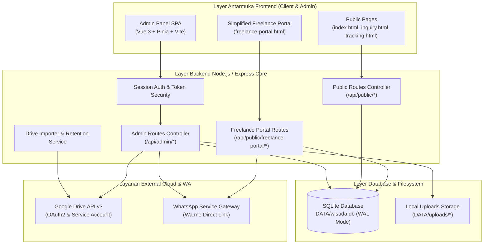
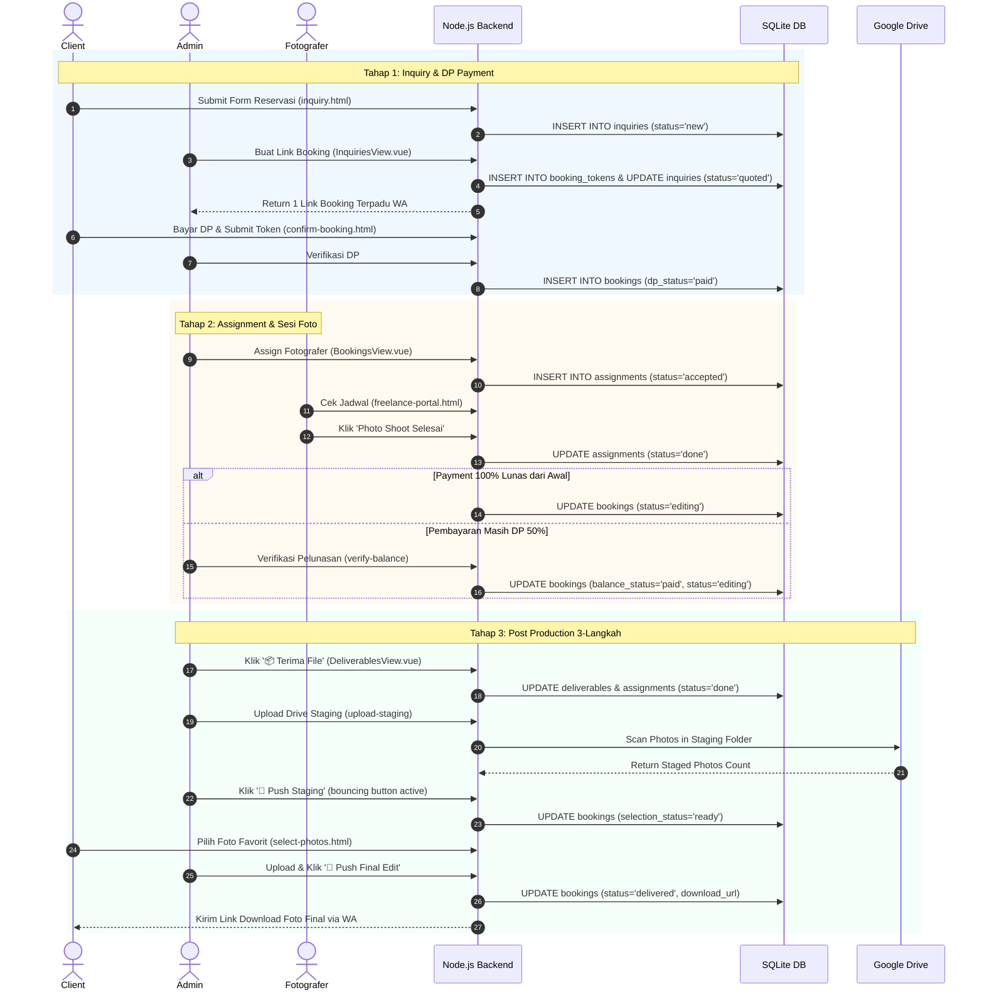
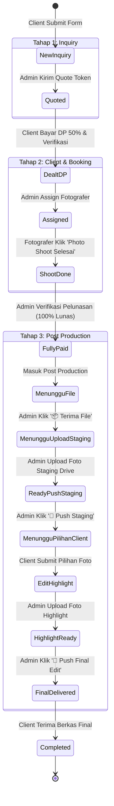
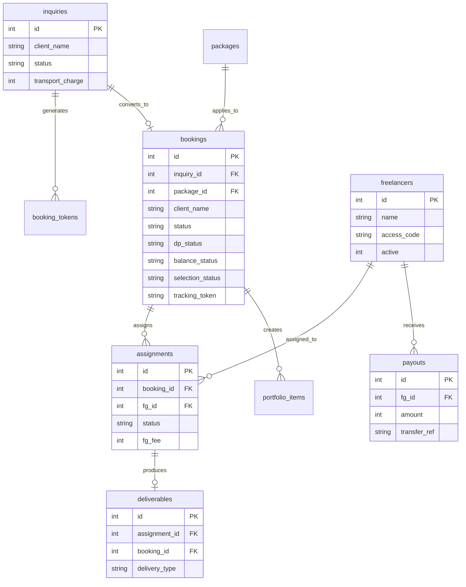

# BUKU PANDUAN MASTER ENSIKLOPEDIS PLATFORM WISUDA v2.0
**Spesifikasi Lengkap Arsitektur, Skema Database, Workflow SOP, Integrasi Drive, Media Handling, API Endpoints, Matriks Tombol UI, & Troubleshooting**

> [!IMPORTANT]
> **Pusat Acuan Flow Sistem (Source of Truth)**: Seluruh alur operasional bisnis terpadu mengikuti cetak biru resmi di [🗺️ FLOW_SISTEM/MASTER_FLOW.md](../FLOW_SISTEM/MASTER_FLOW.md) dan modul spesifikasi di [FLOW_SISTEM/](../FLOW_SISTEM/).

*Versi Dokumen: 2.1.0 — Terakhir Diperbarui: 13 Agustus 2026*

---

## DOKUMEN NAVIGATION / DAFTAR ISI
1. [Bab 1: Gambaran Umum, Arsitektur Sistem & Arsitektur Kode](#bab-1-gambaran-umum-arsitektur-sistem--arsitektur-kode)
2. [Bab 2: Diagram Visual Arsitektur & Alur Kerja Frontend-Backend](#bab-2-diagram-visual-arsitektur--alur-kerja-frontend-backend)
3. [Bab 3: Spesifikasi Skema Database SQLite & Diagram ERD](#bab-3-spesifikasi-skema-database-sqlite--diagram-erd)
4. [Bab 4: SOP Alur Operasional 3-Tahap Pasca Produksi (End-to-End Workflow)](#bab-4-sop-alur-operasional-3-tahap-pasca-produksi-end-to-end-workflow)
5. [Bab 5: Panduan Integrasi Google Drive 3-Step Wizard](#bab-5-panduan-integrasi-google-drive-3-step-wizard)
6. [Bab 6: Penanganan Media, Background Worker & Kebijakan Retensi Storage](#bab-6-penanganan-media-background-worker--kebijakan-retensi-storage)
7. [Bab 7: Panduan Portal Freelance & Sistem Penggajian (Payroll)](#bab-7-panduan-portal-freelance--sistem-penggajian-payroll)
8. [Bab 8: Panduan Seluruh Halaman Publik Client](#bab-8-panduan-seluruh-halaman-publik-client)
9. [Bab 9: Matriks Lengkap Seluruh Tombol Aksi UI & Endpoint Backend](#bab-9-matriks-lengkap-seluruh-tombol-aksi-ui--endpoint-backend)
10. [Bab 10: Katalog Template Notifikasi WhatsApp & Otomatisasi Cron Jobs](#bab-10-katalog-template-notifikasi-whatsapp--otomatisasi-cron-jobs)
11. [Bab 11: Troubleshooting, Pemeliharaan & Developer Watermark](#bab-11-troubleshooting-pemeliharaan--developer-watermark)

---

## Bab 1: Gambaran Umum, Arsitektur Sistem & Arsitektur Kode

### 1.1 Pendahuluan
Platform Wisuda v2.0 adalah sistem manajemen operasional foto wisuda berbasis web yang terintegrasi secara utuh untuk mengelola siklus operasional bisnis fotografi wisuda dari prospek awal (*inquiry*), konfirmasi booking client, penugasan fotografer freelance, pengolahan media pasca produksi di Google Drive, hingga pelunasan pembayaran dan payroll.

### 1.2 Struktur Folder Proyek
```text
/Wisuda/
  ├── admin-app/                 # SPA Admin Panel (Vue 3, Vite, TailwindCSS)
  │     ├── src/
  │     │    ├── views/          # 11 Modul Tampilan Admin SPA
  │     │    ├── stores/         # Pinia Auth & Global State Stores
  │     │    └── router/         # Vue Router Configuration
  │     └── package.json
  ├── src/                       # Backend Application Core (Node.js & Express)
  │     ├── config/              # Database (`database.js`), Env (`env.js`), WA Config
  │     ├── routes/              # Route Handlers (`admin.js`, `public.js`, `freelance-portal.js`)
  │     ├── services/            # Business Logic Services (Drive Importer, OAuth, WA Service, Cron)
  │     └── main.js              # Application Entry Point
  ├── public/                    # Static Assets & Public Client HTML Pages
  │     ├── admin/               # Compiled SPA Production Assets
  │     ├── index.html           # Landing Page & Dynamic Portfolio
  │     ├── inquiry.html         # Public Booking Reservation Form
  │     ├── confirm-booking.html # Client Token Confirmation Page
  │     ├── freelance-portal.html# Simplified Freelance Portal
  │     ├── select-photos.html   # Client Selection Photo Gallery
  │     ├── tracking.html        # Order Progress Tracker Page
  │     └── moodboard.html       # Inspiration Moodboard Collection Page
  ├── DATA/                      # Storage Directory
  │     ├── wisuda.db            # SQLite Database File
  │     ├── uploads/             # Media & Documents Storage
  │     └── backups/             # Automatic Database Backups
  └── package.json               # Root Dependencies & Scripts
```

---

## Bab 2: Diagram Visual Arsitektur & Alur Kerja Frontend-Backend

### 2.1 Diagram Arsitektur Sistem (System Architecture Diagram)



---

### 2.2 Diagram Alur Urutan End-to-End (Sequence Diagram Workflow)



---

### 2.3 Diagram Transisi State Machine Booking & Pasca Produksi



---

## Bab 3: Spesifikasi Skema Database SQLite & Diagram ERD

### 3.1 Diagram ERD Relasi Database (Entity-Relationship Diagram)



---

### 3.2 Detail Rinci 12 Tabel Database
Database SQLite (`DATA/wisuda.db`) berjalan menggunakan driver `better-sqlite3` dengan mode **Write-Ahead Logging (WAL)**.

#### 1. Tabel `bookings`
- `id` INTEGER PRIMARY KEY AUTOINCREMENT
- `inquiry_id` INTEGER (FK references `inquiries.id`)
- `package_id` INTEGER (FK references `packages.id`)
- `client_name` TEXT NOT NULL
- `client_phone` TEXT NOT NULL
- `graduation_date` DATE NOT NULL
- `shooting_time` TEXT DEFAULT '09:00'
- `location` TEXT
- `university` TEXT
- `city` TEXT
- `total_price` INTEGER DEFAULT 0
- `dp_amount` INTEGER DEFAULT 0
- `dp_status` TEXT DEFAULT 'pending'
- `dp_verified_by` INTEGER (FK references `users.id`)
- `dp_verified_at` DATETIME
- `dp_bukti_url` TEXT
- `balance_amount` INTEGER DEFAULT 0
- `balance_status` TEXT DEFAULT 'pending'
- `balance_verified_by` INTEGER (FK references `users.id`)
- `balance_verified_at` DATETIME
- `balance_bukti_url` TEXT
- `status` TEXT DEFAULT 'confirmed'
- `selection_status` TEXT DEFAULT 'pending'
- `drive_parent_url` TEXT
- `staging_drive_url` TEXT
- `highlight_drive_url` TEXT
- `download_url` TEXT
- `tracking_token` TEXT UNIQUE
- `staged_photo_count` INTEGER DEFAULT 0
- `highlight_photo_count` INTEGER DEFAULT 0
- `final_photo_count` INTEGER DEFAULT 0

#### 2. Tabel `assignments`
- `id` INTEGER PRIMARY KEY AUTOINCREMENT
- `booking_id` INTEGER NOT NULL (FK references `bookings.id` ON DELETE CASCADE)
- `fg_id` INTEGER NOT NULL (FK references `freelancers.id`)
- `status` TEXT DEFAULT 'accepted'
- `fg_fee` INTEGER DEFAULT 0
- `offer_status` TEXT DEFAULT 'accepted'
- `fg_confirmed_at` DATETIME
- `shoot_start_at` DATETIME
- `shoot_end_at` DATETIME
- `upload_deadline` DATETIME

#### 3. Tabel `deliverables`
- `id` INTEGER PRIMARY KEY AUTOINCREMENT
- `assignment_id` INTEGER (FK references `assignments.id` ON DELETE CASCADE)
- `booking_id` INTEGER (FK references `bookings.id`)
- `delivery_type` TEXT DEFAULT 'link'
- `drive_folder_url` TEXT
- `raw_folder_url` TEXT
- `qc_status` TEXT DEFAULT 'pending'
- `notes` TEXT

#### 4. Tabel `inquiries`
- `id` INTEGER PRIMARY KEY AUTOINCREMENT
- `client_name` TEXT NOT NULL
- `client_phone` TEXT NOT NULL
- `graduation_date` DATE NOT NULL
- `shooting_time` TEXT DEFAULT '09:00'
- `location` TEXT
- `university` TEXT
- `city` TEXT
- `transport_charge` INTEGER DEFAULT 0
- `status` TEXT DEFAULT 'new'

#### 5. Tabel `freelancers`
- `id` INTEGER PRIMARY KEY AUTOINCREMENT
- `name` TEXT NOT NULL
- `phone` TEXT NOT NULL
- `city` TEXT
- `access_code` TEXT UNIQUE
- `default_rate` INTEGER DEFAULT 0
- `active` INTEGER DEFAULT 1

#### 6. Tabel `packages`
- `id` INTEGER PRIMARY KEY AUTOINCREMENT
- `name` TEXT NOT NULL
- `price` INTEGER NOT NULL
- `max_selected_photos` INTEGER DEFAULT 15
- `highlight_count` INTEGER DEFAULT 5
- `category` TEXT DEFAULT 'Standard'

#### 7. Tabel `portfolio_items`
- `id` INTEGER PRIMARY KEY AUTOINCREMENT
- `booking_id` INTEGER (FK references `bookings.id`)
- `client_initial` TEXT
- `university` TEXT
- `graduation_year` INTEGER
- `cover_image_url` TEXT
- `published` INTEGER DEFAULT 1

#### 8. Tabel `portfolio_import_jobs`
- `id` INTEGER PRIMARY KEY AUTOINCREMENT
- `booking_id` INTEGER NOT NULL
- `folder_id` TEXT NOT NULL
- `status` TEXT DEFAULT 'pending'
- `imported_count` INTEGER DEFAULT 0

#### 9. Tabel `booking_tokens`
- `id` INTEGER PRIMARY KEY AUTOINCREMENT
- `inquiry_id` INTEGER NOT NULL
- `token` TEXT UNIQUE NOT NULL
- `expires_at` DATETIME NOT NULL
- `used` INTEGER DEFAULT 0

#### 10. Tabel `payouts`
- `id` INTEGER PRIMARY KEY AUTOINCREMENT
- `fg_id` INTEGER NOT NULL (FK references `freelancers.id`)
- `amount` INTEGER NOT NULL
- `transfer_ref` TEXT UNIQUE NOT NULL
- `status` TEXT DEFAULT 'transferred'
- `created_at` DATETIME DEFAULT CURRENT_TIMESTAMP

#### 11. Tabel `fg_schedules`
- `id` INTEGER PRIMARY KEY AUTOINCREMENT
- `fg_id` INTEGER NOT NULL
- `date` DATE NOT NULL
- `status` TEXT DEFAULT 'available'

#### 12. Tabel `settings`
- `key` TEXT PRIMARY KEY
- `value` TEXT

---

## Bab 4: SOP Alur Operasional 4-Tahap System (End-to-End Workflow & Gates)

> [!NOTE]
> Rincian lengkap alur operasional 4 Tahap dan Sub-Sistem tersedia di dokumen spesifikasi:
> - **Tahap 1 (Inquiry & Gate 1 DP)**: [📄 TAHAP1_alur_inqury.md](../FLOW_SISTEM/TAHAP1_alur_inqury.md) (Registrasi 1-pintu, Link Terpadu & Timer 3 Jam).
> - **Tahap 2 (Client Deal & Gate 2 Pelunasan)**: [📄 TAHAP2_alur_client.md](../FLOW_SISTEM/TAHAP2_alur_client.md) (Assign FG & Sesi Selesai Cron +30m).
> - **Tahap 3 (Post-Produksi & Deliverables)**: [📄 TAHAP3_alur_postproduksi.md](../FLOW_SISTEM/TAHAP3_alur_postproduksi.md) (Galeri Seleksi, Portofolio & Closing Statement).
> - **Tahap 4 (Arsip & Cleanup)**: [📄 TAHAP4_alur_arsip.md](../FLOW_SISTEM/TAHAP4_alur_arsip.md) (Completed/Cancelled & Drive Retention Cleanup).

### 4.1 Ringkasan Transisi Gate & Post-Produksi (6 Langkah)

```text
[Tahap 1: Inquiry] ── Gate 1 DP ──► [Tahap 2: Client Deal] ── Gate 2 Lunas ──► [Tahap 3: Post-Produksi] ──► [Tahap 4: Arsip & Retention]
```

---

## Bab 5: Panduan Integrasi Google Drive 3-Step Wizard

1. **Step 1 (Credentials Test)**: Probe verification test ke `https://oauth2.googleapis.com/token`.
2. **Step 2 (OAuth Link)**: Penautan akun Gmail Studio via OAuth2.
3. **Step 3 (Root Folder Structuring)**: Struktur otomatis `Wisuda_{client_name}_{year}`.

---

## Bab 6: Penanganan Media, Background Worker & Kebijakan Retensi Storage

| Direktori Storage | Jenis File | Aturan Retensi Cleanup |
|---|---|---|
| `DATA/uploads/portfolio/` | WebP Portfolio Published | Permanen (sampai dihapus admin) |
| `DATA/uploads/gallery_cache/` | Cache Thumbnail Proxy (`w400`/`w800`) | Dibersihkan otomatis saat highlight diupload atau TTL 7 hari. |
| `DATA/uploads/staging_uploads/` | Foto mentah sementara | Otomatis dihapus saat delivery final edit selesai. |
| `DATA/uploads/payment-proofs/` | Bukti Transfer DP / Pelunasan | Otomatis dihapus oleh Cron setelah 90 hari booking completed. |
| `DATA/uploads/invoices-client/` | PDF Kontrak & Invoice Client | Otomatis dihapus oleh Cron setelah 30 hari booking completed. |

---

## Bab 7: Panduan Seluruh Halaman Publik Client

1. `index.html` — Landing Page & Portofolio Dinamis.
2. `inquiry.html` — Form Reservasi Wisuda.
3. `confirm-booking.html` — Konfirmasi Token Reservasi Client.
4. `select-photos.html` — Galeri Seleksi Foto Client.
5. `tracking.html` — Pelacakan Progres Order Real-Time.
6. `moodboard.html` — Koleksi Inspirasi Foto Client.
7. `invoice.html` — Invoice Digital & Proof PDF.

---

## Bab 8: Matriks Lengkap Seluruh Tombol Aksi UI & Endpoint Backend

| Halaman UI | Tombol / Aksi | Endpoint Backend API | Dampak Query SQL / Perubahan Data |
|---|---|---|---|
| **InquiriesView** | Buat Link Booking | `POST /api/admin/inquiries/:id/quote` | Update `inquiries.status = 'quoted'`, buat `booking_tokens`. |
| **BookingsView** | Assign FG | `POST /api/admin/bookings/:id/assign-fg` | Insert/Update `assignments` dengan `status = 'accepted'`. |
| **BookingsView** | Verifikasi DP | `POST /api/admin/bookings/:id/verify-dp` | Update `bookings.dp_status = 'paid'`, buat `bookings` record. |
| **BookingsView** | Verifikasi Pelunasan | `POST /api/admin/bookings/:id/verify-balance` | Update `bookings.balance_status = 'paid'`, jika shoot done ➔ `status = 'editing'`. |
| **DeliverablesView** | **`📦 Terima File`** | `POST /api/admin/post-production/:id/confirm-done` | Update `assignments.status = 'done'`, insert `deliverables.delivery_type = 'fisik'`, update `bookings.status = 'editing'`. |
| **DeliverablesView** | **`☁️ Upload File`** | `POST /api/admin/post-production/:id/upload-staging` | Update `bookings.staging_drive_url`. |
| **DeliverablesView** | **`🚀 Push Staging`** | `POST /api/admin/post-production/:id/publish-staging` | Update `bookings.selection_status = 'ready'`. |
| **DeliverablesView** | **`🚀 Push Highlight`** | `POST /api/admin/post-production/:id/send-highlight-link` | Update `bookings.highlight_drive_url_unlocked`. |
| **DeliverablesView** | **`🚀 Push Final Edit`** | `POST /api/admin/post-production/:id/send-link` | Update `bookings.status = 'delivered'`, `download_url`. |
| **PayrollView** | Bayar Gaji | `POST /api/admin/payouts` | Insert `payouts` dengan `status = 'transferred'`. |
| **Freelance Portal** | `📸 Photo Shoot Selesai` | `POST /api/public/freelance-portal/confirm-session` | Update `assignments.status = 'done'`, jika paid ➔ `bookings.status = 'editing'`. |
| **SettingsView** | Verifikasi Google OAuth | `POST /api/admin/settings/drive-credentials` | Probe test ke Google Token API & insert ke `settings`. |

---

## Bab 9: Katalog Template Notifikasi WhatsApp & Otomatisasi Cron Jobs

### 9.1 Variabel Template WhatsApp
- `{client_name}` — Nama Client
- `{shooting_time}` — Jam Sesi Foto
- `{location}` — Lokasi Sesi Foto
- `{fg_name}` — Nama Fotografer
- `{tracking_url}` — Link Pelacakan Pesanan
- `{download_url}` — Link Drive Foto Final

### 9.2 Spesifikasi Cron Maintenance Jobs
- **Daily Capacity Cleanup (Tiap 00:00 WITA)**: Pembersihan token kadaluarsa.
- **Drive Retention Cleanup (Tiap 02:00 WITA)**: Pemindahan folder Drive expired ke Google Trash.
- **Database Auto Backup (Tiap 04:00 WITA)**: Pembuatan cadangan database SQLite otomatis ke `DATA/backups/wisuda_auto_{timestamp}.db`.

---

## Bab 10: Troubleshooting, Pemeliharaan & Developer Watermark

### 10.1 Troubleshooting Perbaikan Masalah Umum
1. **Modal Error `Gagal mengonfirmasi file diterima`**:
   * *Solusi:* Backend menggunakan `UPDATE assignments SET status = 'done', shoot_end_at = CURRENT_TIMESTAMP WHERE id = ?`.
2. **Tombol Push Staging Warna Abu-Abu (*Disabled*)**:
   * *Solusi:* Tautkan folder Drive Staging yang berisi foto via tombol `☁️ Upload File`. Tombol Push akan otomatis bernyawa dengan animasi bergerak (*bounce*).

### 10.2 Developer Watermark (`AMS`)
Floating Developer Credit Bubble (`AMS`) terpasang di sudut kanan bawah setiap antarmuka web, mengintegrasikan versi commit Git dinamis.

---

*Wisuda Platform Master Encyclopedic Manual v2.0 with Visual Mermaid Diagrams — Fully Verified.*
