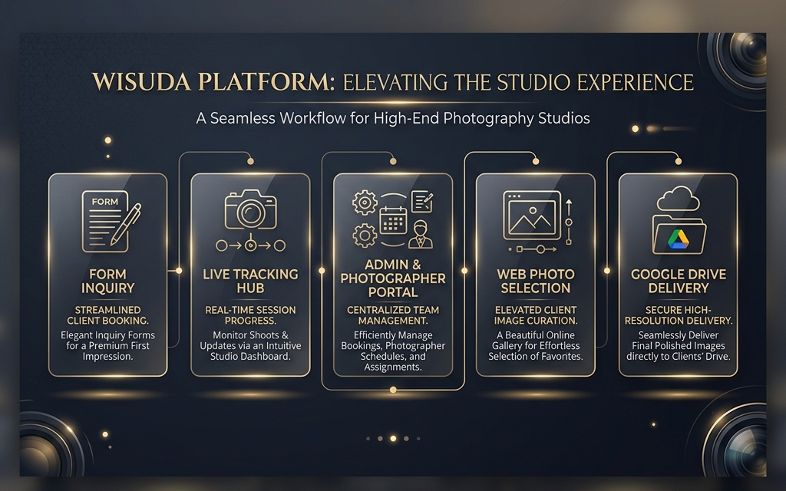

# **Presentasi: Wisuda Platform**

## **Solusi Digital untuk Manajemen Fotografi Wisuda**

_Tagline: Mengubah Kerumitan Menjadi Kemudahan._

Dokumen ini menjelaskan alur kerja, permasalahan yang diselesaikan, dan manfaat dari Wisuda Platform, sebuah sistem terintegrasi untuk mengelola seluruh proses bisnis fotografi wisuda.

---

### **1. Masalah yang Dihadapi**

*   **Komunikasi Tersebar**: Interaksi dengan klien dan fotografer terjadi di banyak platform (WA, Telepon, DM), sulit dilacak.
*   **Penjadwalan Manual yang Rentan Error**: Mengatur jadwal klien dan fotografer secara manual seringkali tumpang tindih dan memakan waktu.
*   **Pelacakan Progres yang Sulit**: Sulit mengetahui status setiap pesanan secara *real-time* (sudah bayar DP? sesi sudah selesai? foto sudah dikirim?).
*   **Pengalaman Klien yang Terfragmentasi**: Klien harus bertanya berulang kali untuk mengetahui status pesanan atau cara pembayaran.
*   **Beban Administratif yang Tinggi**: Admin menghabiskan banyak waktu untuk tugas-tugas berulang seperti mengirim pengingat, mengonfirmasi pembayaran, dan menugaskan fotografer.

---

### **2. Solusi: Wisuda Platform**

Wisuda Platform hadir sebagai **satu platform terpusat** untuk mengatasi semua masalah tersebut, menghubungkan **Klien**, **Admin**, dan **Fotografer** dalam satu alur kerja yang efisien dan transparan.

---

### **3. Alur Kerja dan Peran Pengguna**

Sistem ini dirancang untuk tiga peran utama, dengan alur kerja yang jelas untuk masing-masing.

#### **Peran 1: Client**
*(Alur kerja terpusat di halaman Pelacakan Progres)*

1. **Formulir Konsultasi Awal**: Client mengisi formulir konsultasi di website dengan biodata lengkap & rencana sesi pemotretan untuk mendapatkan penawaran resmi dari Admin.
2. **Halaman Pelacakan Progres**: Menjadi **pusat kendali utama Client** untuk memantau status pesanan secara langsung dan teratur.
3. **Konfirmasi & Pembayaran DP**: Pembayaran dan pengunggahan bukti bayar DP dilakukan langsung melalui halaman Pelacakan Progres (bukan via WhatsApp).
4. **Galeri Pilih Foto Favorit**: Tombol akses menuju galeri pemilih foto favorit diakses langsung dari halaman Pelacakan Progres.
5. **Terima Hasil Foto Google Drive**: Berkas foto akhir otomatis tersedia dan dapat diunduh langsung dari halaman Pelacakan Progres.

#### **Peran 2: Admin (Pusat Kendali)**
*(Memberikan kontrol penuh untuk mengelola seluruh operasional bisnis)*

*   **Dashboard Utama**: Memantau semua aktivitas bisnis dari satu layar (pendapatan, jadwal, tugas pending).
*   **Manajemen Terpusat**: Mengelola pesanan, verifikasi pembayaran, dan menugaskan fotografer hanya dengan beberapa klik.
*   **Penjadwalan Cerdas**: Sistem membantu menemukan fotografer yang tersedia untuk menghindari jadwal bentrok.
*   **Otomatisasi Notifikasi**: Sistem secara otomatis mengirim notifikasi ke klien dan fotografer untuk setiap tahapan penting.
*   **Manajemen Keuangan**: Melacak semua pemasukan dan mengelola pembayaran fee untuk fotografer.

#### **Peran 3: Fotografer (Freelance)**
*(Memudahkan penugasan lapangan dan transparansi fee)*

1.  **Akses Portal**: Login ke portal web khusus dengan nomor WA & Kode Akses.
2.  **Lihat Jadwal Tugas & Moodboard**: Dashboard menampilkan jadwal sesi foto yang ditugaskan (waktu, lokasi, detail klien) serta referensi pose (Moodboard) pilihan klien.
3.  **Update Status Pemotretan**: Menekan tombol **"Photo Shoot Selesai"** begitu sesi foto di lapangan berakhir.
4.  **Pengajuan Payout Fee**: Menekan tombol **"Minta Payment Fee"** untuk mengirim pesan klaim honor ke Admin via WA.
5.  **Kelola Profil & Rekening**: Mengatur status ketersediaan (aktif/libur) dan nomor rekening pencairan fee secara mandiri.

---

### **4. Manfaat Utama**

*   **Efisiensi Operasional**: Mengurangi pekerjaan administratif manual secara signifikan.
*   **Transparansi Penuh**: Semua pihak (klien, admin, fotografer) memiliki informasi yang jelas dan *real-time*.
*   **Pengalaman Klien Profesional**: Memberikan pengalaman yang mulus dan terpercaya bagi klien.
*   **Skalabilitas Bisnis**: Memudahkan pengelolaan pesanan dalam jumlah besar tanpa menambah kerumitan.

---
*Dibuat oleh Hermes Agent*