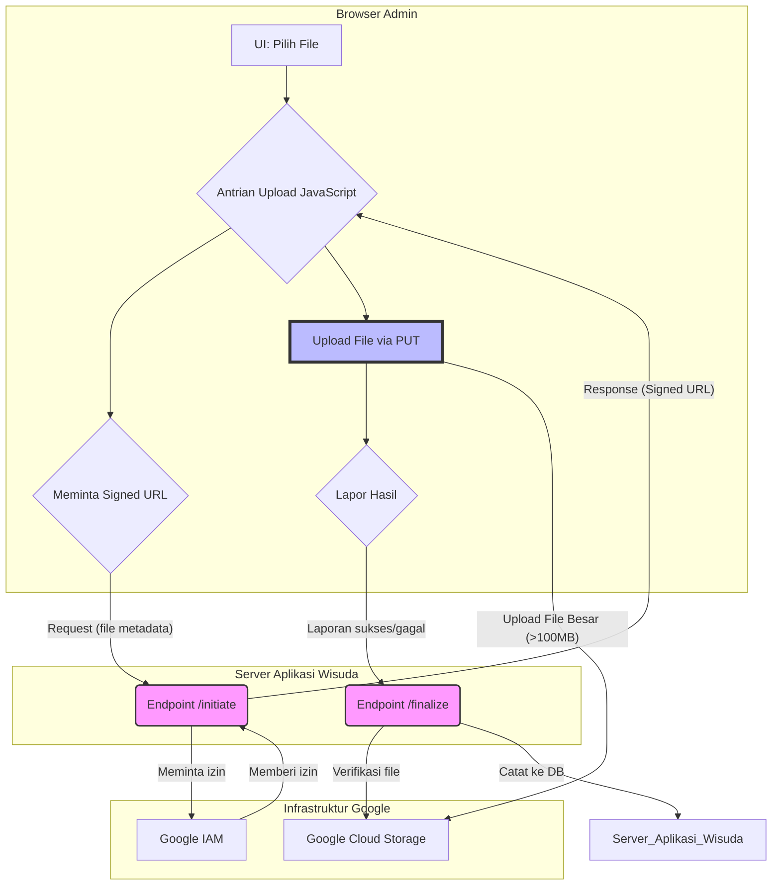

# Proposal Teknis: Arsitektur Direct-to-Cloud Upload v2.0
**Dokumen ini ditujukan untuk:** Developer "Antigravity"  
**Tujuan:** Merancang dan mengimplementasikan sistem upload file yang efisien, skalabel, dan aman untuk file berukuran besar, dengan memanfaatkan arsitektur *client-side upload* langsung ke Google Drive.

---

## 1. Analisis Sistem Saat Ini & Permasalahan

### Arsitektur Frontend
- **Jenis:** Single-Page Application (SPA).
- **Framework:** Vue.js v3.
- **Routing:** `vue-router` v4.
- **Manajemen State:** Pinia.
- **Kesimpulan:** Admin Panel adalah aplikasi modern. Seharusnya, proses latar belakang dapat terus berjalan tanpa terganggu navigasi.

### Proses Upload Saat Ini
- **Metode:** Server-Side Transit. File diunggah dari browser Admin ke server aplikasi, lalu dari server ke Google Drive.

### Masalah yang Teridentifikasi
1.  **Limitasi Teknis Cloudflare (100 MB):** Ini adalah **pemblokir utama**. File besar (>100 MB) tidak akan pernah sampai ke server.
2.  **Beban Server Berlebih (Overload):** Transit file memakan bandwidth, CPU, dan disk server, yang tidak efisien dan tidak skalabel.
3.  **Proses Upload Terputus saat Navigasi:** Pengguna melaporkan bahwa berpindah menu sidebar (navigasi `vue-router`) menghentikan proses upload. Ini mengindikasikan bahwa state upload dan/atau komponen UI-nya terikat pada level halaman (dihancurkan saat pindah "kamar"), bukan pada level aplikasi (di "rumah" utama).

---

## 2. Solusi yang Diusulkan: Arsitektur Hybrid dengan Direct-to-Cloud

- **File Kecil:** Tetap gunakan metode transit via server.
- **File Besar (Upload Galeri oleh Admin):** Implementasikan **Direct-to-Cloud Upload** yang tangguh.

### Diagram Arsitektur Solusi

### Alur Kerja Rinci
1.  **Inisiasi (di Browser):** Admin memilih 1000 file foto di UI.
2.  **Permintaan Izin Massal:** JavaScript di browser mengirim **satu** permintaan ke `POST /api/v2/admin/uploads/initiate` berisi metadata 1000 file tersebut.
3.  **Penerbitan "Tiket":** Server memvalidasi admin, lalu meminta **1000 Signed URL** dari Google. URL ini memiliki masa berlaku panjang (misal: 3 jam) dan dikirim kembali ke browser.
4.  **Proses Antrian Cerdas:**
    *   Browser memulai antrian upload, memproses **5 file secara paralel**.
    *   Setiap file di-upload langsung ke Google Storage menggunakan "tiket"-nya masing-masing. Progress bar di-update secara real-time.
5.  **Penanganan Hasil:**
    *   **Jika Sukses:** File ditandai "Berhasil".
    *   **Jika Gagal (Error Jaringan):** File ditandai "Gagal" dengan tombol "Coba Lagi".
    *   **Jika Gagal (Izin Kedaluwarsa):** Sistem secara otomatis meminta URL baru via `POST /api/v2/admin/uploads/regenerate` lalu mencoba lagi.
6.  **Finalisasi:** Secara berkala (atau di akhir), browser mengirim laporan file-file yang berhasil ke `POST /api/v2/admin/uploads/finalize` untuk dicatat oleh server.
7.  **Persistensi:** Seluruh state antrian (file mana yang sudah, gagal, atau sedang proses) disimpan di `localStorage` browser. Jika admin me-refresh halaman, proses upload dapat **dilanjutkan** secara otomatis.

---

## 3. Analisis Dampak & Rencana Mitigasi

Sebelum implementasi, kita harus mempertimbangkan dampak pada alur kerja dan sistem.

### 3.1. Dampak pada Alur Kerja Admin
- **Positif:** Proses upload akan terasa lebih cepat, lebih andal, dan tidak akan terhenti saat admin membuka halaman lain. Progress upload akan selalu terlihat.
- **Perubahan UI:** Admin akan berinteraksi dengan komponen uploader global yang persisten (misal: di pojok layar), bukan dialog modal yang hilang. Ini adalah perubahan positif yang perlu dikomunikasikan.

### 3.2. Dampak Teknis & Mitigasi

| Potensi Masalah | Analisis Dampak | Rencana Mitigasi & Aksi Perbaikan |
| :--- | :--- | :--- |
| **File "Yatim" (Orphan Files)** | Jika browser ditutup atau koneksi putus **setelah** file di-upload ke Google Drive tetapi **sebelum** memanggil endpoint `finalize`, file tersebut akan ada di Drive tetapi tidak tercatat di database kita. | **1. Desain Ulang `finalize`:** Endpoint `finalize` harus bisa menerima laporan file yang sukses secara berkala (batch), tidak hanya di akhir. **2. Buat Cron Job Pembersih:** Siapkan skrip mingguan (`cron.service.js`) yang: a. Mengambil daftar file dari folder-folder upload di Google Drive. b. Membandingkannya dengan catatan di database. c. Memindahkan file yang tidak tercatat (yatim) ke folder `_orphaned_files/` untuk ditinjau manual. |
| **Keamanan `Signed URL`** | Signed URL adalah kunci sementara. Meskipun berumur pendek, jika bocor, bisa disalahgunakan. | **1. Validasi Super Ketat:** Endpoint `initiate` harus melakukan validasi otentikasi (user login?) **DAN** otorisasi (apakah user ini punya hak untuk upload ke `bookingId` ini?) secara ketat sebelum memberikan URL. **2. Logging:** Catat setiap permintaan `initiate` dan `finalize`, termasuk dari IP mana, untuk audit keamanan. |
| **Konsistensi State Frontend** | Jika browser di-refresh, state upload di memori JavaScript (antrian, progress) akan hilang. | **Gunakan `localStorage`:** Simpan state antrian upload (daftar file, status, URL) di `localStorage` browser melalui *middleware* Pinia. Saat halaman dimuat ulang, Pinia store akan rehidrasi dari `localStorage`, memungkinkan proses upload untuk **dilanjutkan secara otomatis** dari titik terakhir. |
| **Integrasi dengan Kode Lama** | Kode baru harus dipanggil dari tombol-tombol "Upload" yang sudah ada tanpa merusak fungsionalitas lain. | **Buat `useUpload()` Composable:** Di Vue, buat sebuah *composable function* (`useUpload.js`) yang mengekspos fungsi simpel seperti `triggerUpload(files, context)`. Komponen-komponen lama hanya perlu memanggil fungsi ini. Semua logika kompleks (memanggil Pinia, dll.) akan terabstraksi di dalam *composable* tersebut. |

---

## 4. Rencana Implementasi Final (Vue.js + Node.js)

### Fase 1: Backend (Node.js/Express)
1.  **`POST /api/v2/admin/uploads/initiate`**: Implementasikan endpoint yang menerima array file dan mengembalikan array `signedUrl`. Durasi expire URL diset ke **3 jam**.
2.  **`POST /api/v2/admin/uploads/regenerate`**: Implementasikan endpoint untuk meminta ulang URL yang kedaluwarsa.
3.  **`POST /api/v2/admin/uploads/finalize`**: Implementasikan endpoint yang menerima daftar file sukses dan memverifikasinya ke Google API sebelum mencatat ke DB.

### Fase 2: Frontend (Vue.js/Pinia)
1.  **Buat Pinia Store (`stores/upload.js`):**
    - `state`: `queue: Map<fileId, {file, status, progress, signedUrl}>`, `overallProgress`, `isUploading`.
    - `actions`: `addFilesToQueue`, `startUploadQueue`, `handleSuccessfulUpload`, `handleFailedUpload`, `retryFile`.
    - **Integrasikan `localStorage`** untuk persistensi state.
2.  **Buat Komponen Global (`components/GlobalUploader.vue`):**
    - Komponen ini "hidup" di file `App.vue` (level tertinggi).
    - Tampilkan sebagai panel/toast yang persisten di pojok layar.
    - Gunakan store Pinia untuk menampilkan antrian, progress bar per file, progress total, estimasi waktu, dan tombol "Coba Lagi" untuk file yang gagal.
3.  **Refaktor Tombol Upload yang Ada:**
    - Ubah `onClick` pada tombol-tombol upload yang ada. Alih-alih membuka modal lokal, panggil action `addFilesToQueue` dari store Pinia dengan file yang dipilih pengguna.

Dengan rencana ini, sistem tidak hanya akan berfungsi sesuai harapan, tetapi juga akan tangguh, informatif, dan siap untuk kebutuhan skala besar di masa depan.