# 🔄 Wisuda Platform — Complete Business Workflow & State Machine

**Version:** 1.2  
**Last Updated:** 2026-07-25  
**Scope:** Complete End-to-End Agency Operations (Inquiry ➔ Booking ➔ Shoot ➔ Selection ➔ Delivery ➔ Payout)

---

## 1. End-to-End State Machine Diagram

```mermaid
flowchart TD
    classDef lead fill:#e1f5fe,stroke:#0288d1,color:#01579b
    classDef book fill:#fff3e0,stroke:#f57c00,color:#e65100
    classDef shoot fill:#e8f5e9,stroke:#388e3c,color:#1b5e20
    classDef deliv fill:#f3e5f5,stroke:#7b1fa2,color:#4a148c
    classDef pay fill:#e0f2f1,stroke:#00796b,color:#004d40

    subgraph Phase1 ["1. Inquiry & Lead Generation"]
        I1["Inquiry Baru<br/>(/inquiry.html)"]:::lead --> I2["Status: 'new'"]:::lead
        I2 --> I3["Admin Kirim Quote / Link Token"]:::lead
        I3 --> I4["Status: 'quoted'"]:::lead
    end

    subgraph Phase2 ["2. Booking & Verification"]
        I4 --> B1["Client Unggah DP (50%)"]:::book
        B1 --> B2["Admin Verifikasi DP"]:::book
        B2 --> B3["Status Booking: 'confirmed'<br/>generate Kontrak PDF & Tracking Token"]:::book
    end

    subgraph Phase3 ["3. Penugasan & Execution"]
        B3 --> A1["Admin Assign FG & Schedule"]:::shoot
        A1 --> A2["FG Confirm Job (Portal FG)"]:::shoot
        A2 --> A3["Hari H: Shoot Check-in / Out"]:::shoot
        A3 --> A4["FG Setor Hasil Foto (Drive Link)"]:::shoot
        A4 --> A5["Status Assignment: 'uploaded' / 'qc'"]:::shoot
    end

    subgraph Phase4 ["4. QC, Selection & Delivery"]
        A5 --> D1["Admin QC Results"]:::deliv
        D1 --> D2["Client Pilihs Foto<br/>(/select-photos.html)"]:::deliv
        D2 --> D3["Admin Deliver Final Photos & PIN"]:::deliv
        D3 --> D4["Client Transfer Pelunasan"]:::deliv
        D4 --> D5["Status Booking: 'completed'"]:::deliv
    end

    subgraph Phase5 ["5. Payout & Analytics"]
        D5 --> P1["Sistem Hitung Fee Payout FG"]:::pay
        P1 --> P2["Admin Transfer Fee & Kirim Slip"]:::pay
        P2 --> P3["Status Payout: 'paid'"]:::pay
    end
```

---

## 2. Step-by-Step Module Workflows

### 2.1 Lead Generation & Inquiry (`/inquiry.html`)
1. **Calon Klien Input Form**: Mengisi nama, WA, tanggal wisuda, universitas, lokasi, dan paket yang diminati. Data tersimpan di tabel `inquiries` (status: `new`).
2. **Notifikasi Admin**: Sistem mencatat notifikasi baru untuk admin dashboard.
3. **Quotation & Token Paket**: Admin merespon via WA atau menerbitkan `booking_token` unik agar klien bisa mengonfirmasi rincian paket secara mandiri.

### 2.2 Booking & Verifikasi Pembayaran DP
1. **Transfer & Bukti DP**: Klien melakukan transfer DP (50%) dan mengunggah gambar bukti transfer.
2. **Verifikasi Admin**: Admin memeriksa bukti transfer di menu Bookings/DP Pending. Setelah terverifikasi:
   - `dp_status` berubah menjadi `paid`.
   - Status booking berubah menjadi `confirmed`.
   - Sistem menerbitkan **Tracking Token** unik (`TRK-XXX`) dan Kontrak PDF.

### 2.3 Penugasan Fotografer (Freelancer Assignment)
1. **Penjadwalan Admin**: Admin meng-assign fotografer (FG) melalui kalender penugasan (`/admin/schedules`).
2. **Notifikasi WhatsApp**: Notifikasi detail job dikirim ke WA fotografer.
3. **Konfirmasi & Check-in (Portal Freelance)**:
   - FG login di `/freelance-portal.html` menggunakan `access_code` uniknya.
   - FG mengonfirmasi job, melakukan check-in saat mulai photoshoot, dan check-out setelah selesai.
   - FG menyetor link folder Google Drive hasil foto. Status assignment menjadi `uploaded`.

### 2.4 QC, Seleksi Foto & Delivery (`/select-photos.html` & `/tracking.html`)
1. **Admin Quality Control**: Admin memeriksa hasil foto FG (status QC: `approved` / `revision`).
2. **Galeri Seleksi Lightbox**: Klien membuka galeri seleksi touch-friendly, memilih foto favorit sesuai kuota paket, dan menekan submit.
3. **Delivery & PIN Lock**: Admin menyetujui hasil seleksi, mengunggah link akhir, dan mengeset PIN unduh.
4. **Pelunasan & Selesai**: Klien mengunggah bukti pelunasan. Admin verifikasi pelunasan (`balance_status = 'paid'`), dan status booking menjadi `completed`.

### 2.5 Fee Payout Freelancer (`/admin/payroll`)
1. **Perhitungan Fee**: Sistem secara otomatis mengonsolidasikan fee FG berdasarkan tarif paket (`COALESCE(assignment.fg_fee, freelancer.default_rate, package.fg_fee)`).
2. **Pembayaran & Slip PDF**: Admin mengonfirmasi transfer fee, mencatat nomor referensi, dan menerbitkan slip payout PDF. Status payout menjadi `paid`.

---

## 3. Matriks Status & Transisi Data

| Objek Data | Status yang Tersedia | Transisi Utama |
|---|---|---|
| **Inquiry** | `new`, `quoted`, `booked`, `expired`, `lost`, `archived` | `new` ➔ `quoted` ➔ `booked` / `expired` |
| **Booking** | `confirmed`, `shooting`, `delivered`, `completed`, `cancelled` | `confirmed` ➔ `shooting` ➔ `delivered` ➔ `completed` |
| **DP Status** | `unpaid`, `uploaded`, `paid`, `refunded` | `unpaid` ➔ `uploaded` ➔ `paid` |
| **Balance Status**| `unpaid`, `uploaded`, `paid` | `unpaid` ➔ `uploaded` ➔ `paid` |
| **Assignment** | `assigned`, `confirmed`, `shooting`, `uploaded`, `qc`, `done` | `assigned` ➔ `confirmed` ➔ `uploaded` ➔ `done` |
| **Payout** | `pending`, `paid`, `failed` | `pending` ➔ `paid` |

---

*Wisuda Platform End-to-End Workflow Specification v1.2*