# 🔄 Wisuda Platform — Business Workflow, State Machine & SOP

**Version:** 1.3.0  
**Last Updated:** 2026-07-28  
**Scope:** Complete Agency Operations & Client Service SOP (Inquiry ➔ Booking ➔ Shoot ➔ Selection ➔ Delivery ➔ Payout)

---

## 1. End-to-End Business Flow & State Machine

```mermaid
flowchart TD
    classDef lead fill:#e1f5fe,stroke:#0288d1,color:#01579b
    classDef book fill:#fff3e0,stroke:#f57c00,color:#e65100
    classDef shoot fill:#e8f5e9,stroke:#388e3c,color:#1b5e20
    classDef deliv fill:#f3e5f5,stroke:#7b1fa2,color:#4a148c
    classDef pay fill:#e0f2f1,stroke:#00796b,color:#004d40
    classDef auto fill:#fce4ec,stroke:#c62828,color:#b71c1c

    subgraph Phase1 ["1. Inquiry & Lead Generation"]
        I1["Inquiry Baru<br/>(/inquiry.html)"]:::lead --> I2["Status: 'new'"]:::lead
        I2 --> I3["Admin Kirim Quote / Link Token"]:::lead
        I3 --> I4["Status: 'quoted'"]:::lead
    end

    subgraph Phase2 ["2. Booking & Verifikasi DP"]
        I4 --> B1["Client Unggah Bukti DP (50%)"]:::book
        B1 --> B2["Admin Verifikasi DP"]:::book
        B2 --> B3["Status: 'confirmed'<br/>Generate Tracking Token"]:::book
        B3 --> B4["⚡ AUTO: Buat Folder Google Drive<br/>(Service Account — background)"]:::auto
    end

    subgraph Phase3 ["3. Penugasan & Execution"]
        B4 --> A1["Admin Assign FG & Schedule"]:::shoot
        A1 --> A2["FG Confirm Job (Portal FG)"]:::shoot
        A2 --> A3["Hari H: Shoot Check-in / Out"]:::shoot
        A3 --> A4["FG Setor Hasil Foto (Drive Link)"]:::shoot
        A4 --> A5["Status Assignment: 'uploaded'"]:::shoot
    end

    subgraph Phase4 ["4. Seleksi Foto & Delivery"]
        A5 --> D1["Admin Upload Staging<br/>(scan folder JPG Drive → DB)"]:::deliv
        D1 --> D2["Client Buka Galeri Seleksi<br/>(/select-photos.html)"]:::deliv
        D2 --> D3["Client Submit Pilihan Foto"]:::deliv
        D3 --> D4["Admin Edit & Upload Highlight Link"]:::deliv
        D4 --> D5["Admin Deliver Link Final"]:::deliv
        D5 --> D6["Client Konfirmasi Terima → 'completed'"]:::deliv
    end

    subgraph Phase5 ["5. Payout & Analytics"]
        D6 --> P1["Sistem Hitung Fee Payout FG"]:::pay
        P1 --> P2["Admin Transfer Fee & Kirim Slip"]:::pay
        P2 --> P3["Status Payout: 'paid'"]:::pay
    end
```



---

## 2. Step-by-Step Module Workflows

### 2.1 Lead Generation & Inquiry (`/inquiry.html`)
1. **Calon Klien Input Form**: Mengisi nama, WA, tanggal wisuda, universitas, lokasi, dan paket. Data tersimpan di tabel `inquiries` (status: `new`).
2. **Notifikasi Admin**: Badge notifikasi muncul di dashboard admin.
3. **Quotation**: Admin merespon via WA atau menerbitkan `booking_token` unik agar klien konfirmasi paket secara mandiri di `/confirm-booking.html`.

### 2.2 Booking & Verifikasi DP → Otomasi Folder Drive
1. **Transfer & Bukti DP**: Klien transfer DP (default 50%) dan upload bukti.
2. **Verifikasi Admin**: Admin verifikasi di menu Bookings/DP Pending. Setelah terverifikasi:
   - `dp_status` berubah menjadi `paid`
   - Status booking → `confirmed`
   - Sistem generate **Tracking Token** unik (`TRK-XXX-XXXXXX`)
3. **⚡ Otomasi Folder Drive**:
   - Service Account otomatis membuat struktur folder di Google Drive
   - Berjalan di background (non-blocking)
   - Struktur folder yang dibuat:
     ```
     📁 WISUDA CLIENTS/
       └── 📁 Wisuda_NamaClient_YYYY-MM-DD/   ← drive_parent_url
             ├── 📁 JPG/                       ← staging_drive_url (Galeri seleksi client)
             ├── 📁 Highlight/                 ← highlight_drive_url (Hasil edit & portfolio)
             └── 📁 All File Edited/           ← download_url (Deliveries final client)
     ```

### 2.3 Penugasan Fotografer (Freelancer Assignment)
1. **Penjadwalan**: Admin assign FG via kalender penugasan.
2. **Notifikasi WhatsApp**: Detail job dikirim ke WA fotografer.
3. **Portal FG** (`/freelance-portal.html`):
   - FG login dengan `access_code` unik
   - Check-in saat mulai, check-out setelah selesai
   - FG setor link Drive hasil foto → status `uploaded`

### 2.4 Seleksi Foto Client (`/select-photos.html`) — Zero-Storage Architecture
1. **Upload Staging**: Admin scan folder **JPG Drive** (tanpa download). File list disimpan di DB (`staging_files`).
2. **Galeri Client**: Klien membuka link galeri via tracking token:
   - Grid: Request `/api/proxy/thumb/:fileId` (`sz=w400`) → cached ke disk (`gallery_cache/`)
   - Lightbox: Request `/api/proxy/thumb/:fileId?sz=w800` (on-demand HD)
3. **Submit Pilihan**: Klien memilih foto sesuai kuota paket → submit.
4. **Deliver Final**: Admin upload highlight & link final → client konfirmasi → status `completed`.
5. **Auto Cache Cleanup**: `gallery_cache/` otomatis dibersihkan saat highlight diupload, delivered, atau client konfirmasi terima.

### 2.5 Fee Payout Freelancer (`/admin/payroll`)
1. **Kalkulasi Fee**: `COALESCE(assignment.fg_fee, freelancer.default_rate, package.fg_fee)`.
2. **Pembayaran**: Admin konfirmasi transfer & input referensi.
3. **Slip PDF**: System generate PDF slip payout. Status payout → `paid`.

---

## 3. Matriks Status & Transisi

| Objek | Status Tersedia | Transisi Utama |
|---|---|---|
| **Inquiry** | `new`, `quoted`, `booked`, `expired`, `lost`, `archived` | `new` ➔ `quoted` ➔ `booked` |
| **Booking** | `confirmed`, `shooting`, `editing`, `delivered`, `completed`, `cancelled` | `confirmed` ➔ `shooting` ➔ `editing` ➔ `delivered` ➔ `completed` |
| **DP Status** | `unpaid`, `uploaded`, `paid`, `refunded` | `unpaid` ➔ `uploaded` ➔ `paid` |
| **Balance Status** | `unpaid`, `uploaded`, `paid` | `unpaid` ➔ `uploaded` ➔ `paid` |
| **Selection Status** | `pending`, `scanning`, `ready`, `submitted`, `cleaned` | `pending` ➔ `ready` ➔ `submitted` ➔ `cleaned` |
| **Assignment** | `assigned`, `confirmed`, `shooting`, `uploaded`, `qc`, `done` | `assigned` ➔ `confirmed` ➔ `uploaded` ➔ `done` |
| **Payout** | `pending`, `paid`, `failed` | `pending` ➔ `paid` |

---

## 4. Syarat & Ketentuan (S&K) dan SOP Layanan Klien

> ⚠️ **Dynamic Branding Rule**: Semua nama perusahaan, persentase DP, dan retensi file wajib diambil secara **dinamis** dari Admin Settings (`settings.company_name`, `settings.dp_percentage`, `settings.drive_retention_months`).

### A. Pembayaran & Booking SOP
1. **Down Payment (DP)**: Booking di-lock setelah DP dibayar sesuai persentase aktif (default `{dp_percentage}%`). DP bersifat **non-refundable** jika ada pembatalan sepihak.
2. **Pelunasan**: Pelunasan biaya sisa dilakukan maksimal pada **Hari-H setelah sesi foto** atau sebelum link file master final dikirimkan.

### B. Penjadwalan & Toleransi
1. **Ketepatan Waktu**: Klien diimbau hadir **15 menit sebelum** jam sesi foto. Keterlambatan mengurangi durasi foto tanpa perpanjangan otomatis.
2. **Reschedule**: Pengajuan ubah jadwal maksimal **H-3 sebelum acara** tergantung availability fotografer.

### C. Hak Cipta, Portofolio & Masa Simpan
1. **Hak Cipta & Guna**: Hak cipta milik brand; klien mendapatkan hak guna pribadi (*personal license*).
2. **Portofolio**: Brand berhak mempublikasikan karya foto kecuali ada *Privacy Request* tertulis sebelum sesi foto.
3. **Masa Retensi Drive**: Berkas foto di Google Drive disimpan selama masa retensi aktif (`{drive_retention_months}` bulan). Klien wajib mengunduh seluruh file sebelum masa retensi berakhir.

---

*Wisuda Platform End-to-End Workflow & SOP Specification v1.3.0 — Updated 2026-07-28*