```mermaid
flowchart TD
    classDef lead fill:#e1f5fe,stroke:#0288d1,color:#01579b
    classDef book fill:#fff3e0,stroke:#f57c00,color:#e65100
    classDef shoot fill:#e8f5e9,stroke:#388e3c,color:#1b5e20
    classDef deliv fill:#f3e5f5,stroke:#7b1fa2,color:#4a148c
    classDef pay fill:#e0f2f1,stroke:#00796b,color:#004d40
    classDef auto fill:#fce4ec,stroke:#c62828,color:#b71c1c

    subgraph Phase1 ["1. Inquiry & Lead Generation"]
        I1["Inquiry Baru<br/>(/inquiry.html)"]:::lead --> I2["Status: 'new'"]:::lead
        I2 --> I3["Admin Kirim Quote / Link Token"]:::lead
        I3 --> I4["Status: 'quoted'"]:::lead
    end

    subgraph Phase2 ["2. Booking & Verifikasi DP"]
        I4 --> B1["Client Unggah Bukti DP (50%)"]:::book
        B1 --> B2["Admin Verifikasi DP"]:::book
        B2 --> B3["Status: 'confirmed'<br/>Generate Tracking Token"]:::book
        B3 --> B4["⚡ AUTO: Buat Folder Google Drive<br/>(Service Account — background)"]:::auto
    end

    subgraph Phase3 ["3. Penugasan & Execution"]
        B4 --> A1["Admin Assign FG & Schedule"]:::shoot
        A1 --> A2["FG Confirm Job (Portal FG)"]:::shoot
        A2 --> A3["Hari H: Shoot Check-in / Out"]:::shoot
        A3 --> A4["FG Setor Hasil Foto (Drive Link)"]:::shoot
        A4 --> A5["Status Assignment: 'uploaded'"]:::shoot
    end

    subgraph Phase4 ["4. Seleksi Foto & Delivery"]
        A5 --> D1["Admin Upload Staging<br/>(scan folder JPG Drive → DB)"]:::deliv
        D1 --> D2["Client Buka Galeri Seleksi<br/>(/select-photos.html)"]:::deliv
        D2 --> D3["Client Submit Pilihan Foto"]:::deliv
        D3 --> D4["Admin Edit & Upload Highlight Link"]:::deliv
        D4 --> D5["Admin Deliver Link Final"]:::deliv
        D5 --> D6["Client Konfirmasi Terima → 'completed'"]:::deliv
    end

    subgraph Phase5 ["5. Payout & Analytics"]
        D6 --> P1["Sistem Hitung Fee Payout FG"]:::pay
        P1 --> P2["Admin Transfer Fee & Kirim Slip"]:::pay
        P2 --> P3["Status Payout: 'paid'"]:::pay
    end
```

# 🔄 Wisuda Platform — Complete Business Workflow & State Machine

**Version:** 1.3
**Last Updated:** 2026-07-25
**Scope:** Complete End-to-End Agency Operations (Inquiry ➔ Booking ➔ Shoot ➔ Selection ➔ Delivery ➔ Payout)

---

## 1. End-to-End State Machine Diagram



---

## 2. Step-by-Step Module Workflows

### 2.1 Lead Generation & Inquiry (`/inquiry.html`)
1. **Calon Klien Input Form**: Mengisi nama, WA, tanggal wisuda, universitas, lokasi, dan paket. Data tersimpan di tabel `inquiries` (status: `new`).
2. **Notifikasi Admin**: Badge notifikasi muncul di dashboard.
3. **Quotation**: Admin merespon via WA atau menerbitkan `booking_token` unik agar klien konfirmasi paket secara mandiri.

### 2.2 Booking & Verifikasi DP → Otomasi Folder Drive
1. **Transfer & Bukti DP**: Klien transfer DP (50%) dan upload bukti.
2. **Verifikasi Admin**: Admin verifikasi di menu Bookings/DP Pending. Setelah terverifikasi:
   - `dp_status` berubah menjadi `paid`
   - Status booking → `confirmed`
   - Sistem generate **Tracking Token** unik (`TRK-XXX-XXXXXX`)
3. **⚡ Otomasi Folder Drive (baru v1.3)**:
   - Sistem otomatis membuat struktur folder di Google Drive via Service Account
   - Berjalan di background — tidak blocking response admin
   - Struktur folder yang dibuat:
     ```
     📁 WISUDA CLIENTS/
       └── 📁 Wisuda_NamaClient_YYYY-MM-DD/   ← drive_parent_url
             ├── 📁 JPG/                       ← staging_drive_url
             ├── 📁 Highlight/                 ← highlight_drive_url
             └── 📁 All File Edited/           ← download_url
     ```
   - Drive mapping di DB terisi otomatis → admin tinggal upload foto

### 2.3 Penugasan Fotografer (Freelancer Assignment)
1. **Penjadwalan**: Admin assign FG via kalender penugasan.
2. **Notifikasi WhatsApp**: Detail job dikirim ke WA fotografer.
3. **Portal FG** (`/freelance-portal.html`):
   - FG login dengan `access_code` unik
   - Check-in saat mulai, check-out setelah selesai
   - FG setor link Drive hasil foto → status `uploaded`

### 2.4 Seleksi Foto Client (`/select-photos.html`)

#### Alur Admin (Upload Staging)
1. Admin klik "Upload Staging" di post-production
2. Sistem scrape daftar file dari folder **JPG Drive** (tanpa download)
3. `staging_files` tersimpan di DB sebagai JSON `[{fileId, filename}]`
4. `selection_status` → `ready`

#### Alur Client (Galeri Seleksi)
1. Client buka link galeri via tracking token
2. Foto ditampilkan via **proxy server** (`/api/proxy/thumb/:fileId`)
   - Grid: `sz=w400` — di-cache ke disk (`gallery_cache/`) setelah pertama load
   - Popup lightbox: `sz=w800` — on-demand, kualitas lebih baik
3. Client pilih foto sesuai kuota paket → submit
4. `selection_status` → `submitted`

#### Alur Admin (Post-Delivery)
1. Admin upload `highlight_drive_url` → kirim ke client via WA
2. Admin deliver link final → `status = 'delivered'`
3. Client konfirmasi terima → `status = 'completed'`

> **Cache Management**: Thumbnail cache (`gallery_cache/`) otomatis dihapus saat highlight diupload, deliver, clean-staging, atau client konfirmasi terima.

### 2.5 Akses Client via Tracking Token
- **Token**: Format `TRK-{bookingId}-{randomHex}` — dikirim via WA saat DP terverifikasi
- **Tidak ada PIN**: Sistem tidak menggunakan PIN lagi — 100% berbasis token
- **Keamanan**: Token hanya diketahui client melalui link WA → aman
- Tracking page: `/tracking.html?code={token}`
- Seleksi foto: `/select-photos.html?bookingId={id}&token={token}`

### 2.6 Portfolio Auto-Import
- Saat admin upload `highlight_drive_url` → sistem scan folder Highlight
- Foto di-download, dikompres via **Sharp** → WebP
- Disimpan di `DATA/uploads/portfolio/` → tampil di landing page publik
- Admin review & approve sebelum dipublish

### 2.7 Fee Payout Freelancer (`/admin/payroll`)
1. **Kalkulasi Fee**: `COALESCE(assignment.fg_fee, freelancer.default_rate, package.fg_fee)`
2. **Pembayaran**: Admin konfirmasi transfer, input nomor referensi
3. **Slip PDF**: Diterbitkan otomatis. Status payout → `paid`

---

## 3. Matriks Status & Transisi

| Objek | Status Tersedia | Transisi Utama |
|---|---|---|
| **Inquiry** | `new`, `quoted`, `booked`, `expired`, `lost`, `archived` | `new` ➔ `quoted` ➔ `booked` |
| **Booking** | `confirmed`, `shooting`, `editing`, `delivered`, `completed`, `cancelled` | `confirmed` ➔ `shooting` ➔ `editing` ➔ `delivered` ➔ `completed` |
| **DP Status** | `unpaid`, `uploaded`, `paid`, `refunded` | `unpaid` ➔ `uploaded` ➔ `paid` |
| **Balance Status** | `unpaid`, `uploaded`, `paid` | `unpaid` ➔ `uploaded` ➔ `paid` |
| **Selection Status** | `pending`, `scanning`, `ready`, `submitted`, `cleaned` | `pending` ➔ `ready` ➔ `submitted` ➔ `cleaned` |
| **Assignment** | `assigned`, `confirmed`, `shooting`, `uploaded`, `qc`, `done` | `assigned` ➔ `confirmed` ➔ `uploaded` ➔ `done` |
| **Payout** | `pending`, `paid`, `failed` | `pending` ➔ `paid` |

---

## 4. Arsitektur Galeri Seleksi (Zero-Storage)

```
Folder Drive (JPG)
  ↓ Admin klik "Upload Staging"
Scan file list (scrape HTML/API) → simpan fileId+filename ke DB
  ↓ Client buka galeri
/api/proxy/thumb/:fileId → cek gallery_cache/
  ├── CACHE HIT  → serve dari disk (instan)
  └── CACHE MISS → fetch Google CDN → simpan cache → serve
  ↓ Cache otomatis dihapus saat:
    - Admin upload highlight link
    - Admin deliver file final
    - Admin klik "Clean Staging"
    - Client konfirmasi terima
```

**Keunggulan vs sistem lama:**
- ❌ Lama: Download full-res → Sharp compress → simpan → serve (storage besar)
- ✅ Baru: Hanya simpan thumbnail kecil (~50KB) sementara → auto-clean

---

## 5. Integrasi Google Drive (Service Account)

```
.env:
  GOOGLE_DRIVE_MASTER_FOLDER_ID=xxx  ← ID folder "WISUDA CLIENTS"
  GOOGLE_SERVICE_ACCOUNT_PATH=./DATA/service-account.json

Flow:
  DP Verified → createBookingFolderStructure() [background]
    → Buat 4 folder di Drive
    → Set permission "Anyone with link can view"
    → Update drive_parent_url, staging_drive_url, highlight_drive_url, download_url di DB
```

---

*Wisuda Platform End-to-End Workflow Specification v1.3 — Updated 2026-07-25*