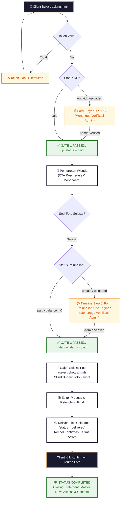
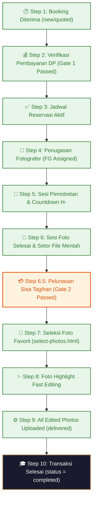

# 📱 Blueprint Spesifikasi Teknikal & Alur Kerja Portal Tracking Klien (`tracking.html`)

Dokumen ini merupakan panduan spesifikasi arsitektur teknis dan alur kerja (*workflow*) resmi untuk **Portal Tracking Klien (`tracking.html`)**, yang berfungsi sebagai antarmuka utama (Pusat Kendali Mandiri Klien) dari pertama reservasi DP, pemantauan alur kerja real-time, pelunasan sisa tagihan, seleksi foto favorit, hingga penerimaan berkas final Google Drive dan penutupan transaksi.

> [!NOTE]
> **Wiki System Flow Hub**: [🗺️ Master Flow System](./MASTER_FLOW.md) | [Tahap 1: Inquiry](./TAHAP1_alur_inqury.md) | [Tahap 2: Client Deal](./TAHAP2_alur_client.md) | [Tahap 3: Post-Produksi](./TAHAP3_alur_postproduksi.md) | [Tahap 4: Arsip & Retention](./TAHAP4_alur_arsip.md)

---

## 🏛️ 1. Prinsip Utama & Karakteristik Portal Tracking Klien

1. **Single Point of Truth Klien**: Klien tidak perlu bertanya berulang kali via WhatsApp; seluruh progres kerja, status pembayaran, jadwal, galeri seleksi, dan berkas foto disajikan secara terpusat dan *real-time* di `tracking.html`.
2. **Standard Web-App & PWA Ready**: Halaman berbasis Alpine.js & Tailwind CSS yang ringan, cepat, mendukung Progressive Web App (PWA) Install, dan aman dari *unintended zoom/touch manipulation* di HP.
3. **Dual Language (EN | ID)**: Mendukung pengalih bahasa instan (English International Default / Bahasa Indonesia) dengan preferensi tersimpan di `localStorage`.
4. **Proteksi Akses Berbasis Token Unik**: Setiap booking dilindungi oleh **Token Tracking Unik (`TRK-xxx`)** dan verifikasi nomor WhatsApp terdaftar.

---

### ⏳ 1.1. Siklus Hidup & Durasi Masa Aktif Link Tracking Klien (`tracking_token`)

> [!IMPORTANT]
> **Durasi Masa Aktif Link Tracking (`tracking.html?code=TRK-xxx`):**
> Link tracking **TIDAK MENGALAMI EXPIRED SAAT EDITING SELESAI**. Portal tracking Klien memiliki **3 Fase Masa Aktif**:

```text
  FASE 1: TIMELINE TRACKER AKTIF (Gate 1 DP s/d Status 'completed')
  ┌──────────────────────────────────────────────────────────────────────────────────┐
  │ • Menyajikan DASHBOARD TIMELINE TRACKER 10-STEP REALTIME                        │
  │ • Klien memantau DP/Pelunasan, jadwal sesi foto, & Galeri Seleksi Foto Mentah    │
  └─────────────────────────────────────────┬────────────────────────────────────────┘
                                            │ Klien Confirm Terima / Status 'completed'
                                            ▼
  FASE 2: CLOSING STATEMENT & DRIVE STORAGE ACCESS (3 Bulan / 90 Hari)
  ┌──────────────────────────────────────────────────────────────────────────────────┐
  │ • TERUS AKTIF SELAMA MASA SIMPAN RETENSI GOOGLE DRIVE (DEFAULT: 3 BULAN / 90 HARI)│
  │ • Klien membuka link kapan saja untuk: Direct Link Drive, Size Calculator Live,  │
  │   Expiry Countdown, Confirm Backup File, & Setting Consent Portofolio Studio     │
  └─────────────────────────────────────────┬────────────────────────────────────────┘
                                            │ Masa Retensi 3 Bulan Habis (Expired Cleanup)
                                            ▼
  FASE 3: EXPIRED CLEANUP & ARSIP PERMANEN (Arsip Cleanup Stage)
  ┌──────────────────────────────────────────────────────────────────────────────────┐
  │ • Cron Worker Cleanup menghapus folder Klien di Root 1 & token di-cleanup        │
  │ • Link menampilkan Halaman Expiration: "Masa Simpan Berkas 3 Bulan Telah Berakhir"│
  └──────────────────────────────────────────────────────────────────────────────────┘
```

---

## 🔐 2. Metode Autentikasi & Pencarian Pesanan

Klien dapat mengakses halaman tracking melalui 2 metode utama:

```text
 ┌──────────────────────────────────────────────────────────────────────────────────┐
 │ METODE 1: DIRECT LINK TERPADU (VIA WHATSAPP / EMAIL)                             │
 │ • Klien mengeklik link: https://studio.com/tracking.html?code=TRK-2026-0812-99  │
 │ • Sistem otomatis memverifikasi token dan MENAMPILKAN DASHBOARD TRACKING INSTAN  │
 └──────────────────────────────────────────────────────────────────────────────────┘

 ┌──────────────────────────────────────────────────────────────────────────────────┐
 │ METODE 2: PENCARIAN MANDIRI PUBLIC (SEARCH FORM)                                 │
 │ • Klien membuka halaman publik https://studio.com/tracking.html                  │
 │ • Klien mengisikan 2 Parameter Wajib:                                            │
 │   1. Kode Token Tracking (contoh: TRK-2026-0812-99)                              │
 │   2. Nomor WhatsApp Terdaftar (contoh: 081234567890 / 6281234567890)              │
 │ • Backend Sanitizer mengomparasi token & nomor WA terdaftar                      │
 └──────────────────────────────────────────────────────────────────────────────────┘
```

---

## 🔗 2.1. Alur Transisi dari Sidetab Inquiry Admin ke Halaman Client (`confirm-booking.html` ➔ `tracking.html`)

> [!IMPORTANT]
> **Klarifikasi Penting Tampilan Awal Klien saat Menerima Link Admin:**
> Klien **TIDAK LANGSUNG MELIHAT TIMELINE PROGRES** saat pertama kali menerima pesan WA dari Admin. Alurnya melalui 2 tahap halaman:

### 1. Tahap Pertama: Halaman Penawaran & Reservasi (`confirm-booking.html?token=TOK-xxx`)
Saat Admin mengeklik tombol **`🔗 Buat Link Booking`** di Sidetab Inquiry Admin Panel (`InquiriesView.vue`), Admin menginput paket, transport charge, diskon nego, dan **Timer Expired 3 Jam**. Link WA yang terkirim membuka `confirm-booking.html`:

* **Tampilan Pertama Klien**:
  1. **Live Timer Expired 3 Jam**: Count-down batas waktu reservasi (`⏳ Sisa 02:45:12`).
  2. **Rangkuman Penawaran & Biodata**: Nama Client, Tanggal Wisuda, Kampus, Lokasi, Catatan Khusus.
  3. **Form Pilihan Paket & Jam Pemotretan**: Pemilihan paket foto dan estimasi jam sesi.
  4. **Rincian Perhitungan Transparan**: Paket + Transport Charge - Diskon Nego = Total Harga.
  5. **Pilihan Jenis Pembayaran**: Opsi DP (50%) atau Pelunasan 100%.
  6. **Info Rekening Bank & Form Upload Bukti Transfer DP**.

---

### 2. Tahap Kedua: Transisi ke Halaman Tracking & Tampilan Timeline Awal (`tracking.html?code=TRK-xxx`)
Saat Klien mengunggah bukti bayar DP di `confirm-booking.html`, sistem mengubah `dp_status = 'uploaded'`, menerbitkan Token Tracking (`TRK-xxx`), dan mengalihkan Klien ke **`tracking.html`**:

* **Tampilan Pertama di `tracking.html` saat `dp_status === 'uploaded'` (Belum Verifikasi Admin)**:
  - **Bagian Atas**: Tampil Header Card Badge `⏳ Menunggu Verifikasi Admin` & Form DP State Uploaded (dengan opsi *Re-upload* jika salah file).
  - **Bagian Bawah (Timeline Tracker)**: Timeline **LANGSUNG TAMPIL DENGAN STATUS INITIAL**:
    - **Event 1 (Booking Diterima)**: `🟢 Centang Hijau` (Booking resmi terdaftar di sistem).
    - **Event 2 (Verifikasi DP)**: `⏳ Amber Pulse` (*"Bukti bayar DP 50% diterima. Menunggu verifikasi admin."*).
    - **Event 3 s/d 10**: Masih dalam status standby/menunggu kelulusan Gate 1.

---

### 3. Tahap Ketiga: Setelah Admin Verifikasi DP di Admin Panel (`dp_status = 'paid'`)
Begitu Admin memverifikasi bukti bayar DP di Admin Panel:

1. Klien **LULUS GATE 1**.
2. Form Upload DP di atas halaman `tracking.html` **OTOMATIS HILANG**.
3. **Timeline Tracker Berubah Secara Realtime**:
   - **Event 1 (Booking Diterima)**: `🟢 Hijau`
   - **Event 2 (Verifikasi DP)**: `🟢 Hijau` (*"Pembayaran DP terverifikasi lunas."*)
   - **Event 3 (Jadwal Aktif)**: `🟢 Hijau` (*"Jadwal reservasi Anda telah dikonfirmasi aktif."*)
   - **Event 4 (Penugasan FG)**: `⏳ Amber Pulse` (*"Kami sedang mempersiapkan fotografer terbaik..."*) $\rightarrow$ `🟢 Hijau` saat FG di-assign.

---

## 🔄 3. Diagram Alur Kerja Visual Tracking Klien (Client Tracking Flowchart)



---

## 📌 4. Rincian Antarmuka & Modul Fitur Klien di Tracking

### 4.1. Header Navigasi & Live Status Indicator
* **Live Realtime Tracking Indicator**: Di bagian teratas halaman, terdapat badge pulsing hijau (`🟢 LIVE REALTIME TRACKING`) yang menandakan bahwa status koneksi & data ter-sync secara realtime.
* **Header Rangkuman Transaksi**:
  - Nama Wisudawan / Klien
  - Asal Universitas & Kampus
  - Tanggal Pemotretan Wisuda
  - Nama Paket Layanan
  - Kode ID Booking (`#BOOK-xxx`)

---

### 4.2. Modul Form Pembayaran DP / Awal (`dp_status !== 'paid'`)

Jika booking masih berada pada tahap penawaran atau DP belum terverifikasi:

```text
 ┌──────────────────────────────────────────────────────────────────────────────────┐
 │ 💰 FORM PEMBAYARAN AWAL / RESERVASI DP (50%)                                     │
 ├──────────────────────────────────────────────────────────────────────────────────┤
 │ • Total Tagihan Paket   : Rp 500.000                                               │
 │ • Tagihan DP (50%)      : Rp 250.000                                               │
 │                                                                                  │
 │ DAFTAR REKENING RESMI STUDIO:                                                    │
 │ • Bank BCA     : 1234567890 a.n Studio Wisuda                                    │
 │ • Bank Mandiri : 0987654321 a.n Studio Wisuda                                    │
 │ • DANA / OVO   : 081234567890 a.n Studio Wisuda                                    │
 │                                                                                  │
 │ UNGGAH BUKTI TRANSFER:                                                           │
 │ [ Choose File ] (Khusus file gambar: JPG, PNG, WEBP)                             │
 │                                                                                  │
 │ ──────────────── [ 📤 Kirim Bukti Pembayaran DP ] ────────────────             │
 └──────────────────────────────────────────────────────────────────────────────────┘
```

* **State `dp_status === 'uploaded'`**:
  Tampil Card Amber `⏳ Menunggu Verifikasi Admin`. Klien diberikan tombol opsional **`🔄 Ingin mengganti/unggah ulang file bukti bayar?`** untuk menangani kasus salah upload file.

---

### 4.3. Modul Reschedule & Brief Moodboard Pose

Pada status `confirmed` / `shooting` (sebelum sesi pemotretan berlangsung), Klien memiliki 2 tombol opsi:

1. **`[ 📅 Ajukan Reschedule Tanggal / Jam ]`**:
   - Membuka modal pengajuan perubahan tanggal wisuda atau jam sesi foto.
   - Backend memvalidasi ketersediaan kuota harian (`max_daily_capacity`) pada tanggal baru tersebut untuk mencegah *overbooking*.
2. **`[ 📄 Lihat Moodboard Pose Saya ]`**:
   - Mengarahkan Klien ke halaman `moodboard.html?token=TRK-xxx` yang menyajikan katalog inspirasi pose foto dan file briefing sheet PDF.

---

### 4.4. Modul Pelunasan Sisa Tagihan (Timeline Step 6 Inline Form)

Begitu sesi foto di lapangan dinyatakan selesai (`is_session_done = 1`), jika Klien masih memiliki sisa pembayaran (DP 50% di awal):

* Pada Step 6 di Timeline Alur Kerja, terbuka **Form Inline Pelunasan**:
  - Menampilkan sisa tagihan yang harus dilunasi (`balance_amount`).
  - Menyediakan input upload bukti transfer pelunasan.
  - Setelah di-upload, status berubah menjadi `balance_status = 'uploaded'` (`Menunggu Verifikasi Admin`).
* **Auto-Bypass**: Jika Klien sudah membayar **Lunas 100% sejak awal** (`balance_amount = 0`), form ini **OTOMATIS DI-BYPASS**.

---

### 4.5. Modul Akses Galeri Seleksi Foto Favorit (`select-photos.html`)

Begitu Klien Lulus Gate 2 (`is_session_done = 1` DAN `balance_status = 'paid'`) dan Admin mengaktifkan Galeri Seleksi (`selection_status = 'ready'`):

* Tampil Card Banner Emas di `tracking.html`:
  **`🎨 Galeri Seleksi Foto Mentah Anda Telah Aktif!`**
* Tombol CTA mengarahkan Klien ke antarmuka galeri seleksi interaktif `select-photos.html`.
* Klien dapat menandai foto favorit hingga batas kuota (`max_selected_photos`), lalu men-submit ke Editor (`selection_status = 'submitted'`).

---

### 4.6. Modul Interactive Timeline Progress Tracker

Timeline pada `tracking.html` menyajikan **10 Milestones Utama** yang merepresentasikan seluruh siklus hidup pesanan secara visual dan dinamis (*real-time status updates*).

#### 🔄 Diagram Visual Alur Kerja Timeline Tracking (Timeline State Machine Diagram)



---

#### 📋 Penjelasan Rinci Setiap Langkah Timeline Tracker (`timelineEvents`)

Berikut adalah rincian lengkap 10 event milestone pada timeline, mencakup kondisi trigger, perubahan visual UI badge, deskripsi teks, serta tindakan Klien dan Admin pada tiap langkah:

---

##### 1️⃣ Event 1: Booking Diterima (`Booking Received`)
* **Icon UI**: `🕐` (Jam)
* **Kondisi Trigger**: Record inquiry/booking telah terbuat di database (`inquiries` / `bookings`).
* **Visual Badge**: `bg-green-50 text-green-700` (Hijau Terbaca).
* **Pesan Deskripsi UI**:
  - *Bahasa Indonesia*: `"Booking Anda telah terdaftar di sistem kami."`
  - *English*: `"Your booking has been registered in our system."`
* **Tindakan Klien & Admin**: Admin mendiskusikan paket via WA, lalu menggenerate Link Booking Terpadu ber-timer 3 jam.

---

##### 2️⃣ Event 2: Verifikasi Pembayaran DP (50%) / Lunas 100% (`Deposit Verification`)
* **Icon UI**: `💰` (Kantong Uang) $\rightarrow$ `⏳` (Pasir Animated Pulse) $\rightarrow$ `✓` (Centang Hijau Bold).
* **Kondisi Trigger & State SQL**:
  - `dp_status = 'unpaid'`: Icon `💰`, Badge Abu-abu. Pesan: `"Menunggu pembayaran DP (50%)."` (atau Lunas 100% Awal). Form Upload DP aktif di halaman.
  - `dp_status = 'uploaded'`: Icon `⏳`, Badge Amber Animated Pulse. Pesan: `"Bukti bayar DP 50% diterima. Menunggu verifikasi admin."`
  - `dp_status = 'paid'`: Icon `✓`, Badge Hijau Bold. Pesan: `"Pembayaran DP (50%) terverifikasi lunas."` (**LULUS GATE 1**).
* **Tindakan Admin**: Memeriksa bukti transfer di Admin Panel, lalu mengeklik `Verifikasi DP`.

---

##### 3️⃣ Event 3: Jadwal Aktif (`Active Schedule`)
* **Icon UI**: `✅` (Centang Hijau)
* **Kondisi Trigger**: Lolos Gate 1 (`dp_status = 'paid'`).
* **Visual Badge**: `bg-green-50 text-green-700` (Aktif secara otomatis setelah DP diverifikasi).
* **Pesan Deskripsi UI**:
  - *Bahasa Indonesia*: `"Jadwal reservasi Anda telah dikonfirmasi aktif."`
  - *English*: `"Your reservation schedule has been confirmed active."`
* **Fitur Tambahan**: Di atas timeline, Klien dapat mengeklik tombol **`[ 📅 Reschedule ]`** atau **`[ 📄 Moodboard Pose ]`**.

---

##### 4️⃣ Event 4: Penugasan Fotografer (`Photographer Assignment`)
* **Icon UI**: `👤` (Siluet) $\rightarrow$ `⏳` (Pasir Pulse) $\rightarrow$ `✓` (Centang Hijau Bold).
* **Kondisi Trigger & State SQL**:
  - `!fg_name`: Icon `⏳`, Badge Amber. Pesan: `"Kami sedang mempersiapkan fotografer terbaik untuk mendokumentasikan wisuda Anda."`
  - `fg_name` terisi: Icon `✓`, Badge Hijau Bold. Pesan: `"Fotografer {fg_name} siap bertugas mendokumentasikan wisuda Anda."`
* **Tindakan Admin**: Admin mengeklik `Assign FG` di Sidetab Client dan menetapkan tarif honor (`fg_fee`).

---

##### 5️⃣ Event 5: Jadwal Pemotretan & Hitung Mundur (`Shooting Schedule`)
* **Icon UI**: `📅` (Kalender) $\rightarrow$ `📸` (Kamera)
* **Kondisi Trigger**: Fotografer telah ditugaskan (`fg_name` tidak kosong).
* **Logika Dinamis H- (Countdown)**:
  - Jika $TanggalWisuda > Today$: Pesan: `"H-{diffDays} menuju sesi pemotretan wisuda bersama FG {fg_name}."`
  - Jika $TanggalWisuda == Today$: Pesan: `"Hari pemotretan. Sesi foto wisuda Anda bersama FG {fg_name} dilaksanakan hari ini."`
  - Jika $TanggalWisuda < Today$: Pesan: `"Sesi foto bersama FG {fg_name} telah selesai dilaksanakan."`

---

##### 6️⃣ Event 6: Sesi Foto Selesai & Setor File (`Photo Session & File Submission`)
* **Icon UI**: `📸` (Biru Bouncing) $\rightarrow$ `⏳` (Amber Pulse) $\rightarrow$ `✓` (Centang Hijau Bold).
* **Kondisi Trigger & State SQL**:
  - `status = 'shooting'`: Icon `📸`, Badge Biru Bouncing. Pesan: `"Sesi foto sedang berlangsung di lokasi bersama FG {fg_name}."`
  - `is_session_done = 1`: Icon `⏳`, Badge Amber. Pesan: `"Sesi foto telah selesai. Fotografer sedang menyetor file foto mentah ke admin."` (Pemicu: Tombol FG, Admin, atau Cron +30m).
  - `is_file_submitted = 1`: Icon `✓`, Badge Hijau Bold. Pesan: `"Sesi foto selesai. File foto mentah telah disetor ke server/Drive oleh fotografer."`

---

##### 6️⃣.5️⃣ Event 6.5: Konfirmasi Pelunasan Sisa Tagihan (`Final Payment Confirmation`)
> [!IMPORTANT]
> **Langkah Aktif Penentu Lolos Gate 2:**
> Event ini muncul jika pemotretan selesai (`is_session_done = 1`), tetapi Klien masih memiliki sisa tagihan DP (`balance_amount > 0`).

* **Icon UI**: `💰` $\rightarrow$ `⏳` (Amber Pulse) $\rightarrow$ `✓` (Centang Hijau Bold).
* **Kondisi Trigger & State SQL**:
  - `balance_amount == 0`: **AUTO-BYPASS** (Langsung lulus ke Event 7 tanpa menampilkan langkah ini).
  - `balance_status = 'unpaid'`: Icon `⏳`, Badge Amber Red Border. Pesan: `<strong>Langkah Aktif:</strong> Silakan lakukan pelunasan sisa tagihan sebesar Rp X untuk melanjutkan progres & membuka galeri seleksi foto.` **(Terbuka Inline Upload Form Pelunasan)**.
  - `balance_status = 'uploaded'`: Icon `⏳`, Badge Amber Pulse. Pesan: `"Bukti pelunasan sebesar Rp X telah diunggah. Tim admin sedang memverifikasi pembayaran Anda."`
  - `balance_status = 'paid'`: Icon `✓`, Badge Hijau Bold. Pesan: `"Pelunasan 100% terverifikasi sah oleh admin."` (**LULUS GATE 2**).

---

##### 7️⃣ Event 7: Seleksi Foto Favorit Klien (`Photo Selection Gallery`)
> [!IMPORTANT]
> **Aturan Dynamic Link 2-Fase (Step 7):**
> * **Fase 1 (Loading Progres)**: Ketika Step 7 tampil di timeline tetapi `selection_status !== 'ready'`, card/step **TETAP MUNCUL DI TIMELINE** dengan icon `⏳` (Amber Animated Pulse) dan teks status: `"Admin sedang mempersiapkan / mengimpor galeri foto mentah untuk Anda pilih..."`
> * **Fase 2 (Link Aktif Unlocked)**: Saat Admin mengaktifkan galeri (`selection_status = 'ready'`), teks status loading `⏳ Sedang Diproses` **OTOMATIS TERGANTIKAN OLEH LINK/BUTTON AKTIF**: `👉 Buka Galeri Seleksi Foto` (`/select-photos/${id}`).
> * **Fase 3 (Submitted)**: `selection_status = 'submitted'`, icon `✓` Hijau Bold: `"Foto favorit pilihan klien telah diterima oleh tim editor."`

---

##### 8️⃣ Event 8: Foto Highlight Fast Editing (`Highlight Photos`)
> [!IMPORTANT]
> **Aturan Dynamic Link 2-Fase (Step 8):**
> * **Fase 1 (Loading Progres)**: Ketika Step 8 tampil di timeline setelah client submit foto favorit tetapi `!highlight_drive_url_unlocked`, card/step **TETAP MUNCUL DI TIMELINE** dengan icon `⏳` (Amber Animated Pulse) dan teks status: `"Tim editor sedang memproses & fast-editing foto highlight pilihan Anda..."`
> * **Fase 2 (Link Aktif Unlocked)**: Saat Admin mengunggah/meng-unlock link highlight, teks status loading `⏳ Sedang Diproses` **OTOMATIS TERGANTIKAN OLEH LINK/BUTTON AKTIF**: `👉 Buka Folder Highlight (Fast Editing)` (`highlight_drive_url_unlocked`).

---

##### 9️⃣ Event 9: Hasil Akhir All Edited Photos (`Final All Edited Photos`)
> [!IMPORTANT]
> **Aturan Dynamic Link 2-Fase (Step 9):**
> * **Fase 1 (Loading Progres)**: Ketika Step 9 tampil di timeline tetapi `!download_url_unlocked` (`status !== 'delivered'`), card/step **TETAP MUNCUL DI TIMELINE** dengan icon `⏳` (Amber Animated Pulse) dan teks status: `"Tim editor sedang memproses retouch & editing akhir untuk seluruh file foto..."`
> * **Fase 2 (Link Aktif Unlocked)**: Saat Admin selesai mengunggah seluruh foto final (`status = 'delivered'`), teks status loading `⏳ Sedang Diproses` **OTOMATIS TERGANTIKAN OLEH LINK/BUTTON AKTIF**: `👉 Buka Folder All Edited Photos` (`download_url_unlocked`) **+ Tombol Utama Konfirmasi**: `[ ✓ Konfirmasi Foto Final Diterima & Selesai ]`.

---

##### 🔟 Event 10: Transaksi Selesai & Completed (`Completed & Receipt Confirmation`)
* **Icon UI**: `🎓` (Toga Wisuda) $\rightarrow$ `✓` (Centang Emas Bold).
* **Kondisi Trigger**: Klien mengeklik tombol konfirmasi penerimaan (atau auto-approve 48 jam).
* **Eksekusi & Transisi Antarmuka**:
  1. `status = 'completed'` (Selesai 100%).
  2. **Timeline Disembunyikan (Closing Timeline)**.
  3. **Antarmuka Utama Bertransisi Menjadi Halaman Closing Statement** (Direct Master Drive Access Tanpa PIN Kunci, Live Storage Size Calculator, Expiry Countdown, Confirmation Backup Secured, & Portfolio Explicit Consent `is_portfolio_allowed`).

---

---

### 4.7. Dual Konfirmasi Klien & Transisi Halaman Closing Statement (`completed`)

> [!IMPORTANT]
> **Dua Tahap Konfirmasi Klien di Akhir Alur Kerja:**
> Sistem mengunci kepastian transaksi melalui **2 Tombol Konfirmasi Berurutan**:

#### 1️⃣ Konfirmasi Pertama: Terima File Final (`POST /api/public/tracking/:id/confirm-receipt`)
Ketika Admin selesai mengunggah editan final (`status = 'delivered'`), pada bagian paling bawah timeline muncul tombol utama tindakan Klien:

`[ ✓ Saya Sudah Menerima & Memeriksa Semua File ]`

* **Dampak Eksekusi**:
  1. `status = 'completed'` (Transaksi Selesai 100%).
  2. **Timeline Progress Tracker DITUTUP / DISEMBUNYIKAN**.
  3. **Antarmuka Bertransisi Menjadi Halaman Closing Statement & Master Drive Access**.

> [!NOTE]
> **🤖 Background Cron Auto-Approve (Jika Klien Lupa / Tidak Klik Konfirmasi):**
> Jika Klien **TIDAK** mengeklik tombol konfirmasi penerimaan secara manual dalam **48 JAM** sejak editan final diunggah (`delivered_at`), maka **Cron Worker Background Service (`runAutoApproveDelivery`)** akan mengeksekusi konfirmasi otomatis:
> * Cron me-set `client_approved = 1` & `status = 'completed'`.
> * Durasi batas 48 jam ini bersifat dinamis dan dapat disesuaikan via Pengaturan Admin (`SettingsView.vue` `auto_approve_hours`).
> * Klien menerima notifikasi WA invoice/resi lunas otomatis.

---

#### 2️⃣ Konfirmasi Kedua: Keamanan & Backup File Klien (`POST /api/public/tracking/:id/confirm-backup`)
> [!CAUTION]
> **PERHATIAN KHUSUS & HIGH-VISIBILITY ATTENTION CALLOUT:**
> Modul ini dirancang dengan **Card Amber High-Visibility Attention Callout Box** di Halaman Closing Statement Klien untuk memastikan Klien tidak kehilangan berkas foto akibat kelalaian mengunduh sebelum batas waktu retensi penyimpanan Google Drive Vendor/Admin.

* **Tampilan Card Warning Attention Klien**:
  ```text
  ┌──────────────────────────────────────────────────────────────────────────────────┐
  │ 💾 KONFIRMASI KEAMANAN & BACKUP FILE KLIEN (PERHATIAN KHUSUS!)                   │
  ├──────────────────────────────────────────────────────────────────────────────────┤
  │ ⚠️ Folder Google Drive ini akan dibersihkan otomatis pada tanggal {drive_expiry} │
  │    (sisa {diffDays} hari lagi). Mohon segera amankan file Anda di penyimpanan    │
  │    pribadi (Cloud Drive / HP / Laptop).                                          │
  │                                                                                  │
  │  ─── PILIH CARA PENGAMANAN: ───                                                  │
  │  1️⃣ [ 📂 1-Klik Salin ke Google Drive Saya ]         ⭐ REKOMENDASI              │
  │     Tersalin ke Drive tanpa menguras kuota download HP/Laptop                    │
  │                                                                                  │
  │  2️⃣ [ ⬇️ Unduh Langsung File ZIP ]                    Unduh ZIP ↗                │
  │     Download 1 file arsip ZIP ke HP/Laptop ({folder_total_size})                 │
  │                                                                                  │
  │  ──────────────────────────────────────────────────────────────────────────────  │
  │  [ ✓ Konfirmasi File Sudah Saya Amankan ]                                        │
  └──────────────────────────────────────────────────────────────────────────────────┘
  ```

* **Dampak Eksekusi**:
  - `drive_cleanup_status = 'client_confirmed'`
  - Card bertransisi menjadi Badge Hijau Emerald: `🟢 Seluruh File Telah Diamankan!` (*"Terima kasih telah mengonfirmasi bahwa seluruh file telah Anda unduh & buat cadangannya."*).
  - Tautan pembuka folder hasil salinan Google Drive klien ditampilkan jika menggunakan Opsi 1.

> [!NOTE]
> **📲 Automated WhatsApp Reminder Cron Worker (Pengingat Otomatis H-14 & H-3):**
> Jika Klien belum mengonfirmasi tombol backup file, **Cron Worker Background Service (`runDriveCleanupCron`)** secara otomatis mengirimkan 2 gelombang pesan peringatan WA langsung ke HP Klien:
> 1. **Peringatan 1 (Cron H-14 / H-7)**: Dikirim saat sisa masa simpan Drive $\le 14$ Hari (`reminded_h14`). Pesan WA: *"Halo Kak {client_name}, mengingatkan bahwa berkas foto wisuda Kakak sisa 14 Hari Lagi sebelum dibersihkan..."*
> 2. **Peringatan 2 (Cron H-3 Final Warning)**: Dikirim saat sisa masa simpan Drive $\le 3$ Hari (`reminded_h3`). Pesan WA peringatan darurat sebelum folder di-trash.

---

#### 🌸 Tampilan Antarmuka Konsolidasi Closing Statement:

```text
 🎓 STUDIO FOTOGRAFI WISUDA - CLOSING STATEMENT & RESI SELESAI
 ════════════════════════════════════════════════════════════════════════════════════

                      ✅ COMPLETED / TRANSAKSI SELESAI 100%
                "Momen Berharga Anda Telah Sempurna Abadi Bersama Kami"

 🌸 UCAPAN TERIMA KASIH:
 Terima kasih banyak Kak {client_name}! Selamat atas gelar dan kelulusan wisudanya.
 Suatu kehormatan bagi kami telah dipercaya mengabadikan momen istimewa Kakak.

 📋 RANGKUMAN DATA TRANSAKSI LENGKAP:
 ────────────────────────────────────────────────────────────────────────────────────
 • Kode Tracking    : TRK-2026-0812-99
 • Nama Wisudawan   : Budi Santoso
 • Nomor WhatsApp   : 0812-3456-7890
 • Tanggal Wisuda   : 15 Oktober 2026
 • Kampus & Lokasi  : Universitas Indonesia (Balairung UI Depok)
 • Paket Layanan    : Paket Wisuda Personal Premium
 • Status Pembayaran: 🟢 LUNAS 100% (Resi Terverifikasi)
 ────────────────────────────────────────────────────────────────────────────────────

 📄 DOKUMEN RESI & INVOICE:
 [ 🖨️ Unduh Invoice PDF Lunas 100% ]

 📂 AKSES UNLOCKED GOOGLE DRIVE MASTER CLIENT:
 [ 📁 Buka Master Google Drive Foto Wisuda Saya ]
   📊 Total Ukuran Folder: 2.4 GB  [ ⚡ Hitung Ukuran / 🔄 Cek Ulang ]
   ⏰ Masa Simpan Drive  : Sisa 21 Hari Lagi (Batas Cleanup: 30 Nov 2026)

 💾 KONFIRMASI KEAMANAN & BACKUP FILE KLIEN:
 [ ✓ Konfirmasi File Sudah Saya Amankan / Download ]

 📸 KONFIRMASI IZIN PUBLIKASI PORTOFOLIO STUDIO (EXPLICIT CONSENT):
 Apakah Kakak mengizinkan foto editan pilihan dipublikasikan di Web Portofolio Studio?
 [✔] YA, SAYA MENGIZINKAN (Foto Highlight Ter-Publish di Katalog Portofolio Studio)
 [  ] TIDAK (Simpan Foto Secara Privat / Private Only)
 (Klien dapat meng-update atau mengubah pilihan ini kapan saja)

 🌸 UCAPAN SALAM CLOSING & APRESIASI:
 "Semoga ilmu & gelar yang diraih membawa keberkahan. Salam hangat dari Tim Studio!"
```

---

## 🗄️ 5. Matriks Endpoint Backend API Terkait Portal Tracking

| Endpoint API | Method | Deskripsi Operasional & Akses Security |
| :--- | :---: | :--- |
| `GET /api/public/tracking?code=TRK-xxx` | `GET` | Memuat data detail tracking booking berdasarkan token atau pencarian nomor WA. |
| `POST /api/public/bookings/:id/upload-dp` | `POST` | Mengunggah file bukti transfer DP (khusus format JPG, PNG, WEBP). |
| `POST /api/public/bookings/:id/upload-balance` | `POST` | Mengunggah file bukti transfer pelunasan sisa DP. |
| `POST /api/public/tracking/:id/confirm-receipt` | `POST` | Klien mengonfirmasi penerimaan foto final $\rightarrow$ status `completed`. |
| `POST /api/public/tracking/:id/recheck-folder-size` | `POST` | Mengeset ulang & mengkalkulasi ulang ukuran total folder Drive Klien secara realtime. |
| `POST /api/public/tracking/:id/confirm-backup` | `POST` | Klien mengonfirmasi berkas foto telah diamankan (`drive_cleanup_status = 'client_confirmed'`). |
| `POST /api/public/tracking/:id/portfolio-consent` | `POST` | Klien memperbarui izin publikasi portofolio (`portfolio_consent`: `approved` / `declined`). |
| `POST /api/public/tracking/:id/reschedule` | `POST` | Klien mengoperasikan pengajuan ubah tanggal & jam pemotretan. |

---

## 🗄️ 6. Ringkasan Status State pada Portal Tracking Klien

| Parameter State | Nilai State UI | Efek Antarmuka pada Portal Tracking Klien |
| :--- | :--- | :--- |
| **`dp_status`** | `unpaid` | Form Transfer & Upload Bukti DP Tampil. |
| | `uploaded` | Card Amber: `⏳ Menunggu Verifikasi Admin` (dengan opsi Re-upload). |
| | `paid` | **Lulus Gate 1**. Form DP Hilang, Status beralih ke Persiapan Pemotretan. |
| **`balance_status`** | `unpaid` | Form Pelunasan Tampil di Step 6 Timeline (jika `is_session_done = 1`). |
| | `uploaded` | Card Amber: `⏳ Menunggu Verifikasi Pelunasan Admin`. |
| | `paid` | **Lulus Gate 2**. Terbuka ke Tahap Post-Produksi & Seleksi Foto. |
| **`selection_status`**| `ready` | Tampil Card Banner CTA `🎨 Buka Galeri Seleksi Foto`. |
| | `submitted` | Tampil Notifikasi: `✓ Foto Pilihan Telah Diterima Editor`. |
| **`status`** | `delivered` | Tampil Tombol `[ ✓ Konfirmasi Foto Final Diterima & Selesai ]`. |
| | `completed` | **Timeline Ditutup** $\rightarrow$ Transisi ke **Halaman Closing Statement**. |
| **`portfolio_consent`**| `pending` | Form Izin Portofolio menampilkan tombol opsi `YA` / `TIDAK`. |
| | `approved` | Badge Hijau `Disetujui` + Link Portofolio + Tombol Pengaturan Ulang. |
| | `declined` | Badge Merah `Disimpan Privat` + Tombol Ubah Pilihan. |

---

*Dokumen cetak biru spesifikasi alur kerja Portal Tracking Klien (`tracking.html`) ini resmi disajikan dan dikunci sebagai acuan utama.*
