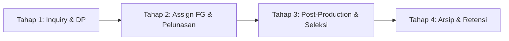

# 🌊 01 — Cetak Biru & Alur Bisnis Operasional Sistem
## Wisuda Photography Platform — State Machine & Business Flows

Direktori ini berisi dokumentasi resmi alur kerja bisnis (*business workflow*) dan mesin status (*state machine*) yang mengontrol seluruh siklus operasional wisuda studio.

---

## 🗺️ Peta Navigasi Alur Kerja (Urutan Tahapan)

---

## 📑 Indeks Dokumen Alur Kerja

| No | Berkas | Deskripsi Alur & Tanggung Jawab Modul |
| :-: | :--- | :--- |
| **00** | **[MASTER_FLOW.md](./MASTER_FLOW.md)** | 🗺️ **Master System Flow & Wiki Hub**: Diagram alur makro end-to-end, isolasi status, dan indeks komprehensif. |
| **01** | **[TAHAP1_alur_inqury.md](./TAHAP1_alur_inqury.md)** | **Tahap 1 (Inquiry)**: Form booking 1-pintu mandiri client, timer reservasi 3 jam dinamis, dan validasi Gate 1 DP. |
| **02** | **[TAHAP2_alur_client.md](./TAHAP2_alur_client.md)** | **Tahap 2 (Booking Deal & Eksekusi)**: Assignment fotografer freelance, sesi foto, konfirmasi kehadiran, dan Gate 2 Pelunasan. |
| **03** | **[TAHAP3_alur_postproduksi.md](./TAHAP3_alur_postproduksi.md)** | **Tahap 3 (Post-Production)**: Pengunggahan master Drive admin (Direct Stream), galeri seleksi foto klien, dan highlight portofolio. |
| **04** | **[TAHAP4_alur_arsip.md](./TAHAP4_alur_arsip.md)** | **Tahap 4 (Arsip & Retensi)**: Sidetab arsip, sistem retensi cloud 3 bulan, dan auto-trash otomatis via cron job. |
| **05** | **[ALUR_FREELANCE.md](./ALUR_FREELANCE.md)** | **Sistem Freelance**: Onboarding 2 jalur, Access Code 8-digit, Portal Mobile (`freelance.html`), dan manajemen Payroll 1-baris. |
| **06** | **[ALUR_PORTOFOLIO.md](./ALUR_PORTOFOLIO.md)** | **Sistem Portofolio**: Izin consent klien `is_portfolio_allowed`, sinkronisasi Cloud-to-Cloud ke Master Root 2, dan halaman publik. |
| **07** | **[ALUR_TRACKING_CLIENT.md](./ALUR_TRACKING_CLIENT.md)** | **Portal Tracking Klien**: Antarmuka `tracking.html`, kalkulator ukuran Drive, integrasi link Google Drive, dan closing card. |
| **08** | **[ALUR_EMAIL_SMTP.md](./ALUR_EMAIL_SMTP.md)** | **Sub-Sistem Email Otomatis**: Nodemailer SMTP gateway, Luxury editorial template engine, dan email rotasi Access Code FG. |
| **09** | **[STRUKTUR_FOLDER_DRIVE.md](./STRUKTUR_FOLDER_DRIVE.md)** | **Arsitektur Dual-Root Drive**: Pembagian Root 1 (Client Dynamic Storage) vs Root 2 (Master Portfolio Permanent Storage). |

---
*Kembali ke [Master Documentation Hub](../README.md)*
