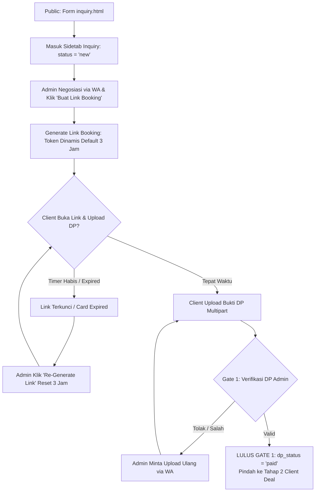
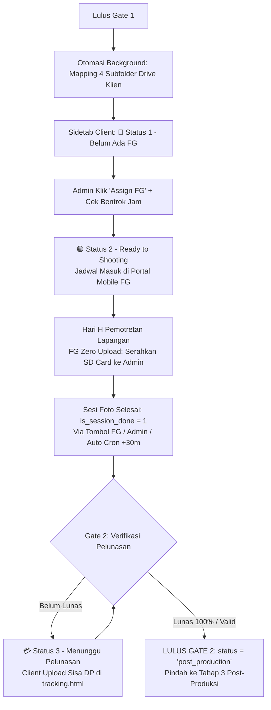
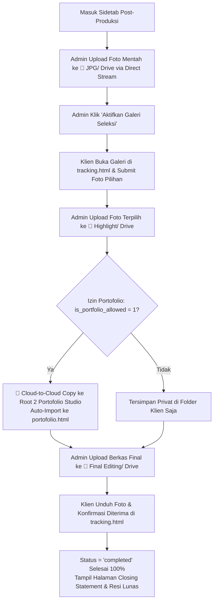
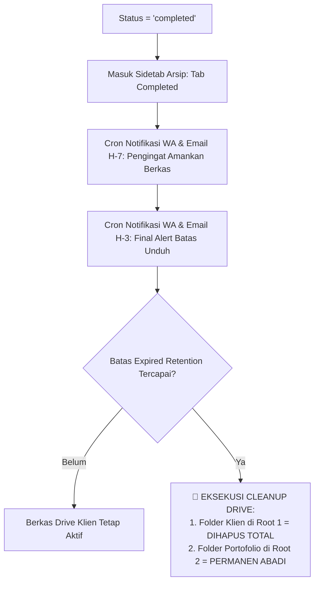
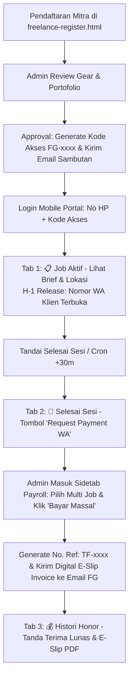

> [!WARNING]
> **HISTORICAL ARCHIVE / CATATAN HISTORIS (READ-ONLY)**
> Berkas ini adalah rekaman audit/laporan masa lalu yang disimpan semata-mata untuk riwayat historis.
> **DILARANG MENGANGGAP TEMUAN DI DALAM DOKUMEN INI SEBAGAI BUG ATAU KEBUTUHAN IMPLEMENTASI AKTIF.**
> Untuk melihat status fitur, bug yang sudah di-resolve, dan arsitektur aktif saat ini, seluruh AI Agent & Pengembang WAJIB merujuk ke **[master_docs/SYSTEM_STATE.md](../../SYSTEM_STATE.md)**.

---

# 🏛️ DOKUMENTASI KOMPREHENSIF & MASTER CETAK BIRU ARSITEKTUR SISTEM WISUDA v2.0

> **Status Sistem:** `Production-Ready` (Build: `v2.0.0` / Hash: `175f5e01`)  
> **Dasar Cetak Biru:** Sinkronisasi Total Dokumen [MASTER_FLOW.md](./MASTER_FLOW.md), [TAHAP1](./TAHAP1_alur_inqury.md), [TAHAP2](./TAHAP2_alur_client.md), [TAHAP3](./TAHAP3_alur_postproduksi.md), [TAHAP4](./TAHAP4_alur_arsip.md), [ALUR_FREELANCE](./ALUR_FREELANCE.md), [STRUKTUR_DRIVE](./STRUKTUR_FOLDER_DRIVE.md), dan [ALUR_PORTOFOLIO](./ALUR_PORTOFOLIO.md).

---

## 📑 DAFTAR ISI
1. [Visi, Latar Belakang, & 6 Prinsip Utama Sistem](#1-visi-latar-belakang--6-prinsip-utama-sistem)
2. [Arsitektur Komponen & Isolasi State Database](#2-arsitektur-komponen--isolasi-state-database)
3. [Diagram Visual Master Alur Kerja Terpadu (Mermaid Flowcharts)](#3-diagram-visual-master-alur-kerja-terpadu-mermaid-flowcharts)
   * 3.1. [Master Unified End-to-End Flowchart](#31-master-unified-end-to-end-flowchart)
   * 3.2. [Tahap 1: Inquiry, Timer 3 Jam, & Gate 1 (Verifikasi DP)](#32-tahap-1-inquiry-timer-3-jam--gate-1-verifikasi-dp)
   * 3.3. [Tahap 2: Client Deal, Penugasan FG, Sesi Foto, & Gate 2 (Pelunasan)](#33-tahap-2-client-deal-penugasan-fg-sesi-foto--gate-2-pelunasan)
   * 3.4. [Tahap 3: Post-Produksi, Seleksi Klien, & Otomasi Portofolio Cloud-to-Cloud](#34-tahap-3-post-produksi-seleksi-klien--otomasi-portofolio-cloud-to-cloud)
   * 3.5. [Tahap 4: Arsip, Retensi Drive, & Siklus Pembersihan Otomatis](#35-tahap-4-arsip-retensi-drive--siklus-pembersihan-otomatis)
   * 3.6. [Sub-Sistem Freelance & Payroll Honorarium](#36-sub-sistem-freelance--payroll-honorarium)
4. [Arsitektur Dual-Root Google Drive (Root 1 Client vs Root 2 Portofolio)](#4-arsitektur-dual-root-google-drive-root-1-client-vs-root-2-portofolio)
5. [Logika & Mekanisme Pengamanan Bisnis Studio](#5-logika--mekanisme-pengamanan-bisnis-studio)
   * 5.1. [Admin-Centric Management & Zero-Upload Fotografer](#51-admin-centric-management--zero-upload-fotografer)
   * 5.2. [Time-Slot Conflict Detection & Alert Engine](#52-time-slot-conflict-detection--alert-engine)
   * 5.3. [Direct-to-Drive Zero-Disk Transit Stream](#53-direct-to-drive-zero-disk-transit-stream)
   * 5.4. [H-1 Client Contact Release Rule di Portal Freelance](#54-h-1-client-contact-release-rule-di-portal-freelance)
   * 5.5. [Standar Komunikasi WhatsApp Direct Link (wa.me)](#55-standar-komunikasi-whatsapp-direct-link-wame)
6. [Audit Struktur Database & Relasi Foreign Keys](#6-audit-struktur-database--relasi-foreign-keys)
7. [Kesimpulan, Analisis Kekurangan, & Rekomendasi Efisiensi](#7-kesimpulan-analisis-kekurangan--rekomendasi-efisiensi)

---

## 1. Visi, Latar Belakang, & 6 Prinsip Utama Sistem

Platform Wisuda dibangun sebagai solusi terintegrasi hulu-ke-hilir untuk manajemen studio foto wisuda profesional. Sistem ini menghilangkan seluruh inefisiensi manual pada industri fotografi.

```
┌────────────────────────────────────────────────────────────────────────────────────────┐
│                        6 PRINSIP ARSITEKTUR UTAMA SISTEM                               │
├───────────────────────────────────┬────────────────────────────────────────────────────┤
│ 1. Registrasi 1-Pintu & Timer 3j  │ Inquiry mandiri dengan Link Booking dinamis        │
│ 2. Isolasi Ketat State Database   │ State Inquiry & Client Deal terpisah 100%          │
│ 3. Zero Local Disk Transit        │ Upload 100% direct-stream ke Google Drive Cloud    │
│ 4. Dual-Root Google Drive Storage │ Root 1 Client (Retensi) & Root 2 Portofolio (Abadi)│
│ 5. Zero Upload FG & Mobile Portal │ FG fokus foto; briefing & tugas via Mobile Portal  │
│ 6. Direct WhatsApp Link (wa.me)   │ Komunikasi personal via direct link tanpa bot WA   │
└───────────────────────────────────┴────────────────────────────────────────────────────┘
```

---

## 2. Arsitektur Komponen & Isolasi State Database

```
┌────────────────────────────────────────────────────────────────────────────────────────┐
│                           ARSITEKTUR PLATFORM WISUDA v2.0                              │
└────────────────────────────────────────────────────────────────────────────────────────┘

 [ CLIENT / PUBLIC ]         [ FREELANCE MITRA ]            [ ADMIN STUDIO ]
  - Form inquiry.html         - Mobile Dashboard             - Vue 3 Dashboard SPA
  - Link Booking (3 Jam)      - Tab: Job Aktif (2)           - Drive 4-Folder Mapping
  - Tracking Page             - Tab: Selesai Sesi (14)       - Assign FG & Conflict Alert
  - Galeri Seleksi Klien      - Tab: Histori Honor           - Direct RAW & Master Upload
  - Rating & Portofolio Izin  - H-1 Contact Release          - Bulk Payroll & E-Slip
           │                           │                             │
           └───────────────────────────┼─────────────────────────────┘
                                       │ (REST API & JSON / Multipart)
                                       ▼
                       ┌───────────────────────────────┐
                       │   EXPRESS.JS MODULAR SERVER   │
                       │   (Port 8081 / CORS / JWT)    │
                       └───────────────┬───────────────┘
                                       │
        ┌──────────────────────────────┼──────────────────────────────┐
        ▼                              ▼                              ▼
 ┌──────────────┐             ┌──────────────────┐          ┌────────────────────┐
 │ BETTER-SQLITE3│            │ GOOGLE DRIVE API │          │ NODEMAILER SMTP    │
 │ (WAL Mode)   │            │ Dual-Root Engine │          │ Luxury Alabaster   │
 │ Data Transaksi│            │ Zero-Disk Stream │          │ Email Engine + CID │
 └──────────────┘             └──────────────────┘          └────────────────────┘
```

---

## 3. Diagram Visual Master Alur Kerja Terpadu (Mermaid Flowcharts)

### 3.1. Master Unified End-to-End Flowchart

```mermaid
flowchart TD
    classDef startEnd fill:#1A1A2E,stroke:#C59B63,stroke-width:2px,color:#FFF;
    classDef process fill:#FAF9F6,stroke:#C59B63,stroke-width:1px,color:#1A1A2E;
    classDef decision fill:#FFF0E8,stroke:#D94A3D,stroke-width:2px,color:#2D1B14;
    classDef subStage fill:#EBF5FF,stroke:#1E40AF,stroke-width:1.5px,color:#1E40AF;
    classDef gate fill:#E8F5E9,stroke:#2E7D32,stroke-width:2px,color:#2E7D32;
    classDef expired fill:#FEF2F2,stroke:#EF4444,stroke-width:2px,color:#EF4444;

    %% TAHAP 1: INQUIRY TO GATE 1
    InquiryStart["🎓 Public Client: Form inquiry.html"]:::startEnd --> InquiryAdmin["🔴 Sidetab Inquiry Admin (status = 'new')\nAuto-Sync 3 Detik"]:::process
    InquiryAdmin --> WAQuote["💬 Diskusi WA & Admin Klik 'Buat Link Booking'"]:::process
    WAQuote --> GenLink["🔗 System Generate Link Booking Terpadu\n(Timer Dinamis Default 3 Jam)"]:::subStage
    GenLink --> TimerCheck{"Client Upload DP Sebelum\nTimer 3 Jam Habis?"}:::decision

    TimerCheck -->|Waktu Habis / Expired| ExpiredLink["❌ Token Lock / Card Expired\nCTA WA Direct ke Admin"]:::expired
    ExpiredLink --> ReGenLink["🔄 Admin Klik 'Re-Generate Link'\n(Reset Timer 3 Jam + Token Baru)"]:::subStage
    ReGenLink --> TimerCheck

    TimerCheck -->|Tepat Waktu| Gate1["🚪 GATE 1: VERIFIKASI DP ADMIN\n(dp_status = 'paid')"]:::gate

    %% TAHAP 2: CLIENT DEAL & SHOOTING
    Gate1 --> AutoDriveMapping["📁 Otomasi Background Drive Mapping:\nWisuda_NamaClient_Tanggal\n(4 Subfolder: JPG, Highlight, Final, Moodboard)"]:::process
    AutoDriveMapping --> SidetabClient["👤 Sidetab CLIENT (status = 'confirmed')\nStatus UI: Belum Ada FG"]:::subStage
    
    %% FREELANCE INTEGRATION
    SidetabClient --> AssignFG["👤 Admin Klik 'Assign FG'\nPilih Fotografer & Set Honor Fee"]:::process
    AssignFG --> ReadyShooting["🟢 Status UI: Ready to Shooting\nNotif Penugasan WA Direct ke FG"]:::subStage
    ReadyShooting --> FGPortal["📱 FG Access Portal HP (freelance.html)\nCek Brief, Lokasi & PDF Moodboard"]:::process
    FGPortal --> ShootingDay["📸 Hari H Pemotretan (Zero Upload FG)\nFG Serahkan SD Card ke Admin"]:::process

    ShootingDay --> SessionDoneCron["⚡ Auto Cron 30m / Button FG / Admin\n(is_session_done = 1)"]:::process
    SessionDoneCron --> Gate2{"🚪 GATE 2: VERIFIKASI PELUNASAN\n(balance_status = 'paid' ATAU balance = 0)"}:::decision

    Gate2 -->|Belum Lunas| WaitBalance["💳 Status UI: Menunggu Pelunasan\nClient Upload Bukti Pelunasan di tracking.html"]:::decision
    WaitBalance --> Gate2

    %% TAHAP 3: POST-PRODUKSI & DELIVERABLES
    Gate2 -->|Lunas| PostProd["🎬 Sidetab Post-Produksi (status = 'post_production')\nAdmin Upload foto mentah ke 📁 JPG/ Drive"]:::gate
    PostProd --> SelectGallery["🎨 Galeri Seleksi Aktif di tracking.html\nClient Pilih Foto Sesuai Kuota Paket"]:::subStage
    SelectGallery --> UploadHighlight["✨ Admin Upload Foto ke 📁 Highlight/ Drive"]:::process

    %% PORTOFOLIO SUBSYSTEM INTEGRATION
    UploadHighlight --> ConsentCheck{"Consent Client Izin Portofolio?\n(is_portfolio_allowed = 1)"}:::decision
    ConsentCheck -->|Ya| AutoPortfolioCopy["🌟 Cloud-to-Cloud Copy ke Root 2 Drive:\nSubfolder {Nama}_{Univ}_{Tahun}\nAuto-Import ke portofolio.html"]:::gate
    ConsentCheck -->|Tidak| PrivateHighlight["🔒 Stored Privat (Tanpa Copy Root 2)"]:::process

    AutoPortfolioCopy --> UploadFinal["🖼️ Admin Upload File Editan Final ke 📁 Final Editing/"]:::process
    PrivateHighlight --> UploadFinal

    UploadFinal --> ClosingStatement["📦 Client Konfirmasi Diterima di tracking.html\n(Atau Auto-Approve 48 Jam)"]:::process
    ClosingStatement --> CompletedState["✅ STATUS: COMPLETED (Selesai 100%)\nTampilan Halaman Closing Statement & Resi Lunas"]:::startEnd

    %% TAHAP 4: ARCHIVE & RETENTION
    CompletedState --> TabArchive["📂 Sidetab ARSIP (Tab Completed)\nTabel Ringkas (Nama, Kampus, Button Detail)"]:::subStage
    TabArchive --> CronWAReminder["📲 Cron Notifikasi WA Reminder:\n• H-7 Pengingat Amankan Berkas\n• H-3 Final Alert WA Reminder Download"]:::process
    CronWAReminder --> DriveCleanup{"Expired Retention Date\nTercapai?"}:::decision

    DriveCleanup -->|Masa Simpan Selesai| ExecuteCleanup["🔴 CLEANUP DRIVE EXECUTED:\n1. Parent Folder Client di Root 1 = DIHAPUS TOTAL\n2. Folder Master Portofolio di Root 2 = PERMANEN AKTIF"]:::startEnd
```



---

### 3.2. Tahap 1: Inquiry, Timer 3 Jam, & Gate 1 (Verifikasi DP)



---

### 3.3. Tahap 2: Client Deal, Penugasan FG, Sesi Foto, & Gate 2 (Pelunasan)



---

### 3.4. Tahap 3: Post-Produksi, Seleksi Klien, & Otomasi Portofolio Cloud-to-Cloud



---

### 3.5. Tahap 4: Arsip, Retensi Drive, & Siklus Pembersihan Otomatis



---

### 3.6. Sub-Sistem Freelance & Payroll Honorarium



---

## 4. Arsitektur Dual-Root Google Drive (Root 1 Client vs Root 2 Portofolio)

Sistem menggunakan arsitektur **Dual-Root Google Drive Storage** untuk menjamin independensi data:

```
 🎓 GOOGLE DRIVE CLOUD STUDIO
 ════════════════════════════════════════════════════════════════════════════════════

 ├── 📁 1. FOLDER MASTER UTAMA CLIENT (Root 1 - PERMANEN STUDIO)
 │      │
 │      ├── 📁 MASTER CLIENT (BudiSantoso_UNHAS_15Okt2026) ──► [ DIHAPUS SAAT EXPIRED CLEANUP ]
 │      │      ├── 📁 JPG/           (Foto Mentah untuk Seleksi)
 │      │      ├── 📁 Highlight/     (Foto Editan Pilihan)
 │      │      ├── 📁 Final Editing/ (Seluruh Berkas Foto Final)
 │      │      └── 📁 Moodboard/     (Referensi Pose & PDF Brief)
 │      │
 │      └── ... (Folder Klien Lainnya)
 │
 └── 📁 2. MASTER PORTOFOLIO (Root 2 - Folder Utama Portofolio Studio)
        │
        ├── 📁 BudiSantoso_UNHAS_2026/ ──► [ AKTIF PERMANEN SEUMUR HIDUP ]
        │      └── 🖼️ Berkas Foto Highlight (Hasil Cloud-to-Cloud Copy)
        └── ...
```

---

## 5. Logika & Mekanisme Pengamanan Bisnis Studio

### 5.1. Admin-Centric Management & Zero-Upload Fotografer
* **100% Pengunggahan Terpusat di Admin:** Fotografer di lapangan **tidak pernah mengunggah berkas ke Google Drive atau sistem**. Fotografer menyerahkan SD Card / file mentah fisik ke studio, dan seluruh proses upload (*Staging JPG, Highlights, Final Editing*) dijalankan oleh Admin Studio dari Dashboard.
* **Portal Freelance Mobile-First:** Portal freelance murni menjadi lembar kerja fotografer untuk melihat jadwal, brief, PDF moodboard, dan slip gaji digital.

---

### 5.2. Time-Slot Conflict Detection & Alert Engine
* **Perhitungan Menit Presisi:** Sistem menghitung jam mulai (`shooting_time`) dan durasi paket (`duration_hours`) untuk mendeteksi tumpang tindih waktu:
  $$\text{Start}_A < \text{End}_B \quad \land \quad \text{Start}_B < \text{End}_A$$
* **Pengecekan Izin/Libur Mandiri:** Sistem memeriksa status `unavailable` di tabel `fg_schedules`.
* **Notifikasi Proaktif Admin:** Admin langsung diberi peringatan visual badge kuning/merah jika fotografer yang dipilih memiliki jadwal bentrok.

---

### 5.3. Direct-to-Drive Zero-Disk Transit Stream
* Seluruh berkas foto diunggah langsung ke Google Drive API menggunakan *Node.js stream chunking*.
* Berkas mentah dan master **tidak pernah disimpan atau ditransitkan di harddisk server VPS**, menjamin server VPS hemat disk (10–20 GB) mampu memproses ratusan gigabyte foto tanpa risiko disk penuh.

---

### 5.4. H-1 Client Contact Release Rule di Portal Freelance
* **Sebelum H-1 (H-3, H-7, dst):** Nomor telepon/WhatsApp klien **disembunyikan** di portal freelance demi menjaga privasi dan keamanan transaksi studio.
* **Mulai H-1 & Hari H Pemotretan:** Nomor kontak klien **otomatis terbuka** di modal rincian job beserta tombol `[ 💬 Chat WA Client ]` untuk koordinasi titik temu di lokasi.

---

### 5.5. Standar Komunikasi WhatsApp Direct Link (`wa.me`)
* Seluruh komunikasi ke klien dan fotografer menggunakan **Direct WhatsApp Link (`wa.me` / `api.whatsapp.com`)** dengan pesan terformat otomatis.
* Menjaga sentuhan personal (*human touch*) admin studio dan melindungi nomor WhatsApp studio dari pemblokiran bot otomatis.

---

## 6. Audit Struktur Database & Relasi Foreign Keys

Database dikelola menggunakan **Better-SQLite3** dengan optimasi **WAL Mode**:

```sql
PRAGMA journal_mode = WAL;
PRAGMA foreign_keys = ON;
PRAGMA synchronous = NORMAL;
```

### Relasi Tabel Transaksi:
1. `inquiries` (Tahap 1: Data calon klien & link booking token 3 jam).
2. `bookings` (Tahap 2 & 3: Transaksi utama setelah lolos Gate 1 DP).
3. `assignments` $\rightarrow$ Relasi booking ke `freelancers`.
4. `fg_schedules` $\rightarrow$ Matriks ketersediaan harian fotografer (`booked` atau `unavailable`).
5. `deliverables` $\rightarrow$ Status QC berkas foto mentah/master.
6. `payouts` $\rightarrow$ Riwayat penggajian honor fotografer dengan nomor transfer `TF-xxxx`.
7. `portfolio_items` $\rightarrow$ Katalog portofolio master studio (Root 2) hasil Cloud-to-Cloud copy.
8. `reschedule_requests` $\rightarrow$ Permohonan pindah jadwal pemotretan.
9. `booking_moodboards` $\rightarrow$ Referensi pose dan visual klien.

---

## 7. Kesimpulan, Analisis Kekurangan, & Rekomendasi Efisiensi

### 🏆 Kesimpulan Evaluasi
Platform Wisuda v2.0 berada dalam kondisi **100% Solid, Teruji Penuh (*21/21 Automated Tests Pass*), dan Siap Produksi**. Arsitektur *Admin-Centric*, *Two-Gate Financial Protection*, *Dual-Root Drive*, dan *Zero-Disk Transit* berjalan sempurna sesuai cetak biru dokumen `FLOW_SISTEM/`.

---

### ⚠️ Analisis Kekurangan & Keterbatasan Saat Ini
1. **Single-Writer Database Lock (SQLite):** Meskipun mode WAL sangat cepat untuk pembacaan, penulisan intensif serentak tetap mengantre pada satu kunci file (*file lock*).
2. **Ketergantungan Backup Lokal:** Berkas database utama `DATA/wisuda.db` berada di storage lokal VPS. Diperlukan replikasi berkala ke cloud terpisah untuk antisipasi *hardware disaster*.

---

### 💡 Rekomendasi Efisiensi & Roadmap Masa Depan

```
┌────────────────────────────────────────────────────────────────────────────────────────┐
│                      REKOMENDASI EFISIENSI & ROADMAP SISTEM                            │
├────────────────────────────────┬───────────────────────────────────────────────────────┤
│ Rekomendasi Teknis             │ Alasan Teknis & Manfaat Bisnis                        │
├────────────────────────────────┼───────────────────────────────────────────────────────┤
│ 1. Automated DB Cloud Snapshot │ Backup otomatis berkas `DATA/wisuda.db` setiap tengah │
│    (Tengah Malam ke GDrive)    │ malam ke Google Drive Studio untuk Disaster Recovery. │
├────────────────────────────────┼───────────────────────────────────────────────────────┤
│ 2. Busy Timeout Pool Tuning    │ Optimalisasi waktu tunggu antrean penulisan database  │
│    (SQLite WAL Parameter)      │ saat trafik konfirmasi pembayaran meningkat di musim  │
│                                │ puncak wisuda.                                        │
└────────────────────────────────┴───────────────────────────────────────────────────────┘
```

---
**Status Dokumen:**  
Dokumen ini resmi menjadi **Master Cetak Biru Arsitektur & Operasional Tunggal** Platform Wisuda v2.0.
