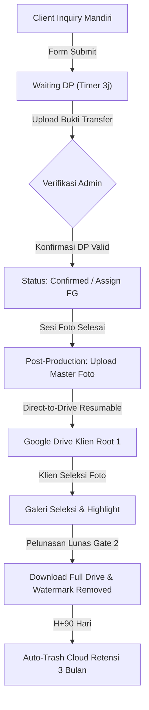

# 🧠 SYSTEM STATE & LIVING MEMORY (SINGLE SOURCE OF TRUTH)
## Wisuda Photography Platform — Luxenary.co Ecosystem

> [!IMPORTANT]
> **PANDUAN WAJIB BAGI SELURUH AI AGENT & DEVELOPER (CLAUDE, GEMINI, ANTIGRAVITY, HERMES, DLL):**
> Dokumen ini adalah **SATU-SATUNYA SUMBER KEBENARAN STATUS RESMI SISTEM SAAT INI (*The Living Single Source of Truth*)**.
> 1. **Dilarang** menganggap catatan bug atau rekomendasi di dalam folder `master_docs/03_LAPORAN_AUDIT/arsip_lama/` sebagai isu aktif yang perlu diimplementasikan ulang.
> 2. Seluruh status fitur, perbaikan keamanan, dan arsitektur resmi diatur dan dikunci di dalam dokumen ini.
> 3. Sebelum memulai analisis, audit, atau modifikasi kode, Agent **WAJIB** membaca dokumen ini terlebih dahulu.

---

## 📌 1. Identitas & Status Rilis Sistem Terkini

| Parameter | Status / Nilai Resmi |
| :--- | :--- |
| **Nama Aplikasi** | Wisuda Photography Platform — Luxenary.co Guide & Documentation |
| **Versi Produksi** | **v2.1.0** (Dual-Mode: Web & Headless API Engine) |
| **Status Unit Tests** | 🟢 **100% PASS** (24 Test Suites / 111 Tests Passing) |
| **Database Engine** | SQLite3 via `better-sqlite3` (WAL Mode Enabled, Indexed FK) |
| **Arsitektur Upload** | **Direct-to-Drive Stream (Resumable Upload API)** — *Zero Disk Transit* |
| **Status Cetak Biru Alur** | 🟢 **100% SYNCHRONIZED** (`master_docs/01_FLOW_SISTEM/` selaras dengan codebase) |
| **Zona Waktu Resmi** | `Asia/Makassar` (WITA UTC+8) |
| **Port Server** | `8081` (Reverse proxy via Nginx HTTPS) |

---

## 🔒 2. Keputusan Arsitektur Kunci yang Dikunci (Locked Architectural Decisions)

Aturan-aturan berikut telah disepakati, diuji, dan **DILARANG DIUBAH / DIROMBAK SECARA SEPIHAK**:

### 1. Strict Google OAuth 3-Step Wizard Workflow
- **Step 1 (Google OAuth Credentials)**: Admin memasukkan Google Client ID & Secret. Backend WAJIB melakukan probe verification ke Google token endpoint sebelum menyimpan ke database. Kredensial tidak boleh tersimpan jika gagal verifikasi.
- **Step 2 (Tautkan Akun Google Drive)**: Hanya dapat diakses setelah Step 1 terverifikasi 100%.
- **Step 3 (Master Root Folder Drive)**: Hanya dapat diakses setelah Step 2 berhasil ditautkan ke akun Gmail Studio.

### 2. Strict Admin-Centric Photo Upload Pipeline
- **Pengunggahan 100% Terpusat di Admin**: Seluruh proses pengunggahan foto wisuda mentah klien, pembuatan folder Drive, dan pengiriman berkas dilakukan 100% oleh Admin Studio dari Admin Dashboard.
- **Direct-to-Drive Stream (Zero Disk Transit)**: Pengunggahan menggunakan Google Drive Resumable Stream langsung dari browser Admin ke API Google Drive tanpa ditransitkan / disimpan di disk lokal VPS.

### 3. Dual-Gate Payment & Security
- **Gate 1 (DP Confirmation)**: Mengubah booking menjadi status deal & membuka penugasan Fotografer Freelance.
- **Gate 2 (Pelunasan & Watermark Clearance)**: Akses link Google Drive master dan penghapusan watermark hanya terbuka setelah pembayaran lunas 100%.

### 4. Zero Blind Test-Driven Regression
- Dilarang keras mengubah kode produksi hanya demi meloloskan test unit lama. Jika alur sistem berubah secara resmi, test suite-nya yang harus disesuaikan.

---

## 📑 3. Master Resolution Ledger (Buku Besar Status Temuan Audit)

Tabel ini merangkum seluruh temuan dari seluruh dokumen audit terdahulu. Seluruh temuan dengan status `🟢 RESOLVED` **TIDAK BOLEH DIOTAK-ATIK LAGI**.

| ID Temuan | Kategori / Komponen | Deskripsi Singkat Masalah Masa Lalu | Dokumen Sumber | Status Terkini | Bukti / Catatan Verifikasi |
| :--- | :--- | :--- | :--- | :--- | :--- |
| **AUD-0801-A** | Auth / Session | Error inisialisasi `SQLiteStore` session | Hermes (01 Ags 2026) | 🟢 **RESOLVED** | Diganti `createBetterSqliteStore` di `src/config/session-store.js`. |
| **AUD-0801-B** | Notification | `generateWaLink` undefined | Hermes (01 Ags 2026) | 🟢 **RESOLVED** | Diperbaiki di `src/config/wa-templates.js`. |
| **AUD-0803-A** | UI/UX / Inquiry | Form inquiry submit button error | Hermes (03 Ags 2026) | 🟢 **RESOLVED** | Form inquiry mandiri 1-pintu normal di `public/index.html`. |
| **AUD-0803-B** | Freelance | Portal freelance styling overflow | Hermes (03 Ags 2026) | 🟢 **RESOLVED** | Layouting responsif diperbaiki di `public/freelance-portal.html`. |
| **SEC-0816-01** | Security / IDOR | IDOR & kebocoran PII pada `/api/public/booking/:id` | Audit Dev (16 Ags 2026) | 🟢 **RESOLVED** | Proteksi parameter token `?code=` aktif. Diverifikasi di `RESPON_2026-08-16`. |
| **SEC-0816-02** | Security / Webhook | Bypass signature webhook QRIS | Audit Dev (16 Ags 2026) | 🟢 **RESOLVED** | `verifyWebhookSignature` diaktifkan di `src/routes/webhook.js`. |
| **SEC-0816-03** | Security / Token | Bypass token via sequential ID tebakan | Audit Dev (16 Ags 2026) | 🟢 **RESOLVED** | Validasi tracking code ketat di `src/routes/public.js`. |
| **SEC-0816-04** | Security / Upload | Upload bukti transfer tanpa token | Audit Dev (16 Ags 2026) | 🟢 **RESOLVED** | Wajib menyertakan `code` token valid. |
| **SEC-0816-05** | Security / Gallery | Penimpaan seleksi foto tanpa token | Audit Dev (16 Ags 2026) | 🟢 **RESOLVED** | Wajib token pada `/api/public/selection/:id`. |
| **SEC-0816-06** | Security / Moodboard | Manipulasi moodboard tanpa token | Audit Dev (16 Ags 2026) | 🟢 **RESOLVED** | Wajib token pada `/api/public/moodboard/:id`. |
| **SEC-0816-07** | Freelance Auth | Session token leakage via GET query | Audit Dev (16 Ags 2026) | 🟢 **RESOLVED** | Token dibersihkan dan disanitasi. |
| **BUG-0816-01** | Runtime / Portfolio | `ReferenceError: photoUrl is not defined` | Audit Dev (16 Ags 2026) | 🟢 **RESOLVED** | Diperbaiki di `src/routes/admin.js`. |
| **BUG-0816-02** | Database / Cron | `no such column: b.tracking_code` pada cron reminder | Audit Dev (16 Ags 2026) | 🟢 **RESOLVED** | Kolom disesuaikan menjadi `b.tracking_token`. |
| **BUG-0816-03** | Business Logic | Booking otomatis `confirmed` sebelum verifikasi DP | Audit Dev (16 Ags 2026) | 🟢 **RESOLVED** | Mengikuti gate 1 status `waiting_dp`. |
| **BUG-0816-04** | Email Template | HTML Injection pada nama client di email | Audit Dev (16 Ags 2026) | 🟢 **RESOLVED** | Sanitasi `escapeHtml` diterapkan. |
| **BUG-0816-05** | Database / Payroll | Variabel global `params = []` | Audit Dev (16 Ags 2026) | 🟢 **RESOLVED** | Dibatasi scope local `const params = []`. |
| **SEC-0817-01** | Security / Edge Case | Bypass token jika parameter `?code=` dikosongkan | Audit Dev (17 Ags 2026) | 🟢 **RESOLVED** | Validasi string non-empty diperketat. Diverifikasi di `RESPON_2026-08-17`. |
| **SEC-0817-02** | Security / API Keys | API Key generator collision check | Audit Dev (17 Ags 2026) | 🟢 **RESOLVED** | Uniqueness validation ditambahkan. |
| **SYNC-0817-01**| Test Suite Sync | 3 Test Suites (`public.test.js`, dll) gagal karena alur lama | Audit Dev (17 Ags 2026) | 🟢 **RESOLVED** | Test suite disinkronkan dengan keamanan token v2.1.0 (`24/24 PASS`). |
| **FEAT-0817-01**| Kearsipan / Analitik | Integrasi 3-Tab Arsip & Soft-Cancel Inquiry | Diskusi Admin (17 Ags 2026) | 🟢 **RESOLVED** | Tab 3 Calon Batal/Expired aktif, Hard Delete dipusatkan di Arsip, data analitik terjaga (`24/24 PASS`). |
| **FEAT-0817-02**| Kearsipan / Workflow | Pemulihan Calon Klien ke Inquiry & Validasi Tanggal Wisuda | Diskusi Admin (17 Ags 2026) | 🟢 **RESOLVED** | Tombol Link Baru dihapus dari Arsip, diganti 'Kembalikan ke Inquiry' ber-modal tanggal baru jika jadwal lewat, bebas bentrok Cron (`24/24 PASS`). |
| **FEAT-0817-03**| Payment / Lifecycle | Fresh Booking Link Reset & Pembersihan QRIS Basi | Diskusi Admin (17 Ags 2026) | 🟢 **RESOLVED** | Menerbitkan link baru otomatis menghapus draft booking unpaid & QRIS lama, menjamin form reservasi klien dan dashboard admin 100% segar (`24/24 PASS`). |
| **FEAT-0817-04**| Client / Reschedule | Integrasi Permohonan Reschedule Langsung di Dalam Card Client | Diskusi Admin (17 Ags 2026) | 🟢 **RESOLVED** | Banner interaktif permohonan reschedule, deteksi bentrok FG, dan tombol aksi cepat Approve/Tolak dipasang langsung di dalam Card Client, Table View, dan Modal Detail (`24/24 PASS`). |
| **FEAT-0817-05**| Client Portal / UI | Penyempurnaan Kartu Profil & Pembayaran di Live Tracking | Diskusi Admin (17 Ags 2026) | 🟢 **RESOLVED** | Header status 'Dikonfirmasi (Aktif)' diganti nama klien menonjol dan No. Invoice, ditambah rincian tipe pembayaran (DP/Lunas), status progres terfokus 100% pada Timeline (`24/24 PASS`). |
| **FEAT-0818-01**| Client Portal / Reschedule | Integrasi Status Permohonan Reschedule di Sisi Klien | Diskusi Admin (18 Ags 2026) | 🟢 **RESOLVED** | `GET /tracking` mengirim `pending_reschedule`, kartu tracking menampilkan banner amber permohonan sedang ditinjau, modal menampilkan review status dan tautan chat admin WA alih-alih form kosong (`24/24 PASS`). |
| **FEAT-0818-02**| Admin / Pipeline Metric | Pembatasan Metrik Bar No. 4 Completed Berbasis Bulan Berjalan | Diskusi Admin (18 Ags 2026) | 🟢 **RESOLVED** | Bar No. 4 dibatasi `bookings_completed_this_month` dan skala basis dihitung proporsional dari volume siklus aktif bulan ini, mencegah distorsi bom waktu arsip all-time (`24/24 PASS`). |
| **FEAT-0818-03**| Admin / Dashboard UI | Optimasi Limit Dinamis & Penghapusan Scrollbar Aktivitas & Email | Diskusi Admin (18 Ags 2026) | 🟢 **RESOLVED** | Scrollbar Aktivitas dihapus total (default 5 sejajar Top FG), Riwayat Email dibatasi default 8, interaksi single-click cycle & double-click custom input aktif dengan persistensi `localStorage` (`24/24 PASS`). |
| **BUG-0818-01** | Admin / Settings | Logic flaw `isGeneralDirty` & `isSeoDirty` menyebabkan tombol simpan disabled | Audit Dev (18 Ags 2026) | 🟢 **RESOLVED** | Logika perbandingan diperbaiki pada `SettingsView.vue` (`24/24 PASS`). |
| **BUG-0818-02** | Admin / Settings | `upload_path` & `upload_path_secondary` hilang dari whitelist `allowed` | Audit Dev (18 Ags 2026) | 🟢 **RESOLVED** | Whitelist & body validator diperbarui di `src/routes/admin/settings.js` (`24/24 PASS`). |
| **BUG-0818-03** | Admin / OAuth | Mismatch endpoint `saveOAuthCredentials` pada wizard Google OAuth | Audit Dev (18 Ags 2026) | 🟢 **RESOLVED** | Wizard diarahkan langsung ke `/verify-oauth-credentials` (`24/24 PASS`). |
| **FEAT-0818-04**| VPS / Deployment | Penyempurnaan Bulletproof `deploy.sh` (Node 20 LTS, Swap 2GB, Rebuild Addons, PM2) | Audit Dev (18 Ags 2026) | 🟢 **RESOLVED** | Skrip `deploy.sh` dirombak 1-command zero error untuk fresh VPS & update (`24/24 PASS`). |
| **BUG-0818-04** | Webhook / Inquiry | `TypeError` template WA pada `POST /api/webhook/inquiry` | Audit Dev (18 Ags 2026) | 🟢 **RESOLVED** | Safe fallback template `client_new_inquiry` ditambahkan di `src/routes/webhook.js` (`24/24 PASS`). |
| **PERF-0823-01**| Storage / Proxy | Pure Zero-Disk In-Memory Thumbnail Streaming & Pembersihan `gallery_cache` | Audit Dev (23 Ags 2026) | 🟢 **RESOLVED** | Disk cache dihapus, proxy mengalirkan stream Google CDN murni in-memory + browser HTTP cache 7 hari (`25/25 PASS`). |
| **BUG-0823-01** | Date / Timezone | Timezone boundary leak pada `lastDay` Dashboard stats memotong data tgl 31 | Audit Dev (23 Ags 2026) | 🟢 **RESOLVED** | Format kalender eksplisit bulan berikutnya diterapkan di `src/routes/admin.js` (`25/25 PASS`). |
| **BUG-0823-02** | Reports / Analytics | Kueri `booked` mengecek status usang menyebabkan conversion rate `0.0%` | Audit Dev (23 Ags 2026) | 🟢 **RESOLVED** | Diselaraskan membaca status `converted` & booking deal aktif di `src/routes/admin.js` (`25/25 PASS`). |
| **BUG-0823-03** | Cron / Reminder | Properti `package_name` undefined pada email follow-up inquiry | Audit Dev (23 Ags 2026) | 🟢 **RESOLVED** | Ditambahkan `LEFT JOIN packages` di `src/services/cron.service.js` (`25/25 PASS`). |
| **BUG-0823-04** | Portfolio / DB | Nilai `graduation_year` tersimpan `NULL` alih-alih `finalYear` | Audit Dev (23 Ags 2026) | 🟢 **RESOLVED** | Variabel `finalYear` di-pass ke `INSERT INTO portfolio_items` di `src/routes/admin/portfolio.js` (`25/25 PASS`). |
| **SYNC-0823-01**| Real-Time & Tests | Missing SSE notify submit seleksi foto & sinkronisasi respon `410` di test | Audit Dev (23 Ags 2026) | 🟢 **RESOLVED** | SSE dipicu di `src/routes/selection.js` dan status `410` divalidasi di `dual_mode_flow.test.js` (`25/25 PASS`). |

---

## 🚀 4. Status Fitur Terkini & Peta Komponen Aktif

---

## 📝 5. Daftar Isu / Backlog Aktif (Active Issues)

> Saat ini **TIDAK ADA ISU BLOCKER AKTIF**. Seluruh test suite backend berada dalam kondisi `100% PASS`.
> Setiap penambahan fitur baru atau perbaikan harus dicatat dalam `master_docs/04_RESPON_MAINTENANCE/` dan di-update pada dokumen ini.

---
*Living Memory System — Wisuda Platform Governance*
